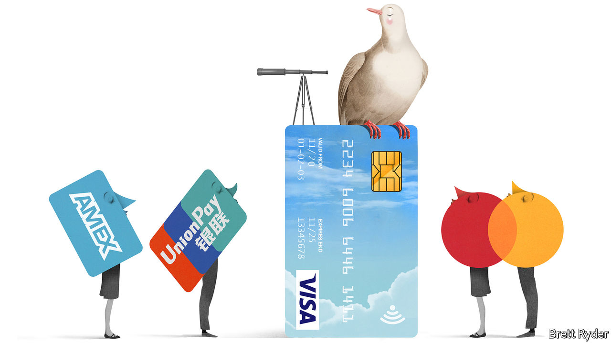

## Schumpeter

# How Visa became the top dog in global finance

> It has overtaken JPMorgan Chase to become the world’s most valuable financial-services firm

> Mar 21st 2020

TOP DOGS in finance used to be big banks with trillion-dollar balance-sheets. No longer. Earlier this month Visa, a humble payments processor, became the world’s most valuable financial-services company. The ongoing stockmarket rout has dragged Visa’s share price down, with analysts cutting forecast revenues from transaction fees, as the coronavirus forces self-isolating consumers around the world into a shopping hiatus. But it has suffered less than erstwhile title-holders like JPMorgan Chase. That investors view Visa as more resilient than Wall Street is perhaps more revealing even than its still eye-popping $291bn market capitalisation. How did a mere cog in the system end up here?

Ask Visa’s bosses and they crow about their firm’s tech and marketing nous. That is a part of it. But the deeper reason for Visa’s success is more prosaic. Being the biggest player in a deeply entrenched payments oligopoly turns out to be fabulously lucrative.

Many casual observers often confuse Visa for a lender that extends credit to people who spend using credit cards adorned with its logo. What it actually does is co-ordinate a complex web of intermediaries that stand between buyers and sellers. The American firm now connects more than 61m merchants to 3.4bn Visa-branded cards, nearly one for every two people on Earth, issued mostly by banks. It takes a small cut for making those connections. Given their volume—nearly $9trn last year, equivalent to over a tenth of global GDP—the commissions add up. Before covid-19 Visa’s revenues grew by around 10% a year, reaching $23bn in 2019.

Banks used to keep all the fees for themselves. Over 10,000 of them collectively owned Visa until it was spun out in 2008. Since then they have watched with envy as Visa’s profits have swelled 15-fold. Some of this is the result of global expansion and so higher revenues. Visa may not be literally “everywhere you want to be”, but it is close. It claims to be present in more than 200 countries and territories. Better yet, operating margins have swollen over the past 12 years—from a rich 43% to a heart-stopping 65%. Of the world’s 100 biggest listed firms by market value, last year only a state-run Chinese booze giant and Saudi Aramco, an oil colossus, had higher margins. Even the juicy 20-25% levels of technology darlings like Apple and Alphabet are meagre by comparison.

Because adding more capacity to Visa’s payments network is cheap, its costs have grown far more slowly than revenues in the past decade. Visa can thus get away with charging more for its services—sometimes considerably more—than its marginal cost of providing them. The windfall profits are funnelled to Visa’s shareholders, whose returns (including dividends) have averaged 24% a year since 2008. Investors, who value the firm at nearly 30 times its most recent annual earnings, against less than ten times for fellow finance firms in the S&P 500 index, clearly believe no competitor will challenge its dominance any time soon.

Visa is not entirely competition-free. Americans still write cheques and the Japanese love their cash. Local schemes nibble at its heels in individual markets—and Mastercard, its only global rival of note, does so just about everywhere. But cheques and banknotes are in decline. Rival incumbents are geographically limited, smaller, or both. And consumers will not sign up to an upstart system before merchants adopt it—which merchants won’t do until it has been embraced by a critical mass of customers. This chicken-and-egg problem is particularly hard to overcome.

Hard, but not impossible. In the longer term Visa faces three threats. First, authorities fed up with it and Mastercard are setting up national lookalikes. China already has UnionPay. Places like Russia, Australia and the EU want payment rails they can control. They could use regulations, including on consumer data, to weaken the duopoly. Competition watchdogs worldwide have gone after both firms, forcing large settlements. Europe and America have capped the fees that payment processors can levy.

Some countries are exploring alternative tracks. Bank-to-bank transfers, which used to take days, are now instant in many places (though not, inexplicably, in America). Thanks to smartphones, interbank pipes could be used to funnel money from consumers’ accounts directly to those of sellers, bypassing Visa’s systems and fees. Such plumbing has caught on in places like Sweden and India. But it is limited to one country, whereas Visa and Mastercard work globally. And uptake has been slow; Britain has had instant transfers for a decade but few shoppers or shopkeepers have noticed. All eyes are on America, with its vast home market. The Federal Reserve wants such a system to be up and running by 2024.

The last threat looms in cyberspace. So far, “fintech” payments startups like Square or Stripe shunt transactions onto Visa’s rails rather than offer a new set of tracks. Apple Pay and Google Pay are little more than a plastic-less way to store your Visa and Mastercard. Facebook’s more ambitious attempt to mint a digital currency, called Libra, has stalled. But Silicon Valley’s vast user base could in principle get around the chicken-and-egg problem, as China shows. Tencent and Alibaba used a huge social-media platform and an online emporium, respectively, to bootstrap payments systems. Amazon could do the same, especially now that Visa has said it would start charging the e-commerce giant higher card fees in its American online stores.

Visa still has plenty of transactions to chase. At a time of social distancing, contactless payments and online shopping look more appealing than filthy banknotes or crowded supermarkets. Banks continue to tolerate it, not least because they receive the bulk of the fees merchants are charged for every Visa transaction. Its revenues of about $7 per card a year are not enough to spark consumer outrage. And it works; its systems are down just 0.001% of the time. Until a rival emerges that is literally everywhere consumers want to be, Visa will be hard to dislodge from its cosy perch.■