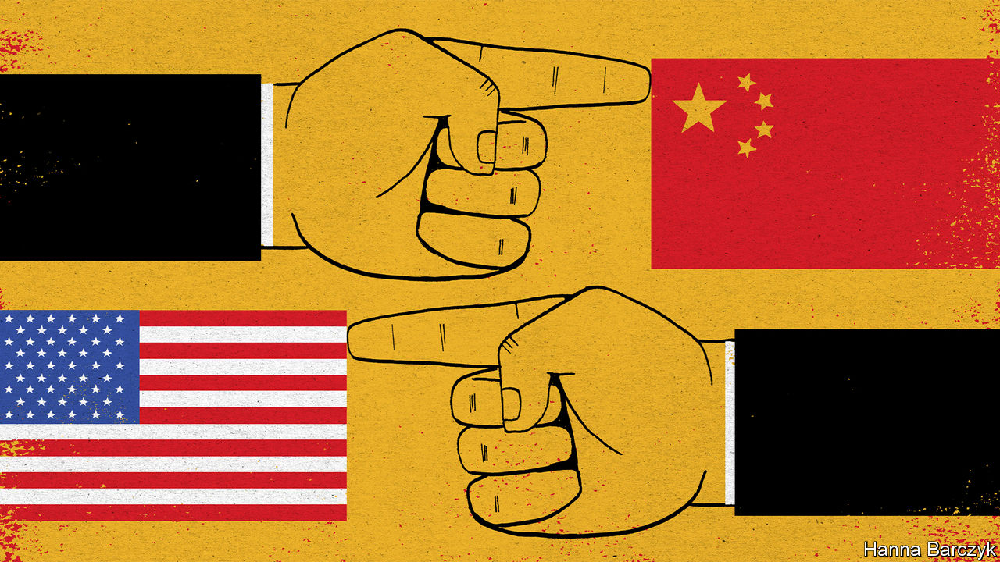

## The blame game

# Amid the pandemic, Sino-American relations are worsening

> China’s mass expulsion of American journalists is an alarming escalation

> Mar 21st 2020

Editor’s note: The Economist is making some of its most important coverage of the covid-19 pandemic freely available to readers of The Economist Today, our daily newsletter. To receive it, register [here](https://www.economist.com/https://my.economist.com/user#newsletter). 

A CRIPPLING PANDEMIC would seem to be an occasion for the world’s two biggest economies to set aside differences and work together. Instead relations between America and China are nearing their darkest point since the crushing of the Tiananmen Square protests in 1989. Amid the crisis, the two countries are engaged in bitter name-calling and tit-for-tat struggles.

Some Chinese officials have been promoting a conspiracy theory that the American army brought covid-19 to China. President Donald Trump, meanwhile, has taken to calling SARS-CoV-2 the “Chinese virus”. One reason why he might wish to emphasise where the virus originated is that curbing travel from China was one of the few actions he took swiftly to fight it. More cynically still, Mr Trump is once again stoking a distracting media debate about his choice of words—whether he is being racist, as critics charge, or standing up for America by telling the truth. That is far more comfortable terrain than examining why he downplayed the virus for weeks.

On March 18th Sino-American feuding intensified. China announced the expulsions of almost all American citizens—about a dozen people—working in mainland China for the New York Times, the Washington Post and the Wall Street Journal. It was the biggest mass expulsion of Western journalists from China since Mao Zedong seized power in 1949.

The sparring has escalated quickly. Early in January China ignored requests for access to Wuhan by American disease-control experts who wanted to assess the early stages of the outbreak. It was furious when, later in January, Mr Trump barred non-American visitors from China. Now that the epidemic has waned, at least temporarily, in China, officials there are trumpeting their resolute handling of it, in contrast with America’s fumbling—a victory for one-party rule, they suggest.

The relationship between the two great powers is far worse than during the presidencies of Barack Obama and Hu Jintao less than a decade ago. At that time there was also much distrust, but the two leaders co-operated on some vital issues, such as climate change and the global financial crisis.

Under Mr Trump and China’s current leader, Xi Jinping, there has been no such detente. Mr Trump has packed his administration with China hawks, withdrawn from the Paris climate accord which Mr Obama and Mr Xi had signed, launched a trade war, hunted for Chinese spies in America and lobbied allies around the world to bar Huawei, a Chinese firm, from their 5G networks. Mr Xi in turn has pursued an increasingly aggressive foreign policy and intensified repression at home.

In January, as covid-19 began to spread beyond China’s borders, the two countries at least managed to suspend their trade war. But tensions have persisted in many other areas. The trading of blows over journalists has been straight from the cold-war playbook. On February 18th the Trump administration designated five Chinese media organisations as “foreign missions” of the Chinese government. The next day China announced the expulsions of three Wall Street Journal reporters, ostensibly as punishment for a headline in the newspaper calling China the “real sick man of Asia”. America then imposed a cap of 100 on Chinese nationals working for those five media: Xinhua, CGTN, China Daily, China Radio International and the distribution arm of People’s Daily. That meant, in effect, the expulsion of 60 people.

China’s response will have a far bigger impact on journalism, stripping the foreign press corps in China of many of its best correspondents. It will also worry many people in Hong Kong, where anger over Chinese interference has triggered frequent protests in recent months. China says the expelled reporters are barred from working there too. This scraps a convention under Chinese rule that foreign reporters, even if shut out of the mainland, can still work in Hong Kong. The central government has, in effect, made it clear that its rules for managing foreign journalists will take precedence over Hong Kong’s far freer system.

In recent years Chinese officials have been confrontational with many Western countries, but more cautious with America. That era may be over. The harshness of China’s retaliation suggests that its leaders are becoming more willing to risk open hostility with the United States.

China’s insinuations over the origin of covid-19 are a sign of this change. For weeks fanciful theories had been circulating online in China and in Chinese media that the coronavirus was an American bioweapon, produced by the CIA or the US Army and released in Wuhan in October, when the city hosted the Military World Games. On March 12th Zhao Lijian, a spokesman for China’s foreign ministry, stepped in on Twitter, where he now has more than 400,000 followers. “It might be US army who brought the epidemic to Wuhan,” he tweeted. “Be transparent! Make public your data! US owe us an explanation!” Other Chinese diplomats have joined in spreading the rumour. Some American officials have also floated a baseless idea that covid-19 emerged from a research lab in Wuhan.

Mr Trump said China’s conspiracy theory was one reason why he would keep calling SARS-CoV-2 the “Chinese virus”. He dismissed a reporter’s suggestion that this might be racist. But his language seems likely to stoke racism, including among his own staff. On March 17th a Chinese-born American television reporter tweeted that a White House official had called the virus “Kung Flu” to her face.

For now the swapping of insults may appear infantile. But as the epidemic worsens, so too will the scapegoating. If far larger numbers die, perceptions in China and America of who is to blame will have profound consequences for a relationship that is already looking scarily frayed. ■

Dig deeper:For our latest coverage of the covid-19 pandemic, register for The Economist Today, our daily [newsletter](https://www.economist.com/https://my.economist.com/user#newsletter), or visit [our coronavirus hub](https://www.economist.com//coronavirus)