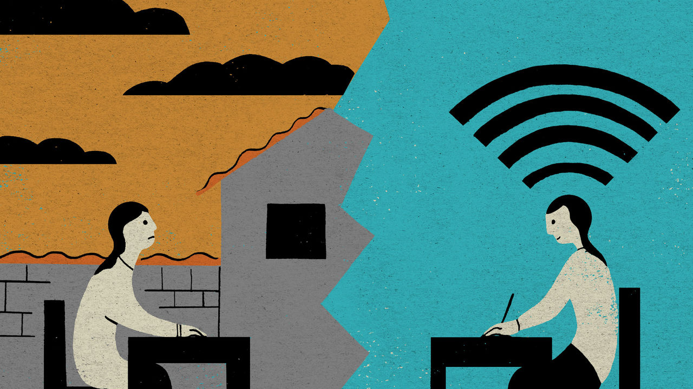

## Chaguan

# How the virus kills dreams for Chinese teens

> By disrupting exams, it could shatter chances of social advancement

> Mar 21st 2020

Editor’s note: The Economist is making some of its most important coverage of the covid-19 pandemic freely available to readers of The Economist Today, our daily newsletter. To receive it, register [here](https://www.economist.com//newslettersignup). For more coverage, see our coronavirus [hub](https://www.economist.com//coronavirus)

AS A TEENAGE schoolgirl, Tang Sisi has mixed feelings about the snowstorm that hit her village in the poor western province of Gansu on March 16th. On the downside, the snow burned out the village’s electrical transformer, cutting her access to online classes that have replaced normal lessons since covid-19 closed schools across China weeks ago. On the upside, when the internet dropped just after Chinese class, Sisi’s first lesson of the day, she could abandon her usual place of study—a rough wooden chair and desk in an outdoor courtyard, placed to catch the signal from a neighbour’s Wi-Fi—and shelter from the storm.

Sisi, whose father is a village official and whose mother is a migrant worker, cannot afford to miss many classes. Like millions of Chinese teenagers she is preparing for an examination for entrance to senior secondary school. It is known as the zhongkao, and sends students down one of two tracks. A vocational track involves three years studying a trade at a technical school. An academic track starts at senior high school and, for the most studious, ends with a four-year degree course at university.

Put bluntly, those who do well at the zhongkao have a shot at becoming doctors, bank managers, government officials or teachers—Sisi’s own ambition is to teach English. Teenagers who do badly must either enter the labour market or study for vocational diplomas of varying quality. The zhongkao may not be as famous as the gaokao, the terrifying university entrance exam that has inspired books, documentaries and feature films. But the zhongkao shapes more lives. In one sign of the exam’s hold on parental imaginations, Chinese social media erupted in heated debate when Hubei province, seat of the virus outbreak, announced that the children of medical workers would be granted ten bonus points on their zhongkao scores.

The idea that clever, hard-working villagers can make it to the best schools is not just an interesting question of public policy. It is a pillar of China’s social contract, with roots in ancient tales of poor students transformed into powerful scholar-officials by brilliance at exams. In modern-day China, a harshly unequal country, education remains an unrivalled ladder of social mobility. Even in a good year, success in the zhongkao is a hard ladder-rung to grasp. As a matter of stated government policy, the test is designed to send roughly half of all students into vocational training, an outcome widely seen—fairly or not—as failure. In 2018 just under 8m teenagers were admitted to academic senior high schools. They represented 58% of all students who completed nine years of compulsory, free education that year. With schools still closed in most of China by covid-19, this is not a good year.

The coronavirus will leave many scars on China. Some of the longest-lasting, but hardest to see, may involve months of schooling missed by vulnerable students, who risk doing worse in the zhongkao than they could have done if face-to-face classes had not been disrupted. In painful contrast, affluent teenagers with good computers, fast internet and private tutors may overperform.

Sisi turned 15 on March 19th and normally attends boarding school in a town an hour from her home. She described her life in an interview conducted over the internet because Chaguan is spending 14 days inside his flat in Beijing, behind a front door bearing a government notice inviting neighbours to monitor his quarantine after a family member returned from abroad.

She has some reasons for hope. Sisi has diligence on her side. Ranked 20th in her class of 52, she reports that “this morning for our English class, only 30 or so students signed in.” Her father installed an internet connection this week, allowing her to study indoors from now on. Sisi is under less time-pressure than students a year older than her. She is in the first of two school years that end in zhongkao tests. This June, assuming the exam is not delayed, she is taking two subjects, with the rest to follow in a year.

More alarmingly, however, Sisi finds online classes hard to follow. “Sometimes I come across things I don’t know in homework and there’s nobody to ask,” she worries in a quiet voice. Some teachers move through lessons too fast, she adds. When unable to take notes in time, she takes screenshots on her phone then tries to make sense of the material later.

A veteran middle-school teacher from Xiamen, reached by telephone, fears that virus-imposed distance learning will hit certain students hard. She worries about those without parents at home to police them, and those—mostly boys, she says sadly—going “through a rebellious age” who don’t see the point of study.

Better-off parents can buy help from such services as Fudaojun, an app which offers one-on-one tuition by experienced teachers, at a typical cost of 150 yuan ($21) for 40 minutes. The app has seen orders from zhongkao students jump by 72% since last year. One of its tutors, a chemistry teacher from the southern province of Guangdong, explains how the zhongkao controls access to elite schools with the teachers and resources that help students to reach good universities, and thus prestigious jobs. That makes a bad zhongkao result a grave blow. “If you’re already losing at the starting line, the gap to catch up is huge,” she says.

Because the epidemic broke out during the spring-festival holidays, easy-going students “still feel they’re on winter break, they haven’t quite shifted their mindset,” worries the chemistry teacher. Nonetheless, one of her tutorial students, a boy with bad school grades, is experiencing a useful culture shock. “Now his mum is home full time, she doesn’t allow him to go out and has set very specific times for study and homework. He’s already doing much better.” That is both a cheering tale and worrying. If good schools promote equal opportunities, closed schools play up accidents of birth. In exam-obsessed China covid-19 is going to break a lot of young dreams. ■

Dig deeper:For our latest coverage of the covid-19 pandemic, register for The Economist Today, our daily [newsletter](https://www.economist.com//newslettersignup), or visit our [coronavirus hub](https://www.economist.com//coronavirus)

## URL

https://www.economist.com/china/2020/03/21/how-the-virus-kills-dreams-for-chinese-teens
