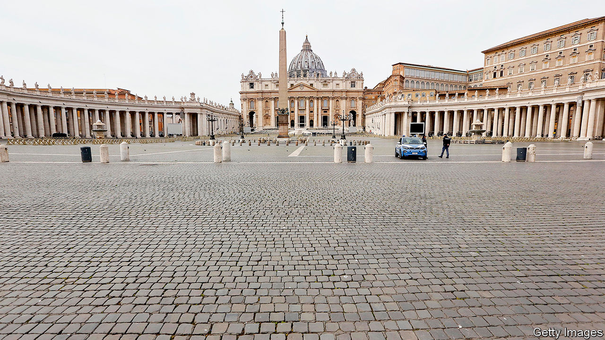
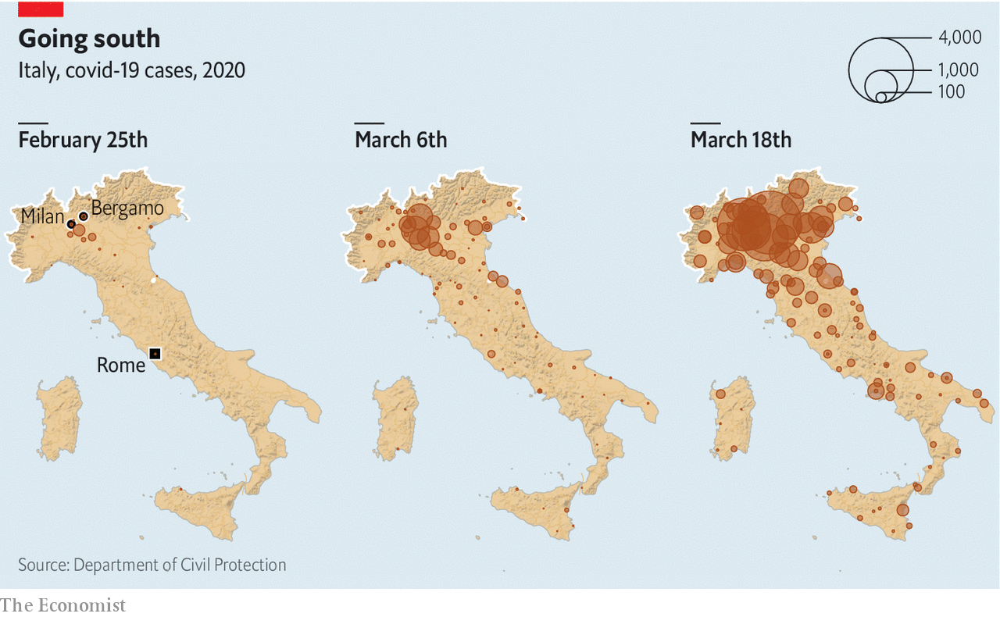

## A gathering catastrophe

# Italy is overtaking China as the country worst-hit by covid-19

> The government is scrambling to meet the challenge

> Mar 19th 2020ROME

Editor’s note: The Economist is making some of its most important coverage of the covid-19 pandemic freely available to readers of The Economist Today, our daily newsletter. To receive it, register [here](https://www.economist.com//newslettersignup). For more coverage, see our coronavirus [hub](https://www.economist.com//coronavirus)

GIULIO GALLERA, a Milanese corporate lawyer from Silvio Berlusconi’s Forza Italia party, is health minister in the regional government of Lombardy. “We are working hour by hour,” he said on March 17th. “Yesterday, we were almost [down] to zero beds in intensive care.” What were lacking were ventilators to go with the other equipment. But then the Red Cross offered 30. “When, at 10pm, the news came through of those 30 ventilators, I almost wept,” said Mr Gallera.

Nowhere is Italy’s race against time more dramatically evident than in Lombardy, the region around Milan and the one worst hit by the spread of covid-19. In the city of Bergamo, the virus has overwhelmed the local health system. Doctors have been taking life-and-death decisions since last month, deciding which patients should be put on the available ventilators. It is hoped that a vast makeshift intensive-care unit being assembled at the Milan exhibition centre will supply the capacity Lombardy needs to cope with relentlessly growing demand. Mr Berlusconi has personally donated €10m ($11m) to the project.

By March 18th the number of people in Lombardy who have tested positive had grown to 17,713, almost half the national total. Of these, 1,959 had died and 924 were in intensive care.

The next few days will be crucial in showing whether draconian containment measures ordered by the central government (see [Briefing](https://www.economist.com//briefing/2020/03/19/in-europe-and-around-the-world-governments-are-getting-tougher)) will begin to slow the spread of the virus in northern Italy and mitigate its effects on the rest of the country, where it could speedily overwhelm health services far weaker than that of prosperous Lombardy. It is grimly predictable that Italy’s death toll of 2,978 when The Economist went to press will soon pass China’s to become the highest in the world.

In Lombardy, the number of new daily cases is still growing, but as a share of the total existing cases the number is starting to fall. By March 18th it was down to 9.2%. Three days earlier, the governor, Attilio Fontana, noted the change. “Let’s hope it is the start of a trend reversal,” he said. But he added: “I am saying it in a whisper.”

Nationally, the percentage increases have also been dropping. But the latest figures showed an uptick, from 12.6% to 13.4%, as the virus spread out to other regions north and south of Lombardy. The absolute numbers, which are what matter to the country’s regional health services, keep rising alarmingly.

So far the south has had fewer than 5% of cases. But tens of thousands of people have fled from the north as the virus spread. The worry is that some are asymptomatic carriers and that the next few days could see the tally of infections soar in the Mezzogiorno, where people have been less scrupulous in respecting the lockdown.

The extent and duration of the epidemic will also determine its impact on a weak economy. Francesco Daveri, who teaches macroeconomics at Bocconi University in Milan, says much depends on when the country returns to normal. If it is in June, he conjectures that the fall in GDP for 2020 could be 2-3%—substantially less than the 5.5% fall in 2009 after the financial crisis. That is a big “if”, though.

On March 16th Giuseppe Conte’s government, a coalition of the centre-left Democratic Party (PD) and the anti-establishment Five Star Movement (M5S), unveiled an emergency budget worth €25bn ($27bn). It includes €10bn of support for incomes and employment, such as a payment in March of €600 for non-salaried workers and a two-month freeze on lay-offs. Other measures include loan guarantees and a moratorium on loan repayments for small and medium-sized companies. “But, almost certainly, a second raft of measures will be needed, targeted more selectively at the sectors that have suffered most,” says Mr Daveri.

The emergency budget marked the second time Mr Conte had trumped his critics, notably in the hard-right Northern League, by providing more than they had demanded (the first time was when he applied stiffer containment measures across the entire country). As before, he waited to show it was he, not they, who was in control. His canny tactics are paying off: the most recent poll found 62% of voters endorsed his government’s handling of the epidemic.

One exception is the League’s leader, Matteo Salvini. He has kept up a barrage of criticism, despite evidence that Italians want their politicians to mute their differences until the crisis is over. On March 16th he was embarrassed by a photograph showing him and his girlfriend strolling through Rome, ignoring the government’s insistence that people keep a metre apart and possibly its requirement that they have a valid reason for leaving home. Mr Salvini said he was shopping for necessities. “This is surely not his moment,” says Sofia Ventura, a professor of political science at the University of Bologna.

It is less obvious that in the longer term the epidemic will undermine the nationalist populism of which Mr Salvini is Italy’s (and arguably Europe’s) most prominent champion. True, it has swept away the disdain for experts that is a core populist trait. Never have Italians been keener to listen to their virologists and epidemiologists or more respectful of their health workers. But contempt for science is more characteristic of the M5s, and the crisis may yet lend credibility to the League’s causes, including its antipathy to globalisation and its Euroscepticism. Already shocked by their neighbours’ refusal to allow the export of protective equipment, Italians were appalled when on March 12th the European Central Bank governor, Christine Lagarde, appeared to rule out steps to protect Italy from the effects of additional borrowing, though she later changed tack, and the bank introduced a large new bond-buying scheme on March 18th.

“When Europe has been in need, Italy has always given,” Mr Salvini railed in one of his many tweets. “Now that we are asking for help, all the [other] countries are starting to close their frontiers.” It is an oversimplification, but one that will strike a chord with many Italians. ■

Dig deeper:For our latest coverage of the covid-19 pandemic, register for The Economist Today, our daily [newsletter](https://www.economist.com//newslettersignup), or visit our [coronavirus hub](https://www.economist.com//coronavirus)

## URL

https://www.economist.com/europe/2020/03/19/italy-is-overtaking-china-as-the-country-worst-hit-by-covid-19
