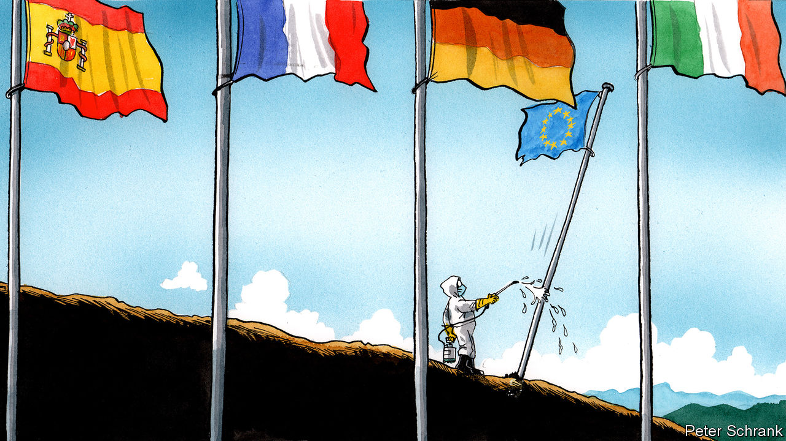

## Charlemagne

# More Europe or less?

> The EU must move closer together—or let states save themselves

> Mar 21st 2020

Editor’s note: The Economist is making some of its most important coverage of the covid-19 pandemic freely available to readers of The Economist Today, our daily newsletter. To receive it, register [here](https://www.economist.com//newslettersignup). For more coverage, see our coronavirus [hub](https://www.economist.com//coronavirus)

“MORE EUROPE” is the invariable mantra for the European Union’s most devout believers. The president of the European Commission, Ursula von der Leyen, is particularly fond of the phrase, usually as a solution to the pressing geopolitical questions of the day. The answer to a rising China? More Europe. A response to a wayward Washington? More Europe. “The world is calling for more Europe,” declared Mrs von der Leyen after her selection last summer. “The world needs more Europe.”

Faced with the covid-19 pandemic, however, the commission has so far opted for a different tactic: less Europe. It has focused on getting the EU out of the way of national governments. Fiscal rules are being quietly abandoned, allowing national governments to spend heroic amounts to allay the crisis. State-aid rules, which stop governments from flooding pet businesses with cash, are being loosened. Some €37bn ($41bn) of funds earmarked for the structural projects that make up the humdrum daily business of the EU budget can be spent on keeping people alive instead.

From one perspective, covid-19 torpedoes the logic of “more Europe”. At its heart was a belief that a body like the EU is the only means of survival in a globalised world. In comparison, the bog-standard nation-state—developed to fend off the miserable Hobbesian state of nature—seems dated and almost vulgar. A pandemic, however, is a nasty blast from this ugly past. The EU evolved to deal with a post-modern world, where borders blurred and markets ruled. Pandemics are a pre-modern problem, best solved by the tool that brought order to a brutish world: the modern state.

Keeping people safe is, after all, a state’s primary concern. Health is the purview of national governments, according to the EU’s treaties. Previous European crises festered in the cracks between national and EU responsibility. Monetary union without a fiscal union left a wound that turned gangrenous. Introducing a passport-free Schengen zone without a functioning European asylum system was another example of half-baked federalism. Often, Brussels is left with responsibility for a topic but not the power to do anything. In this case, responsibility is clear. The actions of national governments will determine how many live or die. Complaining that the EU is failing to help on health matters is akin to buying a cat and moaning when it will not fetch a stick.

When not pursuing “less Europe”, the EU can be most efficient by maintaining the same amount of Europe. Each country will simultaneously face colossal strains on its health service. A functioning single market can churn out medical equipment more efficiently than states going every man for themselves. Yet already accusations of hoarding are flying, while traffic jams build up on intra-EU frontiers after panicky border closures. If goods disappear and markets collapse in a crisis, then old-fashioned autarky starts to appeal and the allure of the EU’s slick trading system fades. Keeping national governments from actively working against one another would be triumph enough for Brussels.

For the optimists, however, this is a perfect moment for the “more Europe” mantra. So-called coronabonds would allow struggling euro-zone states to fund themselves with debt guaranteed by the bloc as a whole. Such an idea is often floated as a cure for the euro-zone’s ills. Countries such as Italy, whose borrowing costs have shot up, love the idea; those who would probably end up paying, such as the Netherlands and Germany, have historically been far less keen. Attitudes could shift. A pandemic comes without the moral baggage of borrowing and the caricatures of feckless Italians running up debts. It is a natural disaster, endured by all.

The European Central Bank, based in Frankfurt, has now done its bit for “more Europe”. It launched a €750bn bond-buying programme late on 18th March. Unlike with earlier schemes from the central bank, Greece’s debt, previously excluded, will be eligible for purchase. After bungling her initial response to the crisis, ECB chief Christine Lagarde issued a belated guarantee: “There are no limits to our commitment to the euro.” The statement was a homage to the mantra of her predecessor, Mario Draghi, who said he would do “whatever it takes” to save the euro.

Yet not all EU leaders are as happy to seize the “more Europe” moment. Some are chomping at the bit. The French president, Emmanuel Macron, applauded the ECB and called for “greater financial solidarity” in the euro zone. Other leaders were muted. In meetings behind closed doors, EU leaders agreed to stick with the “whatever it takes” formulations beloved by the ECB but have offered few actions to back up the words. At the moment, the phrase is used in the same way children say “open sesame!”. Monetary policy is only one half of the solution. A co-ordinated fiscal response at a European level is still necessary for leaders to dig themselves out. It is not guaranteed to happen.

If European leaders spurn “more Europe” on the fiscal level, then at least they should remove the manacles that fetter Leviathan. Shackling the state was not some Lilliputian scheme by small-minded bureaucrats. The EU has reined in the worst impulses of national governments, first in the name of peace, by binding economies so closely together that war was impossible; then, with the aim of prosperity, by stopping them running huge deficits or pouring mad amounts of money into airlines because they have the national flag on the tail-fin. Deficits and bungs are petty concerns in the face of mass death. The state must be unbound.

Covid-19 will offer the most brutal test not of the EU but of Europe’s member-states. Without the EU finally binding itself together fiscally, it will be left to individual states to write the cheques that stop their economies choking. It will be states that deal with the sick. It will be states that take the blame from the bereaved. “More Europe” offers a tantalising solution to the EU’s latest crisis. But “less Europe” must also have its role. ■

Dig deeper:For our latest coverage of the covid-19 pandemic, register for The Economist Today, our daily [newsletter](https://www.economist.com//newslettersignup), or visit our [coronavirus hub](https://www.economist.com//coronavirus)