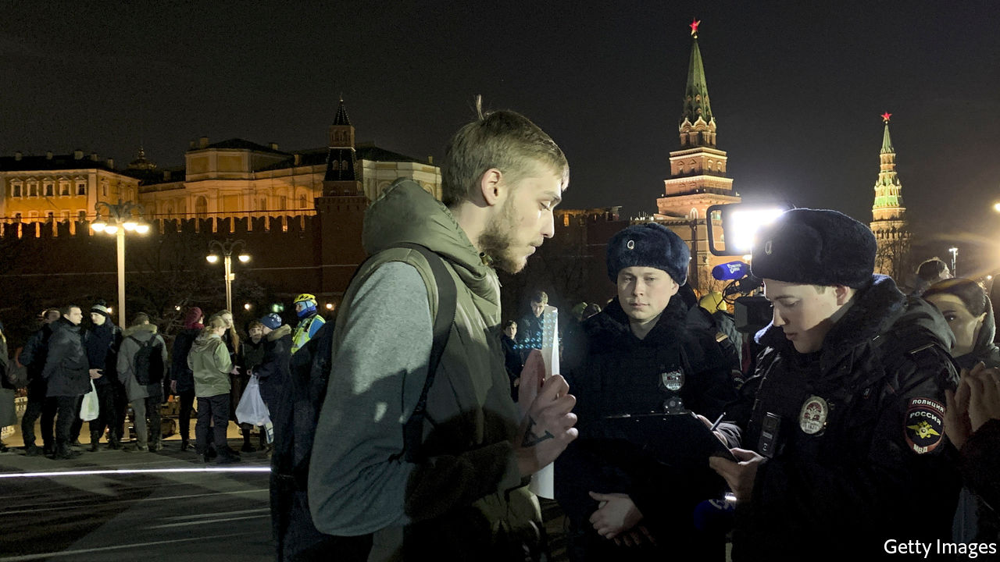

## Another president for life

# Some Russians are resisting Putin’s power grab

> His new constitution recalls the Soviet Union

> Mar 21st 2020

THE WORLD might be heading into its biggest crisis since the second world war, Russians may be sweeping the shelves of supermarkets clean, but Vladimir Putin knows his priorities. On March 17th he decreed that his country must hold an “all-people vote” on a constitutional change designed to keep himself in power indefinitely. “Against the background of the pandemic, Putin’s decision seems criminal,” tweeted Alexei Navalny, Russia’s most prominent opposition figure.

Mr Putin later said the vote could be postponed if need be, but for now it is to be held on April 22nd—the birthday of Vladimir Lenin. It is as meaningless as were elections in the Soviet Union. The amendments that give the president vast powers and reset the clock on his term limits have already been signed into law by Mr Putin and approved by a pliant Constitutional Court. Ekaterina Schulmann, a political scientist, said on Facebook about the court that “rarely has the spirit of slavery and intellectual cowardice revealed itself so fully in a written text.”

The spectacle of a “people’s approval” is likely to stretch over several days, requires no minimum turnout or independent verification and will include home and electronic voting. “Putin was too scared to hold a proper referendum so he came up with this fake procedure,” says Mr Navalny. “The Kremlin is desperate to draw us into it, count us up and then declare victory,” he adds. He has refused to participate in it. On March 15th a group of 350 lawyers, intellectuals and journalists signed an open letter warning of a constitutional coup that threatens to plunge the country into a national conflict. Three days later the number of signatures had swelled to 30,000.

Even Mr Putin’s loyalists feel deceived. “Lying to foreigners is one thing. Lying to his own people is quite another,” one former military officer says. The growing fear of a covid-19 outbreak in Russia, where the number of cases has been suspiciously low, and Mr Putin’s insistence on sticking with the vote, despite his government’s decision to close borders and schools, could exacerbate that anger. Many people remember the Kremlin lying about the scale of the Chernobyl nuclear disaster in 1986. Mr Putin’s amended constitution proclaims today’s Russia to be the heir to the Soviet Union, whose falsehood-filled propaganda rag was called, simply: “Truth”. ■