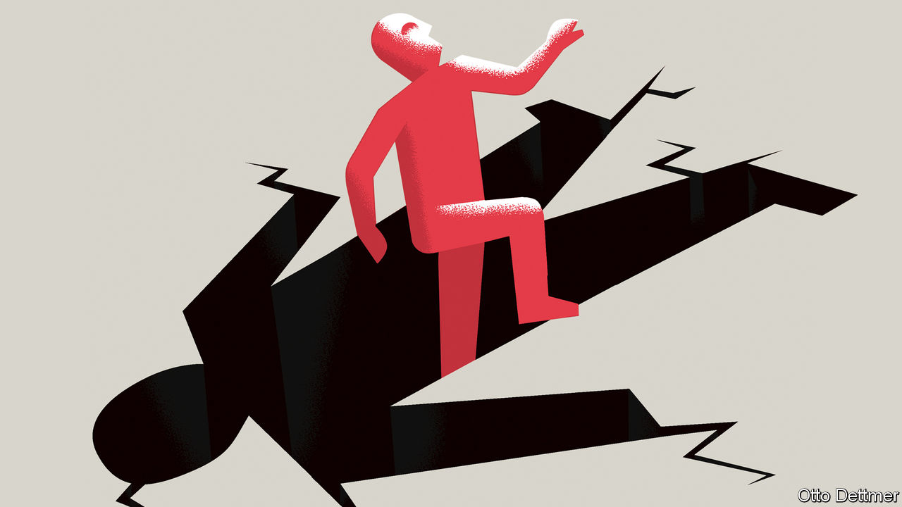
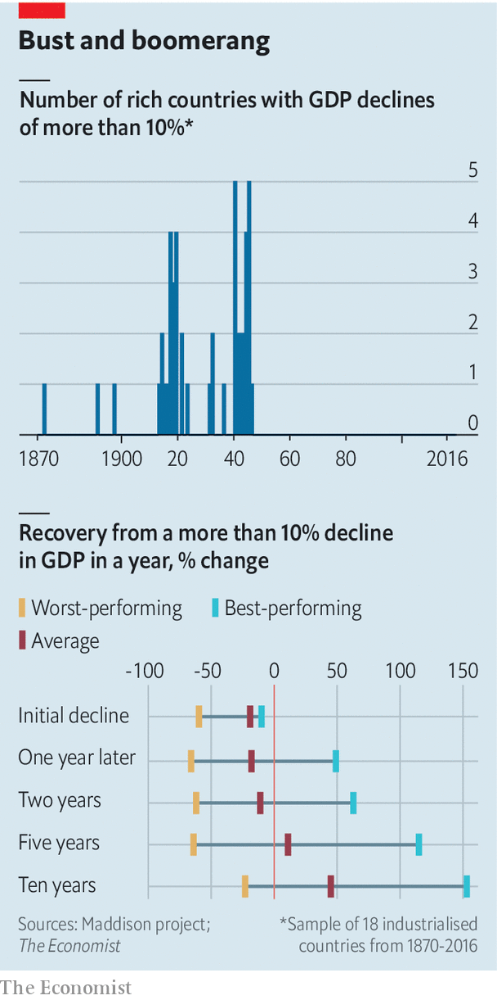

## Free exchange

# Economies can rebound quickly from massive GDP slumps—but not always

> History suggests full recovery takes, on average, about five years

> Mar 19th 2020

Editor’s note: The Economist is making some of its most important coverage of the covid-19 pandemic freely available to readers of The Economist Today, our daily newsletter. To receive it, register [here](https://www.economist.com//newslettersignup). For more coverage, see our coronavirus [hub](https://www.economist.com//coronavirus)

IT WILL BE some time—years most likely—before the full extent of the economic blow from covid-19 can be estimated with any confidence. As ever more of the global economy enters a prolonged shutdown, it seems increasingly clear that the world is facing a drop in output unprecedented in its breadth and intensity. Some analysts see in the growing economic disruptions and market panic the first stirrings of an economic collapse more serious than the global financial crisis of 2007-09. Joachim Fels, an economist at PIMCO, an investment fund, recently warned that in the absence of sufficiently aggressive action from governments the world could face a market meltdown and ensuing depression. All downturns create discomfort, but the pain of a slump—even a very steep one—depends greatly on how long it lasts. History suggests that rapid rebounds from enormous output losses are possible, but not by any means guaranteed.

Some economies, perhaps those of Singapore or even South Korea, could find a footing by the second half of the year, sufficient to offset some of the production lost during the first half. But the probability that others could experience extreme declines in GDP in 2020—perhaps as large as 10%—grows by the day. Falls of that magnitude are not especially unusual in developing economies, where growth is highly volatile. (To take just one example, there have been ten years since 1980 in which real GDP in Libya has fallen by at least 10%, between which plunges the economy has experienced annual growth spurts of as much as 125%.) In industrialised countries swings of that scale are exceedingly rare. An analysis of data gathered by the World Bank reveals that since 1960, across rich countries, there have been only 13 instances in which an economy experienced an annual decline in GDP of at least 5%, only three cases in which output fell by at least 7% in one year (Finland in 2009, and Greece in 2011 and 2012), and none in which output dropped by more than 10%. In the rich world, clusters of large decreases in GDP appear on the heels of the 1973 oil crisis, during the Asian financial crisis of 1997-98, and as part of the global financial crisis and its aftermath.

A longer perspective reinforces the rarity of such events. Economic historians at the University of Groningen, in the Netherlands, maintain a cross-country set of GDP data stretching far into the past. Since 1870, across 18 industrialised economies, there have been only 47 instances in which a country experienced an annual decline in output of more than 10%. Most are associated with world wars and the Depression; of the 47 large output declines, 42 occurred between 1914 and 1945 (see left-hand chart).

How do countries fare after suffering such economic blows? Recoveries are occasionally quite rapid. At the end of the world wars, a few economies experienced near-immediate bursts of growth—partly, but not always, because of rebuilding. The beleaguered Italian economy grew by about 35% in 1946. By 1949 it had already recovered all the ground it lost during the war and then some. The German economy shrank by a staggering 66% from 1944 to 1946, then grew at an annual average rate of 12% over the subsequent decade. In other cases rebounds are less robust. In 1924 real output in both Germany and Austria remained below the levels before 1914. Across the period from 1870, it took an average of five years for output in countries that experienced declines in GDP of more than 10% to regain their peak (see right-hand chart).

Importantly, this reflects the fact that the main causes of economic contraction—world wars—persisted and disrupted activity for several years. French output fell by more than 10% per year in 1940, 1941, 1942 and 1944, for example. Yet focusing on more recent experience, and on smaller initial output declines of just 5%, does not dramatically change the picture. Among the rich economies which experienced annual drops in GDP of more than 5% since 1960, output took an average of four years to return to its previous level. Again, there are examples of immediate, robust recovery. By 1999, for instance, real GDP in South Korea had already risen well above the peak reached in early 1997, before the Asian financial crisis struck. Recoveries from the global financial crisis, in contrast, have been more sluggish. The Italian economy entered the covid-19 crisis having failed to regain the level of real output it achieved in 2008.

Any lessons from these experiences should be applied to the world’s current situation with care. A dangerous pandemic working its way across a highly integrated global economy is an unprecedented event. Still, a few historical patterns are worth noting. First, and most obviously, the duration of the economic pain depends on how much goes wrong as a result of the initial shock. Germany and Austria fared worse than other first-world-war combatants because they lost the war and their empires, and suffered state collapse and hyperinflation. If countries today can survive massive output declines without sustaining much institutional damage, that bodes well for the pace of recovery.

Second, large drops in output often accompany a fracturing of global trade networks. The success with which those trade ties are restored matters for the robustness of the economic rebound. Western Europe enjoyed explosive growth in the years after the second world war, thanks in part to efforts to knit trade back together—a very different outcome from that following the first. Similarly, the world must hope that trade recovers quickly when the pandemic ebbs.

And third, it is important to get macroeconomic policy right. The global financial crisis, and the euro-area debt woes which followed, did not kill millions of people or destroy valuable infrastructure, but the sluggish recovery that followed left Europe both economically and politically vulnerable to new shocks.

Even the mildest brush with the coronavirus could prove economically destructive if governments are reluctant to provide enough stimulus. The world should be able to bounce back to growth once covid-19 is brought under control. It has only to avoid the errors of history.■

Dig deeper:For our latest coverage of the covid-19 pandemic, register for The Economist Today, our daily [newsletter](https://www.economist.com//newslettersignup), or visit our [coronavirus hub](https://www.economist.com//coronavirus)

## URL

https://www.economist.com/finance-and-economics/2020/03/19/economies-can-rebound-quickly-from-massive-gdp-slumps-but-not-always
