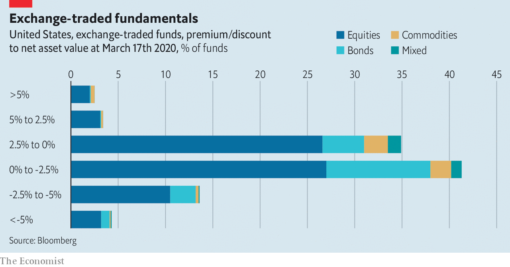

## Two versions of reality

# Exchange-traded fundamentals

> The funds show signs of strain but not panic

> Mar 21st 2020

JEREMIADS HAVE long argued that if some of the $6trn-odd of assets underpinning exchange-traded funds (etfs) are illiquid, then the funds must be too, posing a big risk to their investors. But so far there are signs of strain but not panic. During the current turmoil, some etfs are trading at a discount to their net asset value, often those that have invested in debt. But that may be because they are easy to trade, making them a better gauge of reality than the last recorded price of the underlying securities. ■

## URL

https://www.economist.com/finance-and-economics/2020/03/21/exchange-traded-fundamentals
