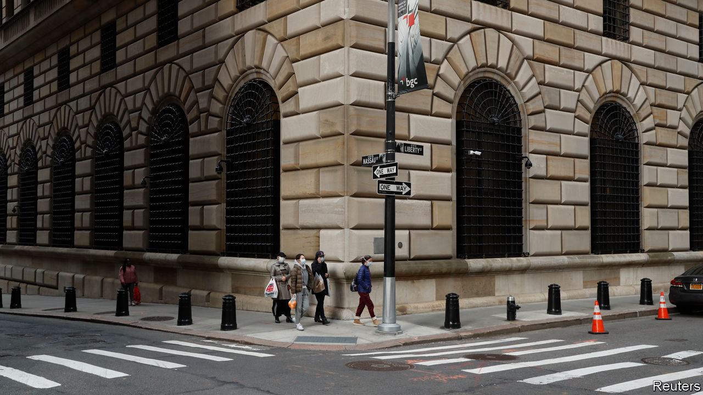
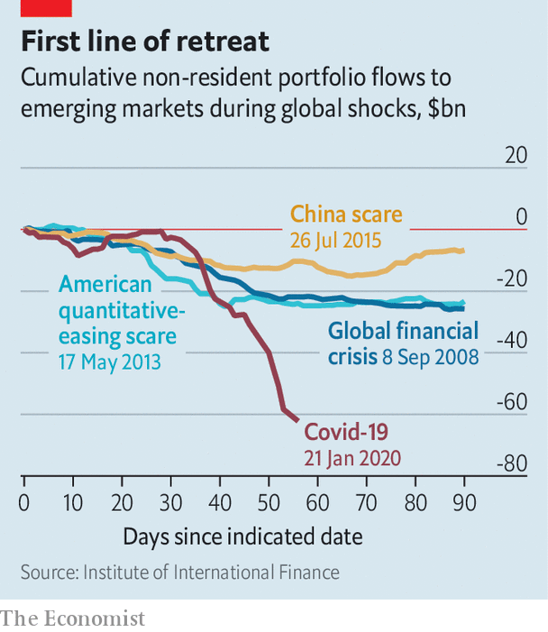

## Multi-coloured swap shop

# The dollar is in high demand, prone to dangerous appreciation

> The Fed does not want to be the world’s central bank

> Mar 21st 2020HONG KONG

AMERICA’S CURRENCY was not always as coveted as it is in today’s troubled times. In the 1960s European central banks had more dollars than they felt comfortable holding. To discourage them from converting their greenbacks into gold, the Federal Reserve introduced its first “swap line” in 1962, allowing foreign central banks to obtain dollars in exchange for their own currency, then swap them back at a later date. Combined with the Fed’s purchases of dollars, the swaps helped protect nervous foreign central banks from the dangers of a dollar devaluation.

The world now faces the opposite problem: a dollar in high demand, prone to dangerous appreciation. It has, unsurprisingly, strengthened against the currencies of emerging markets, which have suffered brutal capital outflows since late January (see chart). But the dollar has, more surprisingly, also strengthened against safe-haven currencies such as the yen and the Swiss franc, and pushed currencies like the pound and the Norwegian krone to their weakest level in decades. On March 18th Bloomberg’s dollar spot index, which measures the greenback against a basket of currencies, hit an all-time high, its seventh consecutive rise. Anyone seeking to swap their yen, francs or euros for dollars (and then swap them back again after a few months) must pay a premium, known as the cross-currency basis, which is deducted from any interest they earn. That premium has risen sharply on several occasions in the past two weeks.

One reason for this scarcity may be the dollar’s global role. Zoltan Pozsar and James Sweeney of Credit Suisse, a bank, have pointed out that supply chains are payment chains in reverse. When the flow of parts, components and assembly is interrupted, so is the flow of payments in the other direction. In East Asia, where the pandemic began, these payments are often made in dollars.

Some hospitals overwhelmed by covid-19 cases have reported a lull before the storm, a period when emergency rooms fall quiet, because people with other ailments are staying away, but the people who cannot breathe have yet to arrive en masse. Something similar befell the dollar funding markets in February. China’s shutdown reduced the need for trade finance, point out Mr Pozsar and Mr Sweeney, removing one source of demand for dollar lending. But as companies’ dollar earnings have dried up, more of them have turned to their banks for help. Companies with pre-arranged credit lines have drawn them down. Large firms that are accustomed to obtaining money directly from the capital markets, through bonds or commercial paper, have also turned to the banks instead.

The banks themselves can turn to the Fed, which can lend them dollars they cannot obtain on their own. But the Fed is less able to help banks that lack a presence in America. Last year non-American banks had $13trn-worth of dollar liabilities, according to calculations by Iñaki Aldasoro and Torsten Ehlers of the Bank for International Settlements. Only 22% of this total was booked with branches or subsidiaries in America. The rest was out of the Fed’s immediate reach.

The Fed can, however, reach out to its fellow central banks. And they, in turn, can help commercial banks within their own bailiwicks. On March 15th the Fed eased the terms of its swap lines with central banks in the euro area, Japan, Britain, Switzerland and Canada. Two days later, the Bank of Japan offered over $30bn in 12-week loans, the largest amount since the 2007-09 global financial crisis. The European Central Bank followed up with $112bn. That narrowed the “basis” that must be paid to obtain dollars through foreign-exchange swaps.

Fed-watchers immediately began wondering if it would expand its swap lines to include prominent emerging markets. There is precedent. The Fed’s first swap line to Mexico dates back to 1967. And in October 2008 it also offered lines to Singapore (which even then was overqualified for the role of emerging market), South Korea and Brazil (the “dodgiest of the lot”, according to Richard Fisher, then president of the Dallas Fed). But Fed officials back then were, and still are today, reluctant to serve as central bank to the world. Transcripts of the October 2008 meeting indicate that several other emerging markets (their identities remain redacted) had already inquired about joining the Fed’s magic circle. “We have done everything we possibly can to discourage” such approaches, said one Fed economist. “We’re not advertising.” ■

## URL

https://www.economist.com/finance-and-economics/2020/03/21/the-dollar-is-in-high-demand-prone-to-dangerous-appreciation
