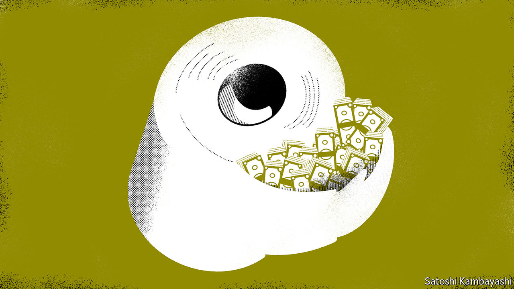
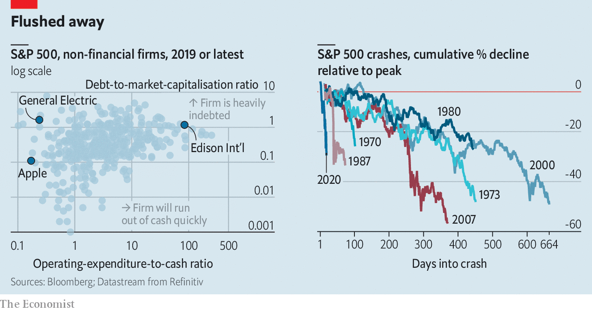
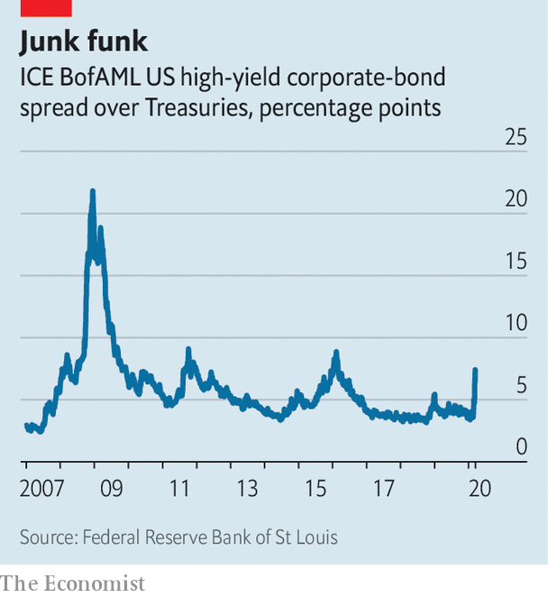

## The cash crisis

# Why America’s financial plumbing has seized up

> Central-bank action is failing to stem the rout

> Mar 21st 2020NEW YORK

Editor’s note: The Economist is making some of its most important coverage of the covid-19 pandemic freely available to readers of The Economist Today, our daily newsletter. To receive it, register [here](https://www.economist.com//newslettersignup). For more coverage, see our coronavirus [hub](https://www.economist.com//coronavirus)

HOUSEHOLDS ARE frantically stocking up on essentials such as loo roll. But in financial markets, the staple that no one can do without in times of stress is cash—the flushing mechanism of the world economy. In theory, it should never dry up; money can be printed. But when firms are desperate for cash it puts a potentially devastating strain on the plumbing of the global financial system. That is why in the past week America’s Federal Reserve has unleashed a huge amount of liquidity. Foreign central banks have joined in. Many face the additional challenge of a strengthening dollar (see [article](https://www.economist.com//finance-and-economics/2020/03/21/the-agonies-of-stock-picking-in-a-falling-market)).

Unlike the 2007-09 financial crisis, when problems in the financial system caused an economic meltdown, the spread of the covid-19 disease has caused a health and economic crisis that has caught banks, financial markets and business in its wake. Big and small firms realise that they are facing— at the least—months of scant revenues, yet still have bills and debts to pay.

Some are better equipped than others (see left-hand chart). The operating expenses (opex), like wages and rent, of all nonbank S&P 500 companies in 2019 amounted to $2.6trn. The same firms held $1.7trn in cash and liquid securities at the end of that year. On average, that was about seven months of opex. But this cash is unevenly distributed. Apple could pay for six years of opex with its $200bn war chest. Many big utilities, such as Edison International, carry only enough cash to cover a week’s worth.

The quickest way for investors, firms and banks to raise cash is to sell liquid assets. Investors moved first. Their priority was to liquidate holdings of risky assets, like stocks and high-yield bonds, and buy safe assets like Treasuries. Markets moved accordingly: the S&P 500 has sold off hard and fast (see right-hand chart) and bond yields rallied. But companies and banks tend to hold their liquid assets in Treasuries. When their need for cash became dire, they dumped even these.

Asset sales help reallocate the stock of existing cash. For every investor selling stocks or bonds to raise cash, there are those willing to take the other side—like Warren Buffett, the fabled “be greedy only when others are fearful” investor, who held $125bn in “dry-powder” at Berkshire Hathaway, his investment firm, at the end of 2019. He has already snapped up shares in Delta, an American airline. But reallocation can only do so much. When all firms face the same economic shock, they need a vast increase in the supply of credit.

Unfortunately, credit is not readily available. Funding strains have emerged across markets globally. In January American firms that issued risky high-yield debt paid around 3.5 percentage points more to issue a bond than the government did. This spread is now above 8 percentage points (see chart 3). But even if firms did want to issue bonds at such rates, they cannot. Corporate debt markets are virtually shut in America and Europe.

If bonds are unavailable, firms turn to banks. Many have credit lines enabling them to borrow whenever they need, up to a certain limit (akin to a credit card). Last week Boeing, an aircraft manufacturer, drew down its entire $13.8bn line in order to stockpile cash. In America, there have been reports of firms of all stripes—from chipmakers to casino and cruise operators—doing the same. In Europe Aercap Holdings, an aircraft-leasing firm, said it was drawing down its $4bn credit line.

But banks have problems of their own. The first is that the thicket of global bank regulations imposed on them since the financial crisis may be exacerbating the funding crunch. Take regulations concerning “risk-weighted assets”. Banks must hold a certain amount of capital relative to the size and riskiness of the assets, such as loans, they have on their books. But as volatility in the value of the assets rises, they become more risky, forcing banks to shrink their balance-sheets. Another example is the new Current Expected Credit Losses rule, which came into effect for public companies in January. It forces banks to provision for bad loans as the probability of default rises, rather than waiting until counterparties start missing payments before booking losses.

The second problem banks have is their own scramble for cash. As lenders make loans, their balance-sheets grow. But balance-sheet is a scarce resource, especially in the current climate. In order to issue more loans banks must either shrink other assets, or find extra capital and funding. They are doing both. Banks have pulled back from market-making activity, as evidenced by the stubbornly high interest rates in the “repo” market, where firms and banks can swap cash overnight in exchange for posting Treasuries as collateral. Ordinarily banks might jump at the opportunity to arbitrage the difference away by hoovering up Treasuries. Yet intermediating in the repo market is something they can ill afford at present. Banks are also retaining more of their profits in order to build up capital. On March 15th America’s six largest banks announced they were halting share buybacks for three months.

Their backstop is the Federal Reserve, America’s lender of last resort. It has gone out of its way to ease the blockages in the financial system by encouraging banks to lend. It started on March 12th when the New York Fed, a branch of the central bank, made $1.5trn (an ocean of cash) available for repo operations. In addition to cutting interest rates on March 15th the Fed announced it would buy up $500bn-worth of Treasuries and $200bn-worth of mortgage-backed securities. By taking assets off the banks’ hands, it enables them to expand lending. It cut the rate on the “discount window”, a tool for banks to borrow from the Fed, and encouraged them to use it freely. It suggested that banks could dip into their capital buffers, worth $1.9trn, and their liquidity buffers, another $2.7trn, to lend to firms and households, which helped ease their regulatory constraints. Then, on March 18th, the Fed announced it would start buying short-dated commercial paper, to provide direct support for big companies. It also relaunched a facility to lend directly to “primary dealers”, a group of financial firms that do not have direct access to typical Fed lending channels.

These steps are the right ones. Other central banks are taking similar steps. For banks that promise to lend cash the European Central Bank has cut the rate at which banks can borrow from the central bank below the rate at which they are compensated for deposits. It says it will also expand its bond-buying programme by a whopping €750bn ($818bn). The Bank of Japan, meanwhile, is buying up company shares directly, too.

The scramble for cash will continue. If enough liquidity is created quickly, the long-term damage to the real economy will be minimised, though. And if firms know that they can get cash whenever they need it, they might not need quite so much in the first place. Rather like loo paper. ■

Dig deeper:For our latest coverage of the covid-19 pandemic, register for The Economist Today, our daily [newsletter](https://www.economist.com//newslettersignup), or visit our [coronavirus hub](https://www.economist.com//coronavirus)

## URL

https://www.economist.com/finance-and-economics/2020/03/21/why-americas-financial-plumbing-has-seized-up
