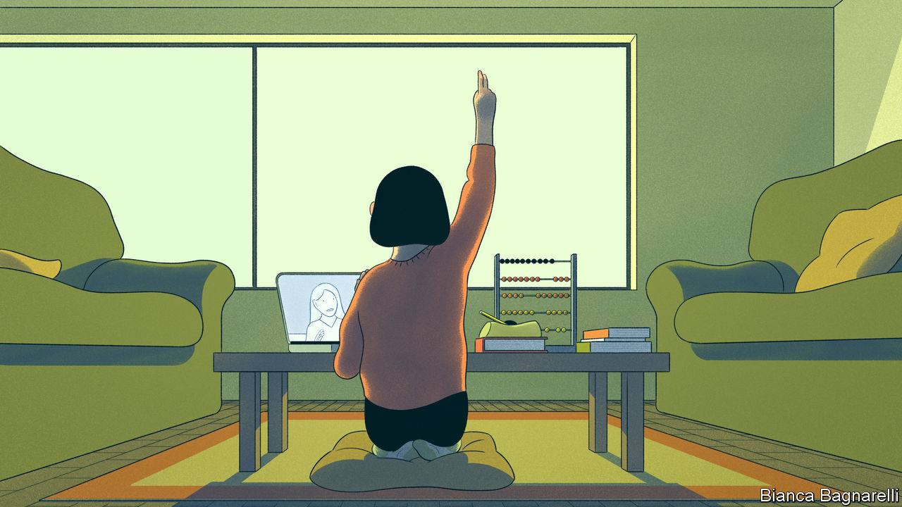
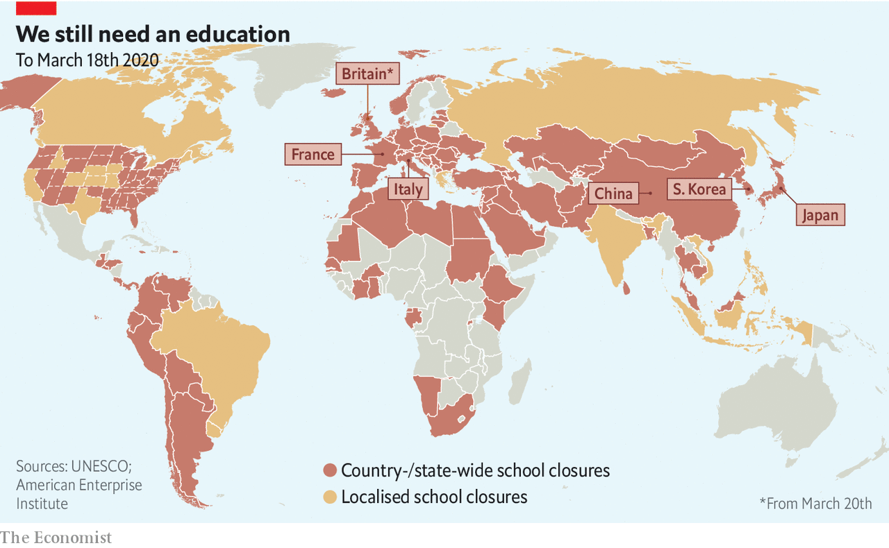
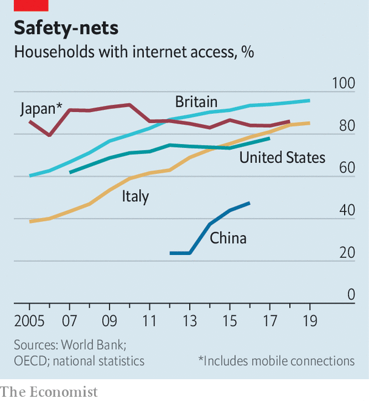

## Mid-term break

# How covid-19 is interrupting children’s education

> Almost a billion children have seen their schools close

> Mar 19th 2020TREVISO

Editor’s note: The Economist is making some of its most important coverage of the covid-19 pandemic freely available to readers of The Economist Today, our daily newsletter. To receive it, register [here](https://www.economist.com//newslettersignup). For more coverage, see our coronavirus [hub](https://www.economist.com//coronavirus)

CHILDREN USUALLY rejoice in a break from school, assuming it will be a chance to slack off. Not Ryu, a nine-year-old in Tokyo. As the new coronavirus spread across Japan, schools throughout the country closed on March 2nd. His parents have enforced a strict schedule every day. It includes Japanese, science and physical education. He does mathematics on his abacus every morning. On weekdays he is allowed to play in a park for 90 minutes. “I wish I could take him to the park more, but we have limited time as we work from home,” frets his mother, Fujimaki Natsuko.

Ryu is one of almost 1bn students around the world whose schooling has been interrupted as a result of covid-19 (see map). As The Economist went to press, just over 100 countries including China, Italy and South Korea had closed their schools, as had 43 states in America, as part of efforts to contain covid-19. Britain will close all schools on March 20th. Schools, where sticky-fingered children gather every day, sharing toys and sucking on pencils, are an obvious place for diseases to flourish. In 2013 Britain’s Health Protection Agency looked at flu outbreaks that coincided with school closures. It found that shutting them slowed the transmission of the virus, even if it also slowed the transmission of knowledge.

The data on whether school closures will curb covid-19 are limited. Children may not be the “main routes of transmission”, says Michael Head, who studies global health at the University of Southampton. And the economic, social and educational costs are heavy. On March 12th Bill de Blasio, the mayor of New York, said there were “many, many reasons” not to close the city’s 1,800 schools (though on March 16th it did just that, shuttering America’s largest school system for at least four weeks). For all governments, deciding whether or not to close schools is a choice between two bad options.

A study in 2009 modelling the effects of closing all schools and formal day-care centres in America for a month put the cost at 0.1-0.3% of GDP. Some countries seem better prepared to deal with the economic impact. In China the nationwide closures came with government-mandated work-from-home policies and subsidies for companies to enable their employees to do so. But in Japan not all parents are entitled to work from home or to take paid sick leave. In Italy one-fifth of workers are self-employed and so do not qualify for sick pay. People in precarious work may lose their jobs altogether if they have to stay at home to look after children.

For poor children, schools may provide the most nutritious meal of the day. Around 26m children in American schools—roughly half of all students—qualify for free or reduced-price lunches. In New York City 22,000 children sleep in municipal shelters. Some school districts in New York are setting up pickup points so that the hard-up can still get free meals. Britain has said it will continue to provide those children who ordinarily get free school meals with food.

Officials must always take such costs into account. But in the middle of a pandemic there is an extra consideration. The study in 2009 estimated that, if schools are closed for a month, between 6% and 19% of key health-care workers would have to stay at home to take care of their offspring. Britain will keep schools running for vulnerable children and those whose parents are key workers.

For most parents, however, the immediate worry is how prolonged school closures will affect their children’s education. Those preparing to take crucial exams are particularly jittery. The gaokao, China’s single university-entrance exam, is usually held in June. This year it will probably be delayed, says Xu Liangdi of China Policy, a think-tank, although the government has so far made no announcement.

Around 245,000 students in Britain were expecting in May and June to sit their A-levels, the exams that determine which university—if any—will grant them a place. On March 18th the government announced that those exams would be cancelled. Boris Johnson, the prime minister, said that the government would make sure that children still got “the qualifications they need and deserve for their academic career.” That may go some way to assuaging fears that children whose parents lack the cash or knowledge to compensate for schools closing would be worst affected.

For American students the stakes are lower, in part because their transcript—based on their academic performance throughout the year—is the most important part of their university application, but also because they can take SATs, the exams used in college admissions, all year round. Most sit them in the spring. For those hoping to start university in 2021, the March and May tests have been cancelled. They will be rescheduled, however, and students may be able to take them at home.

Nonetheless universities may have to be more accommodating. Covid-19 will “absolutely” affect the admissions procedure for Miami University in Ohio, says Bethany Perkins, the director of admissions—particularly the deadlines. Students with offers from American universities have to choose which to accept by May 1st. But students worry that they will have to make an important decision without being able to visit any campuses. Along with their parents, some are calling for the date to be pushed back to June 1st. Colleges have yet to react. Harvard says it is not changing its application process.

The disruption has lent ammunition to those who disapprove of high-stakes exams, which some education theorists want to scrap. Some institutions have already made SATs optional. Others, including Miami University, were considering doing so. The upheaval caused by covid-19 might accelerate that process, says Ms Perkins. But the flaws of other kinds of assessment may become clear in the coming months, bolstering those who believe that SATs and other high-stakes exams, which offer a relatively objective and transparent measure of ability, are the least unfair way to decide who gets into university.

The pandemic won’t change this. But it will highlight the strengths and weaknesses of teaching online. Online resources are increasingly popular but few countries boast a developed digital infrastructure for all students. A survey by Teacher Tapp, an app, of over 6,000 teachers in Britain found that only 40% of those in state schools would be able to broadcast a video lesson, compared with 69% of teachers at independent schools. Elena Silva of New America, a think-tank, says that few American states have adequate kit for teaching online. “Most states are not that prepared. This is a moment of forced opportunity.”

Teachers have little choice but to seize it. Since Italy closed its schools and universities on March 5th, teachers’ forums have filled with discussions on the relative merits of Zoom, Moodle and virtual classrooms. Some teachers had been trained to use such technology, but many have faced a steep learning curve. Carla Crosato, a teacher in Treviso, in northern Italy, has been uploading videos in which she explains the novels of Italo Svevo and Luigi Pirandello to her students. “I never thought I’d become a YouTuber at 56,” she says.

Even if teachers manage to broadcast their lessons, students may struggle to join them. Not everyone can get online (see chart). In America 7m school-age children cannot access the internet at home. Lin Kengying of 21st Century Education Research Institute, a think-tank in China, says that the closure of schools since the Lunar new year holiday, which began at the end of January, has led his organisation to reconsider the potential of e-learning. “It hasn’t been smooth,” he says, citing problems such as internet access, scheduling classes, teachers unfamiliar with online tuition, and subjects such as physical education being “awkward” to teach remotely. In China teachers have to submit lesson plans for review by censors, which has led to delays. Students have been spamming the main online teaching app with one-star reviews in an effort to get it removed from the app store. And Xue Hua, a mother of two in Jiangxi province, has been printing out all the learning materials for her 16-year-old son, Guo Guo, because she worries about too much screen-time.

Even done properly, online learning is a poor substitute for the kind that happens in a classroom. On average, students fare worse working online, especially those with less strong academic backgrounds, says Susanna Loeb of Brown University. Online courses can be an asset when students cannot be in school, but she reckons that they are “suboptimal for most” and argues that long periods of time spent away from actual schools will probably lead to children’s education suffering.

Online learning has clear potential. Educational technology powered by artificial intelligence can help children in poor countries with iffy schools—supposing they have internet access. In 2018 researchers found that after four and a half months of using an Indian app called Mindspark, which tests basic language and maths skills, children made more progress in these areas than those in the control group. But the success of such initiatives relies on preparation and organisation, not sudden scrambles to teach existing curriculums to entire populations of students in the midst of a pandemic. ■

Dig deeper:For our latest coverage of the covid-19 pandemic, register for The Economist Today, our daily [newsletter](https://www.economist.com//newslettersignup), or visit our [coronavirus hub](https://www.economist.com//coronavirus)

## URL

https://www.economist.com/international/2020/03/19/how-covid-19-is-interrupting-childrens-education
