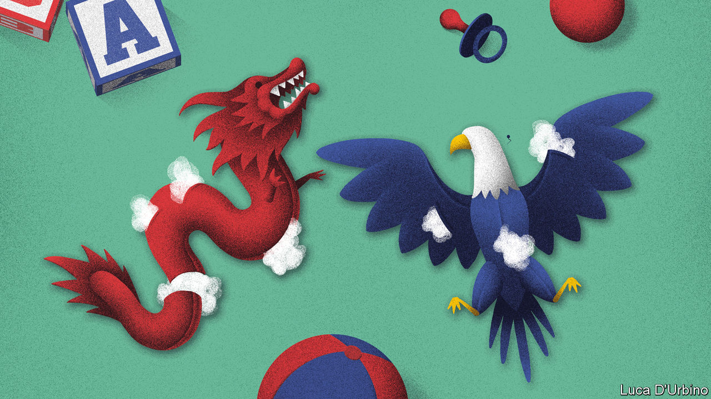

## China v America

# Expelling journalists is no way to fight a pandemic

> In a crisis, reporting is more valuable than ever

> Mar 21st 2020

THE FLOW of information is essential to curbing a pandemic. Yet on March 17th China took a dramatic step towards throttling it. Xi Jinping’s government ordered American journalists for the New York Times, the Washington Post and the Wall Street Journal to leave the country, in the biggest expulsion of Western correspondents from China since the Communist takeover in 1949. The world sorely needs objective reporting on the place with the longest experience of fighting covid-19. China, too, lacks objective reporting about the virus or any other sensitive topic. At times like this people need masks, not muzzles.

The expulsion is part of an ongoing feud between America and China. For a moment in January it seemed as if tempers were cooling, when both sides wisely agreed to suspend their trade war. In recent weeks the temperature has reached boiling-point. In a stunning failure of diplomacy, American and Chinese officials have been trading insinuations, all but blaming each other for covid-19. A few Chinese diplomats and American lawmakers have shared preposterous conspiracy theories about the virus having been cooked up in biowarfare labs. Enough, already.

The two powers are behaving more and more like cold-war rivals, tussling in every domain (see [article](https://www.economist.com//china/2020/03/21/amid-the-pandemic-sino-american-relations-are-worsening)). President Donald Trump’s administration made CGTN America, a state-owned broadcaster, register last year as a “foreign agent” and in February designated it and four other state-media outlets as foreign missions, a declaration that their staff are propagandists, not journalists. This is a foolish battleground for a democracy to pick. It cannot out-censor an authoritarian regime. Inevitably, a tit-for-tat cycle has ensued. Last month China expelled three correspondents of the Wall Street Journal, citing a single offensive headline. Mr Trump then booted out 60 staff from Chinese state-owned media. Now China has shut out many of the finest reporters on its territory.

One alarming implication concerns Hong Kong. The expelled Americans have been told they cannot work there either. This upends a convention that has largely prevailed under Chinese rule that foreign correspondents are free to work in the territory even if barred from the mainland. China has, in effect, scrapped an important feature of its “one country, two systems” policy.

But the most alarming consequences are global. There was a time, more than a decade ago, when some Americans talked optimistically about a possible “G2” partnership. They believed that America and China, for all their differences, could tackle the world’s challenges together. That now seems laughable.

Americans have cause to be irked by China’s behaviour. Western media there are suffering ever tighter restrictions. Chinese officials have become blunter in their warnings: carry on reporting like that on Xinjiang’s gulag for Muslims, or on the finances of powerful families, and your visa may not be renewed. But when America expels Chinese media workers, it does not make things better. On the contrary, it gives China a pretext to treat American reporters as if they represent America—which they do not.

Mr Trump may shrug. He never cared much for press freedom. Like many Chinese officials, he dismisses unwelcome reporting as “fake news”. To him, journalists are collateral damage in a struggle with China that is about something bigger: ensuring that America retains its pre-eminence. This zero-sum approach further poisons a sour relationship. It also makes it harder to grapple with global problems.

During the financial crisis of 2007-09, China and America did manage to talk to each other about how to save the world from economic ruin. Their ability to co-ordinate was a huge help. Today’s disaster requires their co-operation all the more. Instead, both countries are treating covid-19 as a trial of strength between competing political systems. That augurs badly for global efforts to fight the pandemic—and for the world that will emerge when the virus has eventually been tamed. ■