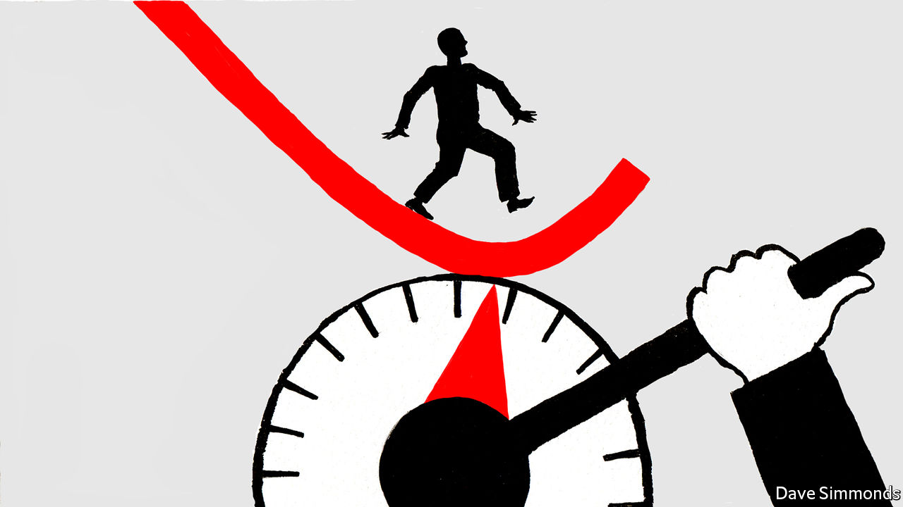
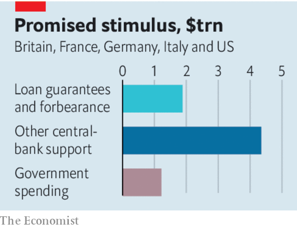

## The world economy

# How to prevent a covid-19 slump, and protect the recovery

> Governments need to be able to dial financial support up and down for people and firms

> Mar 19th 2020

Editor’s note: The Economist is making some of its most important coverage of the covid-19 pandemic freely available to readers of The Economist Today, our daily newsletter. To receive it, register [here](https://www.economist.com//newslettersignup). For more coverage, see our coronavirus [hub](https://www.economist.com//coronavirus)

IN JUST TWO months the world economy has been turned upside down. Stockmarkets have collapsed by a third and in many countries factories, airports, offices, schools and shops have been closed to try to contain the virus. Workers are worried about their jobs and investors fear companies will default on their debts. All this points to one of the sharpest economic contractions in modern times. China’s GDP probably shrank by 10-20% in January and February compared with a year earlier. For as long as the virus rages, similar drops are likely in America and Europe, which could trigger a further downward lurch in Asia. Massive government intervention is required to ensure that this shock does not spiral into a depression. But scale alone is not good enough—new financial tools need to be deployed, and fast.

Western authorities have already promised huge sums. A crude estimate for America, Germany, Britain, France and Italy, including spending pledges, tax cuts, central-bank cash injections and loan guarantees, amounts to $7.4trn, or 23% of their GDP (see [Briefing](https://www.economist.com//briefing/2020/03/19/governments-are-spending-big-to-keep-the-world-economy-from-getting-dangerously-sick)). Yet central banks are responsible for over four-fifths of that and many governments are doing too little. A huge array of policies is on offer, from holidays on mortgage-payments to bail-outs of Paris cafés. Meanwhile, orthodox stimulus tools may not work well. Interest rates in the rich world are near zero, depriving central banks of their main lever. Governments typically try to stimulate demand in a downturn but people trapped at home cannot spend freely. History is not much of a guide. The global pandemic of 1918 took place when the economy was wrecked by war. China has endured a lockdown but its social model is different from the West’s.

What to do? An economic plan needs to target two groups: households and companies. And it needs to be fast, efficient and flexible so that if the virus retreats only to resurge, workers and firms can be confident that governments will dial assistance down and up again as needed. Start with households, where large government spending is needed. One aim is to protect vulnerable people, by subsidising sick pay and ensuring those without insurance have health care. But spending is also needed to discourage lay-offs at firms running far below capacity, by subsidising workers’ wages—an area where Germany has led the way.

Governments also need to jerry-rig digital systems so they are able to distribute cash to households directly, as Hong Kong hopes to. The aim should be to have the capability to ramp further support up and down quickly. Many places, including America, rely on sluggish postal services and tax agencies to distribute cash. If funds can be sent instantly through mobile phones or online bank accounts, people will feel more confident and avoid hoarding cash and slowing the recovery when the virus recedes.

All this spending will cost governments dear, but the fiscal stimulus of about 1% of GDP so far across Europe is clearly too low. America’s plan to spend 5% is closer to the mark given the risk of a double-digit GDP drop. As fiscal deficits balloon, governments will have to issue piles of bonds. Central banks should step in to buy those bonds in order to keep yields low and markets orderly. Inflation is a second-order concern and there is little danger of it taking off. To prevent a euro-zone crisis, the European Central Bank plans to buy €750bn of assets. But it and European governments should also give a clear guarantee of sovereign support for Italy and other peripheral economies.

The second priority is to get cash to millions of companies, whose failure would damage the economy’s potential. They face a cash drought even as bills fall due. Bond markets are closed to many of them. Mass defaults would fuel unemployment and bad debts at banks, and make it harder for commercial activity to rebound. Most governments have intervened, but in flawed ways. France says nationalisation is an option—which firms will resist. America is propping up the commercial-paper market, but this funds only a fraction of all corporate debt and is used by big firms—not small ones, which employ most people. Germany and Britain have offered loan-guarantee schemes but it is unclear who will process millions of loan applications. The best approach is to use the banking system—almost all firms have accounts, and banks know how to issue loans. Governments should offer banks cheap funding to lend to their clients while guaranteeing that it will bear most of the losses. Borrowers could be offered bonuses for repaying loans early.

There are huge drawbacks to all of this. Public and corporate debt will soar. Handouts will be given to rich people and loans extended to firms that are badly run. But even with this fearful list of side-effects, the advantages are overwhelming. Cash will be distributed fast. Vulnerable people will be able to get by. Households will be confident enough to spend when conditions improve. And firms will keep their workforces and plants intact, ready to get back to action when this dark episode has passed.■

Dig deeper:For our latest coverage of the covid-19 pandemic, register for The Economist Today, our daily [newsletter](https://www.economist.com//newslettersignup), or visit our [coronavirus hub](https://www.economist.com//coronavirus)

## URL

https://www.economist.com/leaders/2020/03/19/how-to-prevent-a-covid-19-slump-and-protect-the-recovery
