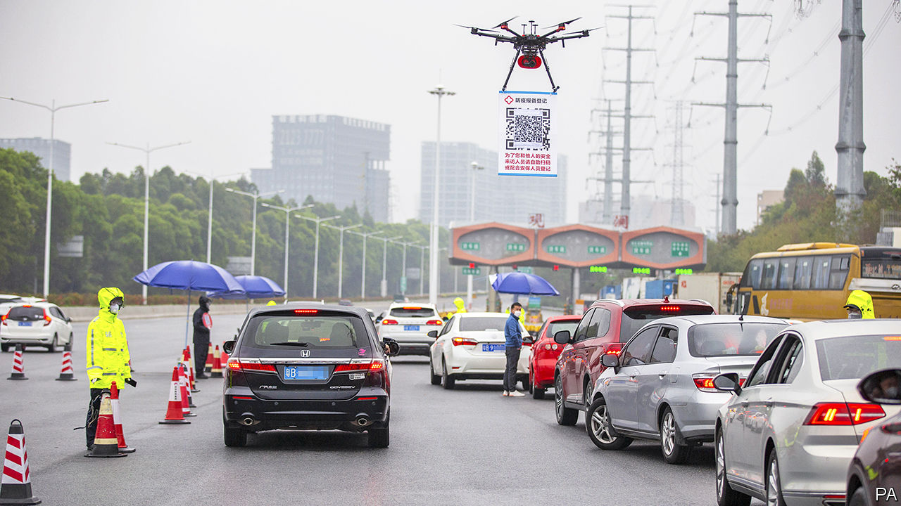
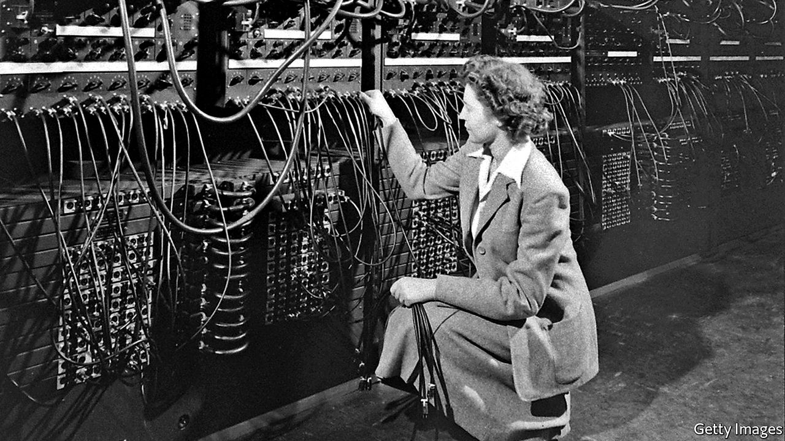

## On coronavirus and business, central banks, Hong Kong, data

# Letters to the editor

> A selection of correspondence

> Mar 21st 2020

[Schumpeter ](https://www.economist.com//business/2020/03/05/covid-19-is-foisting-changes-on-business-that-could-be-beneficial)(March 7th) connected the coronavirus crisis to the lesson of “resilience and adaptation” offered by the strike on the London Underground in February 2014. Shaun Larcom, Ferdinand Rauch and I analysed the strike and found that the partial closure of the network forced many commuters to experiment with new routes. For many this resulted in shorter travel times; they continued to use the new routes after the strike, thus generating a lasting benefit.

The current global experiment with alternative work arrangements (less business travel, increased teleworking) might also bring long-term gains to businesses. There is another benefit. The covid-19 crisis has brought about mass-education on hygiene. Schoolchildren are being taught how to sneeze responsibly, touching one’s face is becoming frowned upon, and proper handwashing techniques are enjoying their 15 minutes of fame. Although covid-19 might unfortunately be here to stay, it may also change social norms (elbow bumps instead of handshakes) and improve hygiene habits. If those changes stick, we may see fewer cases of flu and other infectious diseases. Going forward, this could improve health outcomes and lower associated costs.

Joseph Schumpeter taught us to embrace disruption. Although the covid-19 crisis is making this very challenging, at the moment it is preferable to embracing people.

TIM WILLEMSWashington,  DC

Another lasting effect may be the reinvention of the office. Schumpeter noted that firms may now find it is better to encourage remote working, given how inefficiently office space is used. Big British and American companies pay on average $5,000 per employee in annual rental costs, though just half the desks are used during working hours. The potential benefit to companies is clear. Yet it is less clear whether employees would share equally in those benefits.

It may be prudent, from the point of view of employees’ wellbeing, to reflect before implementing long-term remote-working policies. Feeling part of a shared institutional culture can be meaningful and motivating. Flexible working may cut commuting times and improve the work-life balance, but working remotely reduces the valuable face-to-face connection between employee, colleagues and company. It would be a shame if flexible working were weaponised against employees for the sake of saving on office costs.

PATRICK KELLYChief executiveMizen GroupNew York

Working from home could result in staff forking out thousands in extra costs. An office employee who works a 40-hour-week for, say, 46 weeks a year will spend an extra 1,840 hours at home. Think of the additional cost for heating and lighting a house that is otherwise vacant during the day, not to mention powering a computer during that time and running a printer (ink, paper). Firms also provide extensive IT support. What happens if your personal computer breaks down? Is that a company cost or individual cost? Then there are the small items such as stationery, coffee and, dare I say it, toilet paper that are provided at the office.

MARGARET O’BRIANLondon

The problem with China’s success in using surveillance methods such as facial recognition and colour codes to tame covid-19 is that this could legitimise the extensive use of profiling tools (“[Code red](https://www.economist.com//china/2020/02/29/to-curb-covid-19-china-is-using-its-high-tech-surveillance-tools)”, February 29th). One can easily imagine how massive surveillance and limitations to fundamental rights like privacy could become the new norm. Desperate times call for desperate measures, but democracies face the dilemma of solving serious problems and at the same time protecting privacy, covid-19 or not.

ASBJORN AMMITZBOLL FLUGGEphd fellowDepartment of Computer ScienceUniversity of Copenhagen

I read your short piece noting the high staffing numbers at European central banks (“[Labour hoarding](https://www.economist.com//finance-and-economics/2020/02/22/are-there-too-many-central-bankers)”, February 22nd). Please consider that apart from the core functions related to monetary policy, banknotes and currency management, the size of central banks varies depending whether a single institution also handles coinage, printing, payment-system supervision, public-debt management, economic surveys, statistical collection, banking resolution, and the supervision of banking, insurance and markets. Then there is financial consumer protection and the duties related to new challenges, like fintech.

For instance, when comparing staffing levels at most European central banks with the Federal Reserve, you should add staff at the FDIC, OCC, SEC, NCUA, NAIC, and others, and of the regulatory authorities in each state. All in all, this raises the central-bank staff per inhabitant in the EU and America to the same level.

THIERRY DESANOISPresidentStanding Committee of European Central Banks UnionsParis

The consequences of Boris Johnson restricting the power and independence of the judiciary in Britain may be more far-reaching than the erosion of a safeguard against unchecked executive power (“[Boris v the judges](https://www.economist.com//leaders/2020/02/20/boris-johnson-takes-on-the-judges)”, February 22nd). The principle of judicial independence in Britain underpins the legal systems of some former British colonies, in which authoritarianism is more appropriately described as a feature rather than a tendency. The weakening of judicial independence in Britain may thus have a knock-on effect of undermining judicial independence in other places.

For Hong Kong, the recent appointment of the heavy-handed Xia Baolong as director of the Hong Kong-affairs office signals Beijing’s tightening grip on the city’s administration. A decline in Britain’s judicial independence may stoke concerns of opportunistic attempts by Beijing to diminish the power of Hong Kong’s judiciary. Even though judicial independence requires judges to be partial only to the law, Beijing expressed in a white paper published in 2014 that it is a basic political requirement that judges in Hong Kong be patriotic. When Baroness Hale was appointed to the city’s Court of Final Appeal in 2018, it came as no surprise that pro-Beijing lawmakers voiced concern about her handling cases in which national interests may be at stake. If Mr Johnson has his way, it may spell an unprecedented challenge to Hong Kong’s independent judiciary.

JUSTIN BONG-KWANBarrister-at-lawHong Kong

Kudos to The Economist for sticking to using data as a plural (“[Data, data everywhere](https://www.economist.com//finance-and-economics/2020/02/27/rethinking-how-we-value-data)”, February 29th). Although I don’t understand why there is a grammatical quarrel over this, I have found myself for years having to correct the young scientists I’ve mentored. While we’re on the topic, bacteria and sera are also plurals, the singular forms being bacterium and serum (also media/medium, in contexts other than the media world The Economist inhabits).

GEORGE CROSSNew York