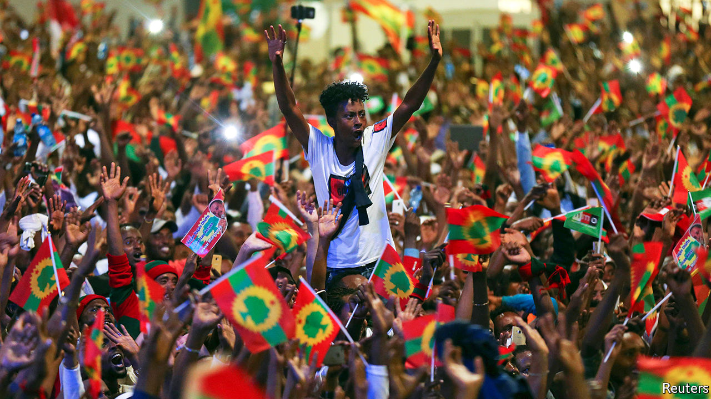
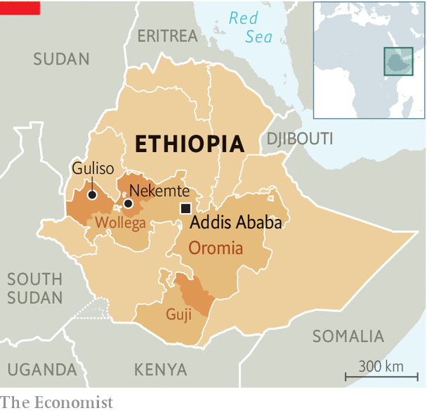

## Onslaught in Oromia

# A hidden war threatens Ethiopia’s transition to democracy

> Abiy Ahmed’s crackdown in Oromia is bloody and lawless

> Mar 19th 2020NEKEMTE

IN THE CORNER of a restaurant in Nekemte, a town in western Ethiopia, Fisaha Aberra unfolds a piece of paper on which he has scrawled the names of 11 men he says were shot by soldiers last year. After this came mass arrests. Fisaha and two siblings fled their home in Guliso to Nekemte, leaving one brother behind who was arrested last month, for the second time in a year, and beaten so hard he cannot walk.

Arrests and summary executions have become commonplace in the far-flung reaches of Oromia, Ethiopia’s largest region. The Ethiopian security forces are waging war on armed Oromo separatists. They are also treating civilians brutally. Accounts by witnesses suggest there is indiscriminate repression of local dissent in a country supposedly on the path from one-party rule towards democracy.

This was not what Ethiopians expected from Abiy Ahmed, who became prime minister in 2018. He was a young reformer from Oromia. He promised democracy for all and redress for what Oromos claim is centuries of political and economic marginalisation. Abiy freed thousands of political prisoners and welcomed rebel groups back from exile to contest elections, now scheduled for August.

Abiy made peace with neighbouring Eritrea, for which he won the Nobel Peace Prize, as well as with rebel groups including the Oromo Liberation Front (OLF), which is now an opposition party. The group’s armed wing, the Oromo Liberation Army (OLA), agreed to put down its guns; in return its soldiers were to join Oromia’s police. Many hoped to see the end of an insurgency that began almost 50 years ago.

But the social fractures that lifted Abiy to high office continue to divide Ethiopia. Years of unrest in Oromo areas have weakened local government and left a security vacuum. In Wollega (to the west) and Guji (in the south) returning rebels stepped into the breach, sometimes working with the police to enforce order. But they soon began accusing the government of betraying the Oromo cause and reneging on promises to give them jobs in the police. The government, in turn, accused the OLA of keeping its weapons. The details of the peace deal were never disclosed, making it easier for both sides to accuse the other of failing to honour it.

By the end of 2018 the rebels had returned to the forests and were murdering officials and attacking army convoys. In 2019 the air force was reportedly bombing OLA training camps. After a third peace deal flopped in 2019 the OLF formally split from its armed wing (though they are thought to keep covert lines of communication). The government, in effect, declared a state of emergency in Wollega and Guji, with the army in charge of security. By the start of 2020 fighting in Guji had forced some 80,000 people from their homes.

In January, as the security forces intensified their operations, the government switched off the internet across much of western Oromia. Outside big towns in Wollega, which is under curfew, even landlines and mobile networks are disconnected. Reports of killings and arrests travel by word of mouth. “We’re back to the pre-telephone age,” says Asebe Regassa, a local academic. Aid workers can barely enter the very far west, where the war is most intense. In parts of Guji, transport is banned. “Farmers are punished from both sides,” says Mulatu Jergafa, who lives in Nekemte. “If they go to their coffee farms the guerrillas suspect they might be government informants and beat them; but the military also suspects they might be informants for the guerrillas and does the same.”

Geresu Tufa, an Oromo activist, describes it as a war in which “you cannot tell who is friend and who is foe.” Nobody knows, for example, exactly how many fighters the OLA has, though it is thought to number in the low thousands. It is also unclear which armed groups are actually linked to the OLA, since anyone can pick up a gun and claim to be fighting for it. In most places the insurgency may be a potpourri of loosely connected militias rather than a full-fledged rebellion.

Uncertainty also surrounds the counter-insurgency. By December the Oromia Support Group, an NGO, had documented 64 extra-judicial killings and at least 1,400 cases of arbitrary detention over the previous six months. Since then many more abuses have been reported, including the burning of homes. In January activists claimed the army had massacred 59 civilians in Wollega. The OLF alleged another 21 had been killed nearby. The government has denied all allegations. This is unconvincing, but it is possible atrocities reflect a breakdown in the chain of command rather than orders from the top. “Senior federal officials may not know the full extent or nature of the military’s operations in Wollega,” says William Davison of the International Crisis Group, an NGO in Brussels.

What is not in doubt is that there has also been political repression. “The opposition movement in Oromia has totally stopped,” says the OLF’s chief, Dawud Ibsa. In recent months thousands of its supporters have been arrested, including nine of its leaders. In Nekemte, security forces have repeatedly closed offices belonging to the OLF and its more moderate ally, the Oromo Federalist Congress (OFC). Public gatherings have been banned, though the ruling Prosperity Party recently staged a rally. The OFC’s representative in Nekemte spent four months in a cell in the town’s historic palace, which has been turned into a detention facility.

All this comes months before what is supposed to be Ethiopia’s first free and fair election (unless it is derailed by covid-19). In Wollega and Guji the vote will probably be postponed on security grounds. This will help the government, which is unpopular in these places.

The government insists it remains open to negotiation with the rebels. “It is good for people to solve their issues through discussion, meetings and conversations,” Abiy told lawmakers last month. But it seems uninterested in further peace talks and acts as if the conflict can be resolved through force. The rebels, meanwhile, continue to denounce the Ethiopian state as a colonial oppressor which can never be trusted. And so the carnage continues. ■

## URL

https://www.economist.com/middle-east-and-africa/2020/03/19/a-hidden-war-threatens-ethiopias-transition-to-democracy
