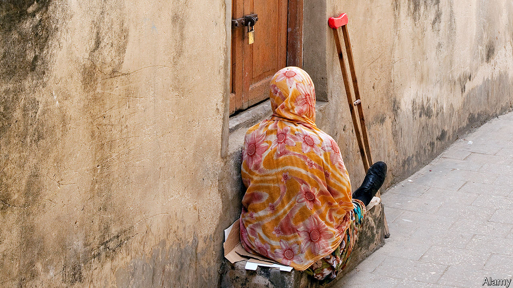

## Double trouble

# Africans with disabilities are at higher risk of HIV

> And they are less likely to receive treatment

> Mar 19th 2020

NOMASOMI LIMAKO, who lives in South Africa, was often told that she could not get HIV because she is wheelchair-bound. She had never met a disabled person with the disease, as far as she knew, so she believed the rumour. Then came her own diagnosis. Today the 48-year-old pharmacy assistant knows that her disability actually made her more vulnerable to the disease. Even as covid-19 creates a new public-health crisis, Africa is continuing to grapple with an old one. Studies show that Africans with disabilities are at least twice as likely to get HIV as those without.

One reason is that disability compounds HIV’s other risk factors. Disabled children are often excluded from school, so many receive no sex education. Even for those in school, a widespread assumption that disabled people do not have sex means that teachers think they do not need to learn about it. In Ethiopia more than three-quarters of 10- to 24-year-olds with disabilities had never discussed sex with their parents. Social status matters, too. Even in places where disabled people know more about condoms than everyone else, such as Uganda, they still have higher rates of sexually transmitted diseases. Researchers think this is because the disabled have a tougher time negotiating with their partners about having safe sex.

“When you are disabled and you have HIV, you get double discrimination,” says Miiro Michael, a social worker in southern Uganda. “When you are a woman, you get triple discrimination.” This is because women in much of sub-Saharan Africa, disabled or not, are at higher risk of getting HIV than men. In Burundi women with disabilities are three times more likely to have HIV than those without, and ten times more likely than able-bodied men. In Burkina Faso disabled women have the same HIV prevalence (5.4%) as sex workers.

Trading sex for money is something disabled women are more than three times as likely to do as able-bodied women, according to a study in Cameroon. This is often because they are poor. Across Africa disabled women tend to suffer high levels of sexual abuse, too. In Burundi they are about twice as likely to have endured it as the non-disabled. Some are victims of “virgin rape”—a crime reflecting the belief that an HIV-positive man can be cured if he has sex with a virgin and transfers the disease to her. Since disabled women are often baselessly assumed to be virgins, they are particularly at risk.

Once the disabled get HIV, treatment is difficult. Travel costs are a big reason. Disabled people also report being turned away by clinics because health workers don’t believe the disabled can get HIV. Moreover, many clinics do not have wheelchair ramps and the like to provide access to people who cannot walk. One study in Uganda found that disabled people were less likely to receive their test results than others. This may have been because they found it difficult to return to a clinic.

Some are trying to improve the situation. A project in Kenya led by Humanity & Inclusion, an international NGO, provides HIV information to the blind using Braille and radio shows. Community health workers in South Africa offer in-home HIV treatment to the immobile. In Rwanda they are taught to communicate the basics about the virus in sign language. Senegal conducted a prevalence survey of disability and HIV—a good step in the “disability data revolution” that advocates say is necessary to tailor future policies. All but five African countries have ratified the Convention on the Rights of Persons with Disabilities, which pledges them to ensure broad legal equality for the disabled.

No country stands out as a model. Policymakers often fret that providing for disabled people will be expensive and consume scarce resources. But some solutions that do not cost much can make a big impact. Health centres, for example, could start by installing wider doorways, adjustable beds and ramps. And health and education departments could do a far better job of teaching their own staff about the sex lives of the disabled, even if it may take time to remove social stigmas and correct horrific misapprehensions, such as that rape is a cure for HIV. ■

## URL

https://www.economist.com/middle-east-and-africa/2020/03/19/africans-with-disabilities-are-at-higher-risk-of-hiv
