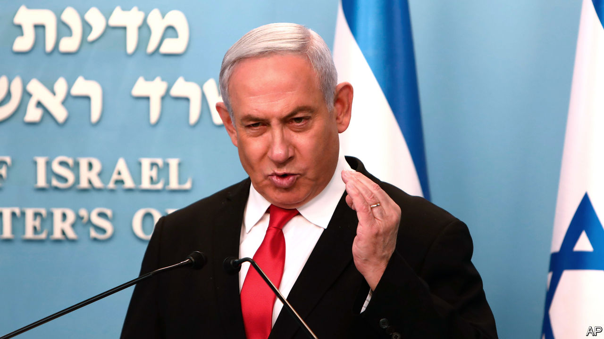
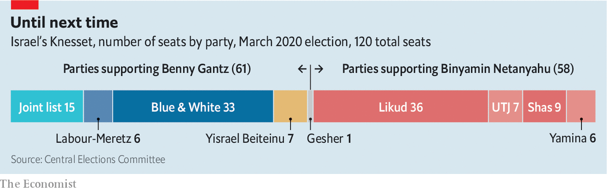

## Crisis, opportunity

# Binyamin Netanyahu vows to protect Israel from the virus

> But his rival, Benny Gantz, has the first shot at forming a government

> Mar 19th 2020JERUSALEM

BINYAMIN NETANYAHU, Israel’s prime minister for the past 11 years, is never one to waste a crisis. In recent days he has used his televised briefings on the covid-19 pandemic to exhort the leader of the opposition, Benny Gantz, to join an emergency unity government—under Mr Netanyahu, of course. The prime minister seems undeterred by the failure of his coalition of nationalist and religious parties to win a majority in the parliamentary election on March 2nd (see chart), or by the charges of bribery and fraud that he faces.

On March 16th Mr Gantz was given the first shot at forming a government, having received the endorsement of 61 members of the 120-seat Knesset (Israel’s parliament). He vowed to “form a national unity government, as broad as possible, within days”. But his allies are united only in their desire to replace Mr Netanyahu. They include Yisrael Beiteinu, a Jewish nationalist party led by Avigdor Lieberman, and the Joint List, an alliance of Arab-majority parties that is now the third-biggest bloc in the Knesset. They are unlikely to sit in government together. Even some in Mr Gantz’s own party, Blue and White, oppose a government that is supported by Arab lawmakers.

Mr Gantz’s preference would be to form a unity government that includes Mr Netanyahu’s Likud party. “I extend my elbow,” said Mr Gantz, referring to new guidelines barring handshakes. But Mr Netanyahu has always insisted that, if the premiership were to rotate between them, he should go first. Mr Gantz and his colleagues are loth to accept this proposal as they believe Mr Netanyahu would not abide by the deal. Moreover, they think he will use his position to try to shield himself from legal action. Mr Gantz could try to pass legislation preventing a politician facing criminal charges from forming a government. But right-wing politicians might accuse him of sabotaging the effort to fight covid-19.

The outbreak in Israel has given the negotiations a sense of urgency. There have been over 400 confirmed cases but no deaths yet. Israel is refusing entry to all foreigners. Citizens returning from abroad must self-quarantine for 14 days. Schools and restaurants have been ordered to close, and indoor gatherings of over ten people are banned. The government has also taken the controversial step of using mobile-phone surveillance technology, normally reserved for counter-terrorism operations, to track virus-carriers. By designating the move an “emergency measure”, Mr Netanyahu was able to bypass the Knesset.

A more comprehensive response, involving emergency funding, will be difficult to implement without a new government or oversight committees in the Knesset. Yet on March 18th the speaker of the Knesset, Yuli Edelstein, a Likudnik, adjourned the body for five days. Mr Gantz, backed by a majority, had been trying to replace Mr Edelstein and form the committees in a way that reflected the minority status of Likud and its allies.

Mr Netanyahu accuses Mr Gantz of practising “small politics” at a time of national emergency. But the same accusation has been levelled at the prime minister. His critics claim that he delayed the order to quarantine American visitors to Israel because of pressure from the administration of President Donald Trump, and that he delays the publication of public-health orders until his own televised briefings, so that he can strike the pose of a leader. “A small group of officials are really doing the hard work,” says a minister.

Mr Netanyahu’s trial, originally due to begin this week, has been pushed back to May 24th. Some have viewed this as a political decision—made by judges, but under pressure from the justice minister, a Netanyahu appointee. Mr Gantz, upon accepting the mandate to form a government, spoke of “illegitimate efforts by the current prime minister to evade justice”. ■

## URL

https://www.economist.com/middle-east-and-africa/2020/03/19/binyamin-netanyahu-vows-to-protect-israel-from-the-virus
