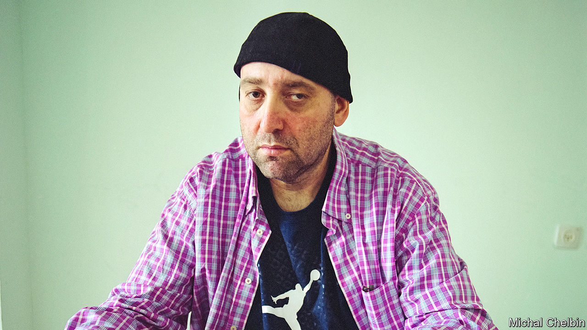

## The throw of the dice

# Falafel died on February 14th

> The homeless man who became a world backgammon champion was 51

> Mar 19th 2020

IT WAS THE best of times; it was the worst of times. That was the beginning of a book he had heard about somewhere. He didn’t remember which one. Or perhaps it was “It was the worst of times, it was the best of times.” Either way, it described exactly the months he had spent when he first arrived in 1994 to make his luck in New York. His mother, despairing that he would ever take a job, had kicked him out of the house. He carried nothing with him on the freezing journey from Buffalo except an extra hoodie or two, a chessboard and a chess clock. Being pretty good at chess, that was all he thought he needed to make an impression.

He had no contacts in the Big Apple, no friends, nothing. And nowhere to sleep. Since he liked his sleep, being naturally lazy and lumpish, this was a nightmare. He tried park benches, the subway, anywhere he could. One night the best he could find was one of the stone chess tables in Washington Square Park, where he lay on his back snoring loudly with chunks of falafel, his favourite and almost his only food, stuck to his unshaven face. He was shaken awake by the brawny tattooed arms of Russian Paul, whose particular special table this was; in exchange for guarding it for him, Russian Paul agreed to give him $2 a day to buy more falafel, at least. So Falafel he became. Since no one, not even his mother, called him Matvey, this was fine. And so began a sequence of twists and turns, losses and wins, that culminated in 2007 with his crowning by his peers, the Giants of Backgammon, as a genius, and the best backgammon player in the world.

He hadn’t given the game much thought before. Growing up—moving from Russia, where he was born, to Israel as a child, to Buffalo from the age of 14—he had mostly played chess, which seemed to him a better way to spend the time than going to college. But he noticed in the park that hustling backgammon, playing tourists and other “fish”, or “pigeons”, or “marks”, who wandered by and wanted a game, was much more lucrative. Besides, the more he looked at it, the more fascinated he became. This was both a game of strategy, working out how to get home and bear off all your checkers before your opponent did, and also one of sheer chance, driven by the throw of the dice. It needed not only skill, but luck. You could do all the planning you liked, but the gods had to be on your side. Backgammon mirrored life: sometimes safe, sometimes on the street. He wanted to understand the full truth of it.

Once Russian Paul, in his impatient way, had taught him the moves, and once he had stopped losing, he was hooked. He was no genius in his own mind, and his openings were ragged, but he could survey the vital mid-section of a game and know exactly what to do, with mathematical precision. Backgammon students were already turning to computer programs that could analyse and predict moves, factoring in the near-infinite variations of the dice, and he did that too; one neural-net program, called Snowie, helped him more than anything. But there was still a place for old-fashioned intuition and brainwork, awareness of the tiniest advantage, and this was where he outshone all the rest. When Snowie analysed his games, they often came out perfect.

For up to 15 hours a day he played. Sometimes this was in the park, under the trees. Sometimes it was in casinos, reminders of backgammon’s glamorous days in the 1960s, under gilding and chandeliers, or in tournaments in lookalike hotel ballrooms all over the place. There he would wander in, looking like a dumb-ass in his saggy nylon shorts and yellow woollen hat, so that players clamoured to take him on and he would sit there chattering and rocking, sometimes laughing aloud, as he took them to the cleaners. But at other times he would just sit in his room—if he could find a room, afford one or keep one—playing online with the shades drawn, hour after hour, with his laundry and rubbish piling up around him. In this one sphere of backgammon, he was not lazy. He was always learning, looking for the truth.

He hoped for a fortune, too. Backgammon was a gambling game, and he loved to bet. If he said he could do something—dance, get married within a year, lose weight—he bet on it, usually a “ruble”, or $1,000. Such bets sometimes came good, often didn’t, but winning at backgammon became a near-certainty. He could earn his living that way, with a board game, even though his parents had said he never could. The fact that he looked like an idiot, as he cheerfully admitted, irresistibly drew weaker players towards him. Tournaments did not earn him much, but private side-games were a different matter. If he used the red cube to double the stakes, then double again, and double again, he could win tens of thousands of dollars in a game that might not even take an hour.

Fairly often, he won that big. But then, just as fast, he would lose it again. He bet the money on colleagues who lost their games, or on sports teams that let him down. He took $1,500 to a flophouse on the Bowery, where a thief made off with it as he slept. In the end, he cared much less about the money than the mere fact of having won it, and being able to gamble it away. Any backgammon game could produce heart-stopping reversals of fortune, so he was used to it. Every man played out his luck. And he had nothing much to spend the cash on: plane tickets, hotel rooms, eventually a flat in Tel Aviv, where he became part-owner of a poker club. Even as a global celebrity who was profiled in Esquire and the New Yorker, he continued to wear the baggy shorts, sweatshirt and backwards baseball cap that were his summer wardrobe. He socialised happily over the boards, but still spent his spare time alone with Snowie or with online players from whom, too, he won plenty of money.

It seemed to be true that he could not function properly in normal society. At tournaments he was gregarious and fun in his lumbering bearish way, but with girls he was shy, and the famous marriage bet (with the family he wanted) never came off. He also found America hard to settle in. For years before he managed to return he longed for the love, warmth and closeness of Israel, the childhood paradise he remembered—and where the falafel was much better, too. Backgammon, he knew, was all about getting home. ■