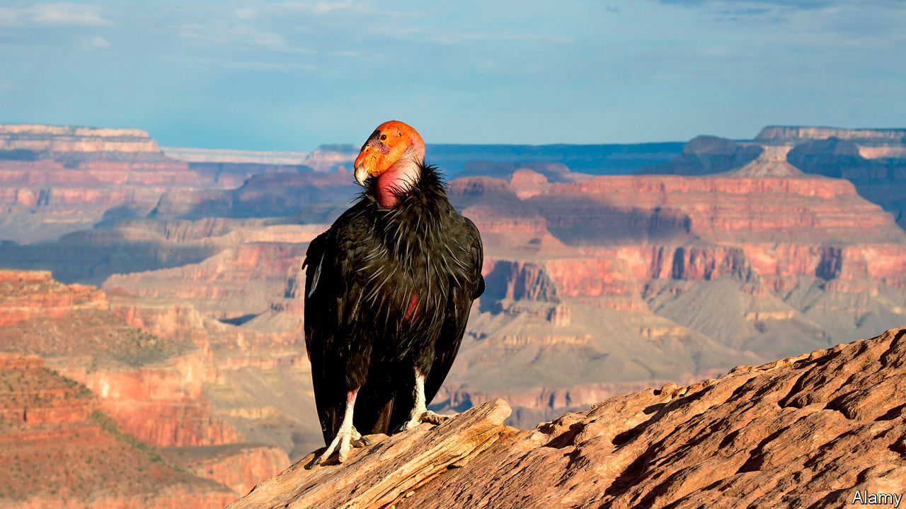

## Sentimental journey

# A new way to review scientific literature is being tested

> It analyses the sentiments of papers’ authors

> Mar 19th 2020

HOW DO YOU measure progress? That is the question Kyle Van Houtan, an ecologist at the Monterey Bay Aquarium, in California, found himself asking when he faced the task of working out whether methods of boosting the populations of endangered species in the wild have improved over the years.

In normal circumstances, those keen on studying the effectiveness of research write reviews of the scientific literature. In a flourishing field, though, this may involve reading and extracting information from hundreds, possibly thousands, of papers. That requires a large team, and brings problems of co-ordination. Dr Van Houtan therefore wondered whether getting computers to do the heavy lifting might help.

The answer is that it does. His study on the matter, published this week in Patterns, tapped into a branch of machine learning called natural-language processing. This is a way of analysing large volumes of text with minimal human supervision. He and his colleagues identified five existing natural-language-processing systems and borrowed them. They used them to search the abstracts of 4,313 papers on species-conservation projects published over the course of the past four decades. The software’s task was to look for words associated with success, such as “protect”, “support”, “help”, “benefit” and “growth”, and also words associated with failure, like “threaten”, “loss”, “kill”, “problem” and “risk”. Different words had different values attached to them, depending on how positive or negative they were felt to be by the original model-makers. The result was that each abstract could be assigned a sentiment score, averaged from the five different inputs.

In total, the team analysed 1,030,558 words. They found that in papers published in the 1980s, when conservation science was in its infancy, terms from the negative list were much more common than those from the positive one. During the past decade, by contrast, terms associated with success became more frequent. Average sentiment scores increased during the study period by 140%.

That is clearly encouraging news for conservationists. It suggests that their methods are working in general, and are improving with experience. But more detailed analysis was also possible. Giant pandas, which numbered 1,864 when censused in 2014 and had their status upgraded from “endangered” to merely “vulnerable” in September, have seen the sentiment of the literature about them swing from negative to positive in a matching way. Papers on the California condor (pictured), by contrast, remain littered with negative sentiments even though its numbers have risen, according to a census in 2016, from an extinction-threatening 22 to 446. But only 276 of those birds were wild, and so the condor is still listed as “critically endangered”.

Given the numbers involved, it might be argued that both of these results were predictable. They seem, nevertheless, to be evidence that the method works. And that may be relevant in the context of the team’s analysis of rat-clearance projects intended to help species which have evolved in the absence of those subsequently introduced rodents, and also projects on small islands intended to protect populations of such autochthonous species (often these projects are the same thing). Sentiment analysis sees no clear signal of success here.

Whether Dr Van Houtan’s method might be generalised to other fields of science is debatable. Conservation is, at bottom, an emotion-driven activity. People care about the results in a way that goes beyond professional amour propre. That researchers’ sentiments show up in their choice of words is therefore little surprise, and might well not be true elsewhere. But the fact that Dr Van Houtan has been able to use natural-language processing to expand the pool of papers which can be taken into a review from the hundreds to the thousands suggests that others might benefit from having a look at his achievement.■

## URL

https://www.economist.com/science-and-technology/2020/03/19/a-new-way-to-review-scientific-literature-is-being-tested
