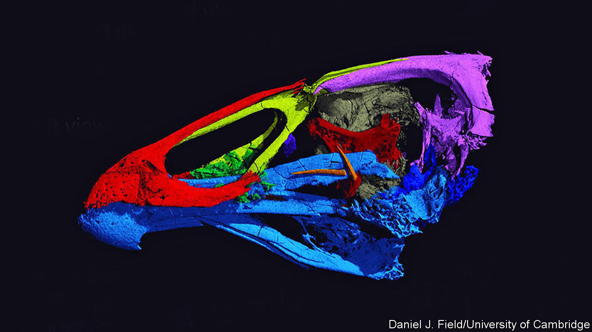

## Palaeontology

# Another ancient bird skull is another bit of avian history

> It helps to date the origin of modern birds

> Mar 19th 2020

FOSSIL BY FOSSIL, the story of the birds becomes clearer. It is now well established that modern birds, the Neornithes, are actually a relict group of dinosaurs which survived a cosmic collision, 66m years ago, between Earth and an asteroid or comet. This impact wiped out the rest of the Dinosauria, along with a lot of other creatures. A paper published last week about a tiny dinosaur belonging to a related group, the Enantiornithes, which was found preserved in amber in what is now Myanmar, showed just how diverse flying dinosaurs had become more than 30m years before this collision. This week sees the release, in a paper in Nature, of details of another fossil, which those studying it believe is close to the point of origin of the Neornithes themselves.

The fossil in question is called Asteriornis maastrichtensis. As its name suggests, the rock containing it was dug from deposits found near Maastricht—though actually over the border from that Dutch city, in Belgium. These deposits, which are between 66.8m and 66.7m years old, date from the end of the Cretaceous period. Indeed, and not coincidentally, the name of the last stage of this period is the Maastrichtian, for these are strata that originally defined it.

This particular rock interested palaeontologists because it included visible leg bones that looked as though they belonged to a bird. Late Cretaceous bird fossils are rare, so instead of chancing their arms by using physical or chemical methods to explore the rock for more remains, Daniel Field of Cambridge University and his colleagues employed computerised tomography, a process more familiar to most people as a medical-scanning technique. The result, an image of the animal’s skull with false colours added to clarify which bits are which, can be seen in the picture.

A. maastrichtensis does indeed turn out to be a member of the Neornithes. Specifically, it is part of the Galloanserae. This taxon includes both modern dry-land fowl and their kin (chickens, quails and so on) and modern waterfowl (ducks, geese and the like). The skull of A. maastrichtensis exhibits features of both groups, so presumably predates the split between them. Since the Galloanserae are themselves reckoned to have evolved shortly after the Neornithes came into being, this puts A. maastrichtensis as having lived near to the origin of the Neornithes.

As to what it looked like when alive, the animal’s left femur, its best-preserved bone besides those of its skull, suggest A. maastrichtensis was a long-legged creature that strutted around. This, and evidence that the rocks it was preserved in were originally part of a fossil shoreline, has led to reconstructions that somewhat resemble a modern wading bird.

As the example of A. maastrichtensis shows, a single fossil can help to nail down previously uncertain dates. Estimates of the date of origin of the Neornithes, based on so-called molecular clocks, which attempt to use mutation rates to determine when the most-recent common ancestors of organisms now alive were themselves alive, had suggested dates ranging from 139m to 89m years ago. Dates from fossils are more accurate. Based on the discovery of A. maastrichtensis, the smart money is now on the Neornithes as a group being only a little older than the dinosaur-killing impact itself.■

## URL

https://www.economist.com/science-and-technology/2020/03/19/another-ancient-bird-skull-is-another-bit-of-avian-history
