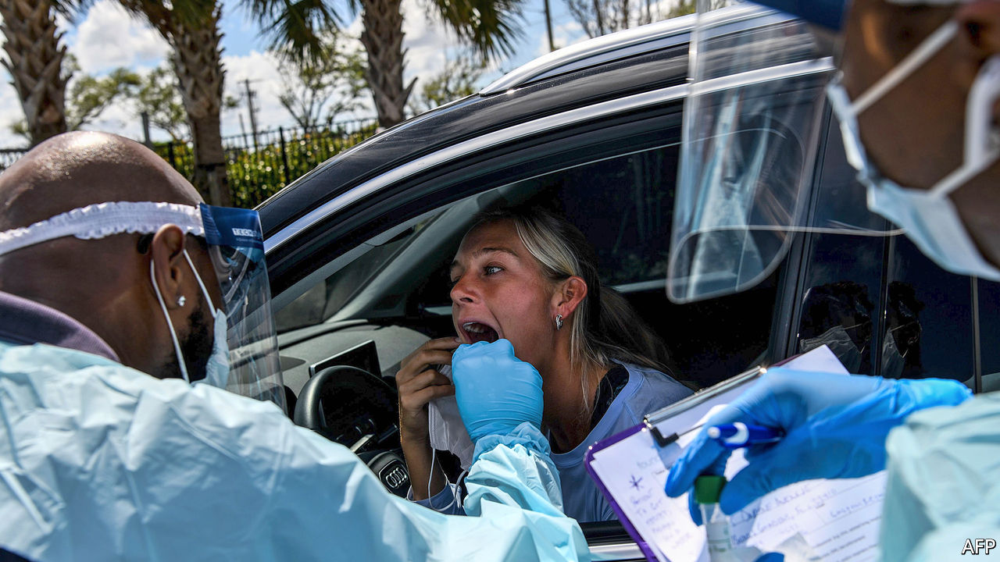

## The coronavirus pandemic

# Developing and deploying tests for SARS-CoV-2 is crucial

> Without them, no one knows what is going on

> Mar 19th 2020

Editor’s note: The Economist is making some of its most important coverage of the covid-19 pandemic freely available to readers of The Economist Today, our daily newsletter. To receive it, register [here](https://www.economist.com//newslettersignup). For our coronavirus tracker and more coverage, see our [hub](https://www.economist.com//coronavirus)

“WE HAVE A simple message to all countries.” So said Tedros Adhanom Ghebreyesus, the head of the World Health Organisation (WHO) at a news conference held in Geneva on March 16th. “Test, test, test. All countries should be able to test all suspected cases, they cannot fight this pandemic blindfolded.” Without adequate testing for SARS-CoV-2, the novel coronavirus that is now sweeping rapidly around the world, he said, there can be no isolation of cases and the chain of infection will not be broken. As if to prove the point, a vigorous policy of testing seems to have slowed the virus’s spread in South Korea quite dramatically. And in Vo, a town in Italy, thorough and repeated testing of all 3,300 inhabitants has stopped new infections entirely.

Two main types of test are used to identify viral infections: genetic and serological. The first genetic test for SARS-CoV-2 was created just a few days after the virus’s genomic sequence was published, on January 12th, by a group of Chinese researchers. Others, developed subsequently by public health bodies around the world (and also a few companies) have their own tweaks, but their broad principle is the same.

Each starts with a swab taken from the back of the nose or the throat of an individual suspected of being infected, in a search for RNA—for SARS-CoV-2 stores its genes as RNA, rather than the similar molecule, DNA, which animals such as human beings employ for the purpose. Because of this quirk, the first step of genetic testing is to copy any RNA collected into DNA, using an enzyme called reverse transcriptase. That done, the DNA is then amplified in quantity by a process called the polymerase chain reaction (PCR). The now-amplified DNA is sequenced and matched (or not) against the sequence that would be expected if the starting point was RNA from the virus.

Executed properly, genetic tests of this sort are extremely accurate. But they have limitations. One is that if the virus is present only at low levels—at the start or end of an infection, for example—their sensitivity drops. Also, taking a throat swab is neither simple nor foolproof. If the sampling probe goes insufficiently deeply into the orifice concerned, or fails to gather enough cells, the test might not work. Virologists say that the best sort of throat swabbing almost inevitably makes a patient gag or cough. This means that whoever is doing the swabbing needs to be protected from infection.

All this assumes that the tests themselves are designed properly. The WHO published protocols for a SARS-CoV-2 test in January, and most places which have created their own tests have based them on these instructions. In America, however, the Centres for Disease Control and Prevention (CDC) designed its own protocols. Tests created using these American CDC protocols, which were distributed across the country to state-level public-health laboratories, turned out to be flawed. This no doubt contributed to America’s slower response to the unfolding crisis.

The actual apparatus used to carry out PCR tests of this sort—regardless of the exact bug being tested for—is commonplace in hospitals in rich countries, for it is used routinely to identify viruses from influenza to hepatitis to HIV. But the process is thereby centralised, and can be slow. It may take as long as 48 hours after a sample is collected for the result to be returned to a patient. What is needed is a test which can be conducted immediately after sampling, a process known as “near-patient testing”. This involves packing everything required for a test—both the instruments and the chemicals—into a reasonably portable machine, designed specifically to look for SARS-CoV-2, that can be deployed away from a big hospital laboratory.

Several firms are working on such things. BioMérieux, a French biotechnology company, says it will have a test on offer by the end of March, and that it has an emergency-use authorisation for it from the Food and Drug Administration, which approves such devices for America. Cepheid, a Californian firm, will try to use a similar approval process to get its own coronavirus-specific test to market. This is a box, the size of a small laser printer, that ingests a sample, carries out an analysis and returns a result within a couple of hours.

Machines like these could be particularly valuable in places where public-health laboratories are few and far between. John Nkengasong, head of Africa CDC (an arm of the African Union unrelated to the American organisation of the same name), wrote in the Lancet in February of his concern about the spread of coronavirus across his continent, given the strong links between many African countries and China, the place where the pandemic began. One of his worries was the continent’s lack of testing capacity. At the start of 2020, only the Pasteur Institute in Senegal and the National Institute for Communicable Diseases in South Africa were able to carry out full-scale genetic detection of SARS-CoV-2.

Subsequent training, led by the WHO, has now enabled scientists in around 40 African countries to diagnose infection with the virus—but this can still be done only in each country’s central public-health laboratory. Near-patient testing would help a lot. And many health-care workers in Africa are already familiar with similar self-contained diagnostic machines, because they have been used extensively to track the efficacy of antiretroviral therapy for HIV.

Genetic tests identify active infections. But to understand properly how SARS-CoV-2 is spreading through a population it is also important to know who has been infected in the past and recovered. That is where serological tests come in. They look not for RNA in swab samples, but for antibodies in blood samples. Antibodies usually hang around in a person’s bloodstream well after an infection has cleared. They thus form a historical record of the pathogens people have been exposed to over the course of their lives.

Each antibody is tailored to latch onto a specific protein on the surface of a pathogen, thus disabling it. A serological test for SARS-CoV-2 therefore works by using such a protein—referred to as an antigen—to capture antibodies from a blood sample. Most tests under development focus on spike, a protein which protrudes prominently, and in many places, from the surface of the otherwise-spherical SARS-CoV-2 virus particle. In a typical test, a blood sample would be placed into a test tube coated inside with the antigen. If relevant antibodies are present, they will stick to the antigen. Depending on the design of the test, a positive result could produce a colour change or emit light to indicate success. The whole thing is reasonably cheap and could give results in minutes.

BioMedomics, a firm in North Carolina, for example, has designed a serological test for SARS-CoV-2 that needs only a few drops of blood from a finger prick, and which gives results in 15 minutes. It includes a hand-held plastic stick which looks similar to that from a pregnancy-testing kit. And, similarly to those tests, it uses coloured lines to indicate the presence of particular antibodies. The company says the test has already been widely used by China’s public-health authorities, but has not yet been reviewed for use by America’s FDA.

Designing a serological test, then, is straightforward. Checking that it gives accurate results takes time, though. A common problem with such tests is that antibodies may cross-react, meaning that a test for SARS-CoV-2 might also show a positive result when it comes across a different coronavirus—the original SARS, perhaps, or one of the coronaviruses that cause colds. Testing the accuracy of these tests requires trials involving hundreds of people who are known to have had SARS-CoV-2 infections, and hundreds of others who are known not to have been infected.

Once validated, serological tests are fast and cheap to run at scale. They have already been deployed in China, Singapore and South Korea. Data on their efficacy, however, have not yet been publicly released or independently verified. America’s CDC is evaluating two serological tests and Public Health England, the relevant government body in that country, is also working on a test. Chris Whitty, England’s chief medical officer, said that the introduction of such a test would be a “game changer” in the quest to track and control the spread of SARS-CoV-2 across the population. It cannot come fast enough.■

Dig deeper:For our latest coverage of the covid-19 pandemic, register for The Economist Today, our daily [newsletter](https://www.economist.com//newslettersignup), or visit our [coronavirus tracker and story hub](https://www.economist.com//coronavirus)