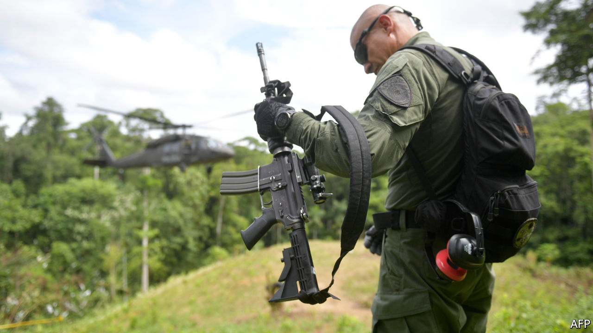

## Burning leaves, spurning leavers

# A tale of two crises in Colombia

> America pays for a pointless drug war, but is less keen to help with a huge refugee crisis

> Mar 19th 2020TUMACO AND VILLA DEL ROSARIO

A PLUME OF pink smoke wafts above the treetops, signalling where the Black Hawk helicopters should land. They circle down and, one at a time, rest their front wheels on the hillside. It is too steep to land properly, so they keep their rotors whirring while the passengers alight and then immediately lift off again.

The Colombian government is pulling up coca bushes, the leaves of which are used to make cocaine. It is a costly task, both in blood and treasure. Ten Colombians were killed during coca-eradication operations in 2019, and 50 were wounded.

Gun-toting police stand guard on the hillside, near Tumaco in south-western Colombia, to scare off gangsters. Riot police with shields, batons and tear-gas grenades stand ready, too. Their job is to deal with angry coca farmers, who object to having their crops destroyed. They wear anti-slash gloves in case a farmer expresses his feelings with a machete.

Dogs sniff the field for landmines, which gangsters sometimes plant to make eradication more hazardous. Happily, they find none. Finally, men working in pairs uproot the coca bushes with a shovel and a two-handed tug. They are farmers, flown in from other parts of Colombia so they cannot be identified by the gangs. They are paid well, to compensate for the risk and long absences from home.

President Iván Duque’s administration is trying to wipe out coca, as the United States insists it must. Last year it destroyed 100,000 hectares of it—twice as much as the previous administration managed in 2017. However, cocaleros replanted slightly more. Coca was grown on 212,000 hectares of Colombia in 2019, 2% more than the previous year, according to estimates released by the White House on March 5th. And the new bushes were higher-yielding than the ones they replaced. Potential pure cocaine production rose by 8%, to 951 tonnes.

Both the White House and the Duque administration try to put a positive spin on these dismal numbers. The number of coca fields has stabilised, they argue, after rising sharply over the previous decade.

But so long as people want to snort cocaine, it will be hard to stop people from growing coca. Demand is brisk: some 2m Americans took the drug in 2018, up from 1.4m in 2011, according to the National Survey on Drug Use and Health. Colombia produces perhaps 70% of the world’s cocaine. If, somehow, eradication reduced the supply significantly, the price would rise, raising the incentive for farmers to plant more coca. And as a helicopter ride over south-western Colombia illustrates, there is plenty of space on which to grow it. The forest stretches to the horizon in every direction, punctuated only by smouldering gaps where it has been slashed and burned to make way for coca bushes.

Colombia is twice the size of France. Gangs encourage coca farmers to encroach on national parks, which are 11% of Colombian territory. Many indigenous reserves (which are 32% of Colombian territory) are full of coca. Police can only enter in consultation with their leaders. In areas with no good roads, farmers struggle to get alternative crops such as papayas to market. Coca leaves, by contrast, are light; and the buyers come knocking on your door. Since farmers seldom own the land they sow, they are not deterred by threats to confiscate it. Small wonder that Mr Duque’s predecessor, Juan Manuel Santos, likened the war on drugs to pedalling “a stationary bicycle”.

Yet President Donald Trump urges Colombia to pedal harder. He demands that it resume aerial spraying of herbicide on coca fields. This stopped in 2015 after the World Health Organisation said it might cause cancer. Spraying by hand continues—men in hazmat suits carefully target individual plants. Mr Trump wants to dump clouds of glyphosate over wide areas again. “You’re gonna have to spray,” he told Mr Duque on March 3rd. “If you don’t spray, you’re not gonna get rid of [the coca fields].”

Colombia may have to comply. The Trump administration has previously threatened to decertify it as an ally in the war on drugs, which could trigger sanctions and the withdrawal of most American aid. “Aggressive forced eradication [is] a way of appeasing the US government,” writes Vanda Felbab-Brown of the Brookings Institution, a think-tank.

Since 2000 the United States has given Colombia more than $11bn to fight drugs and deal with insurgencies. For 2019-20 Congress has approved $418m in aid to continue that war, and also to promote peace with ex-rebels and rural development. In 2016 the FARC, the largest insurgent group, signed a peace deal and has laid down its arms. That created a vacuum in other parts of the country that has been filled by other drug-dealing groups.

In remote areas where the state is more or less absent, dozens of local leaders are being murdered. Intensive forced eradication of coca makes matters worse. It alienates rural Colombians from the state, argues Ms Felbab-Brown, and so makes it harder to pacify the coca-growing areas. Often, the state destroys a farmer’s livelihood today and offers an alternative, such as a road to get papayas to market, some time in the future. For peasants who live hand-to-mouth, this is unappealing.

Meanwhile, on the other side of Colombia is an emergency that outsiders are neglecting. Thousands of Venezuelan refugees arrive every day. On March 13th Mr Duque announced that border crossings would be closed temporarily because of covid-19. This is unlikely to stop the influx entirely—the border is more than 2,000km (1,200 miles) long and impossible to police.

The refugees who have recently crossed are in a wretched state. “One group came and picked up some dirty saucepans. I thought they were going to clean them, but they started licking them. That’s when I realised how hungry they were,” says Father Jose David Caña Pérez, who runs a Catholic feeding centre in the border town of Villa del Rosario.

Venezuela’s economy shrank by two-thirds between 2013 and 2019, mainly because of the ineptitude of Nicolás Maduro’s dictatorship. The proportion of Venezuelans who are extremely poor has risen from 10% in 2014 to an incredible 85% in 2018. “I had a choice between buying shoes for my kids or food,” says Anais Parra, who used to work in a bakery in Venezuela. Now she sits in Father Caña’s feeding centre, watching her children tuck into pork, beans and plantains. By selling snacks in the street, she earns as much in a day in Colombia as she did in a month in Venezuela.

Of the 4.5m Venezuelans who have left their country, Colombia has absorbed 1.8m. Its foreign-born population has risen 14-fold since 2013. It has welcomed the newcomers, treating their illnesses, educating their children and letting them work. Until this week, thousands of children who lived in Venezuela near the border commuted to classrooms in Colombia each day. On the Colombian side, the state laid on buses for them. On the Venezuelan side, their own government made them walk.

The pressure on the border is likely to intensify. The price of oil, Venezuela’s only big export besides people, has crashed. Peru and Ecuador, two of Colombia’s neighbours which had previously accepted lots of refugees, tightened visa rules last year. Colombia stoutly kept its border open for a long time; whether it will formally re-open it when the threat of the novel coronavirus eventually lifts remains to be seen.

The rest of the world is helping, but not much. It would cost about $1.5bn a year—or 0.5% of GDP—for Colombia to cope with the influx humanely, the International Monetary Fund estimates. Donors are supplying an eighth of this. Colombia is doing what it can, but it is struggling. Many refugees sleep on bits of cardboard under trees. Schools are groaning with extra pupils.

Clinics are finding it even harder. It was the fear of Colombia’s health service being overwhelmed that prompted the border closure. Venezuelans cannot get treatment for covid-19 in their own country, so they are likely to seek it in Colombia. Indeed, many cannot even get soap in Venezuela.

Colombians feel a historic obligation: many of them went to work in Venezuela back in the days when Venezuela was prosperous and Colombia was not. Venezuelans are culturally similar and speak the same language, so they assimilate relatively easily. Because the refugees work, they will ultimately contribute to the Colombian economy, argues the finance minister, Alberto Carrasquilla. “Immigration is a net plus, over the medium term,” he says.

But in the short term, the welcome mat has worn thin. A year ago most Colombians approved of the government’s policy of offering a haven to Venezuelans, according to Gallup. Now most do not. Many people near the border “feel threatened. They feel there is no control over who is coming in,” said Estefania Colmenares, a journalist, shortly before the border closed.

Colombia did not create either of these crises. The drug trade is driven by global demand. The Venezuelan exodus is driven by a corrupt, brutal and incompetent dictatorship in Venezuela. Yet Colombia is left to deal with the consequences: swathes of ungovernable territory in one part of the country, overstretched public services in another. It needs the right kind of help: less bullying to wage an unwinnable war on drugs, and more cash to cope with a refugee crisis in the middle of a pandemic. ■

## URL

https://www.economist.com/the-americas/2020/03/19/a-tale-of-two-crises-in-colombia
