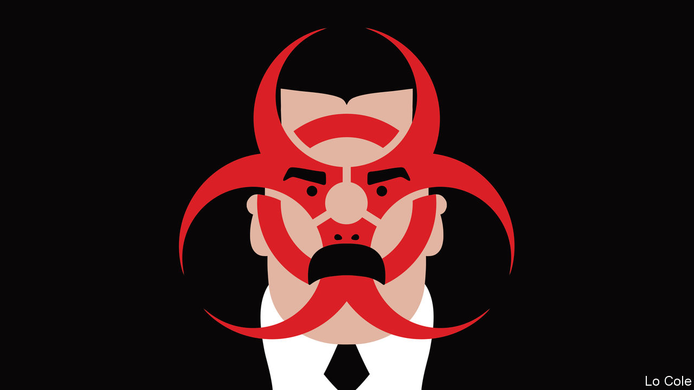

## Bello

# Venezuela’s political quarantine

> The virus may favour an unlikely deal between the regime and the opposition

> Mar 19th 2020

AS IF IT were needed, coronavirus is a cruel reminder that the man who holds all the power in Venezuela is not Juan Guaidó, whom some 60 countries recognise as its president, but Nicolás Maduro, the dictator who kept the office by electoral theft. Blaming foreigners for 36 detected cases of covid-19, on March 16th Mr Maduro ordered a lockdown of the country similar to those in Spain and Italy, placing the armed forces in charge of enforcing it. That may be medically sensible. It is also politically convenient.

Mr Guaidó, who is the speaker of the National Assembly, last month began a new round of street demonstrations against Mr Maduro’s regime, which will now presumably stop. They are a shadow of the massive protests that followed his proclamation as “interim president” 14 months ago, when Mr Maduro began a second term after a fraudulent election. In theory the opposition remains committed to ousting Mr Maduro and calling a democratic presidential ballot. But sweeping American sanctions on Venezuela’s oil industry have so far failed to break the regime. Talks between government and opposition broke down in September. That leaves the opposition with a dilemma.

Under the constitution an election for the National Assembly is due towards the end of this year. In 2015, in Venezuela’s last free election, the opposition won a big majority in the assembly. Mr Maduro’s people see the chance to seize the only institution they don’t control. Radicals in the opposition insist that the vote will be a farce and pledge to boycott it. Any credible election would have to include a fresh presidential vote, they say. Pragmatists fear that a boycott will render the opposition irrelevant. They see a faint opportunity for a deal.

Earlier this month representatives of the government and the opposition agreed on a procedure to appoint new members to the electoral authority. In theory the government would accept international observation of the vote, by the UN and the European Union, says a European diplomat. But there are plenty of obstacles. Around 30 of the opposition’s legislators have been stripped of their parliamentary immunity by Mr Maduro’s puppet judiciary, and are either in exile or jail. Its main parties are banned on technicalities. Any deal would have to involve complete freedom to campaign.

But Mr Maduro has weaknesses, too. Thanks mainly to his mismanagement, Venezuela is in no condition to cope with the virus. Its hospitals were already death traps. Many of its doctors are among the 4.5m Venezuelans who have fled his rule. With Russian help, Venezuela’s production of oil, which accounts for 95% of its legal exports, has stopped falling (though it is still only 60% of its level of 2018). But this month’s plunge in the oil price leaves it below Venezuela’s average cost of production. On March 15th Mr Maduro wrote to the IMF, which he has spent years denouncing as an imperialist tool, asking for a $5bn loan to fight covid-19. The IMF turned him down because his government lacks sufficient international recognition.

There is little sign that Mr Guaidó’s backers in the administration of President Donald Trump are prepared to contemplate any deal in Venezuela. This week Mr Trump nominated Carlos Trujillo, a hardliner, to be his top diplomat on Latin America. The region continues to be polarised by Venezuela, as the battle to be secretary-general of the Organisation of American States, a 34-member club, has illustrated. Luis Almagro, the Uruguayan incumbent, is seeking a second term in a vote of foreign ministers due to take place on March 20th (virus permitting). A vocal opponent of Mr Maduro, he has been more effective at grandstanding than diplomacy, say his critics. But there is no space for nuance. Hugo de Zela, an experienced Peruvian diplomat who favoured a less confrontational approach, this week dropped out. Mr Almagro is likely to beat his remaining rival, María Fernanda Espinosa, a former Ecuadorean foreign minister widely seen as Mr Maduro’s candidate.

The hardliners have a problem. There is no evidence that sanctions alone will get rid of Mr Maduro. That means having to deal with him, one way or another. This week Colombia, which has no diplomatic relations with Venezuela, recognised that when its health minister spoke to his counterpart about the virus. None of this means caving in to dictatorship. It is merely to grasp that the virus offers a fresh opportunity for negotiations. “It’s a road,” says the European diplomat. “There is no other one.”

## URL

https://www.economist.com/the-americas/2020/03/19/venezuelas-political-quarantine
