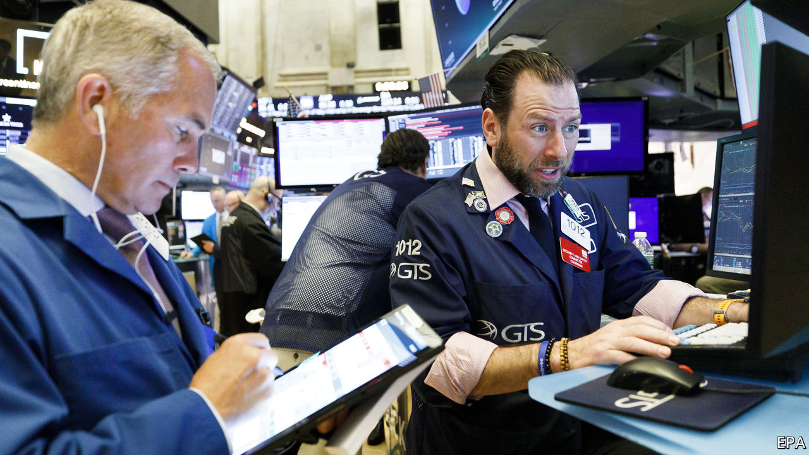
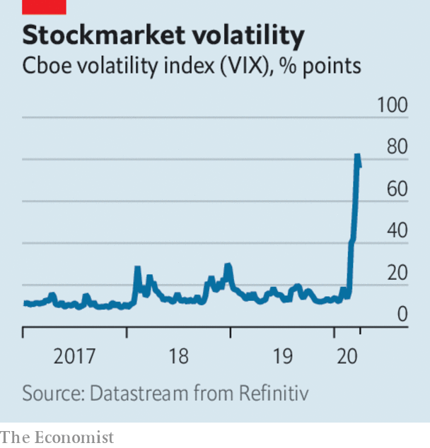

# Business this week

> Mar 21st 2020

The Federal Reserve took more emergency measures to bolster short-term liquidity in markets by providing new funding lifelines to banks. It also cut its benchmark interest rate close to zero and began a new programme to buy commercial paper. Stockmarkets were in free fall; trading was halted again on the New York Stock Exchange after steep plunges triggered an automatic “circuit breaker”. The S&P 500 had its worst day since 1987, falling by 12%. It has now shed all the gains it made last year. See [article](https://www.economist.com//finance-and-economics/2020/03/21/why-americas-financial-plumbing-has-seized-up).

As investors turned to the dollar for safety, the pound fell to levels last seen during the 1980s, dropping below $1.15 in trading. Uncertainty about Brexit was an extra factor weighing on panicky markets. See [article](https://www.economist.com//britain/2020/03/21/covid-19-is-delaying-brexit-negotiations).

The European Central Bank launched a €750bn bond-buying programme that covers government and corporate debt. Banks in the euro zone tapped €109bn in ultra-cheap loans under a new facility. China’s central bank lowered the amount of cash holdings that banks are required to keep in reserve, a measure intended to free up loans to businesses. Industrial output in China shrank by 13.5% in January and February compared with the same two months in 2019, the biggest drop on record. In Britain the government unveiled a £330bn ($380bn) loan package for firms. See [article](https://www.economist.com//leaders/2020/03/19/how-to-prevent-a-covid-19-slump-and-protect-the-recovery).

Andrew Bailey took over as governor of the Bank of England, a baptism of fire as the central bank reacts to the covid-19 crisis and continues its preparations for Britain’s withdrawal from the EU’s financial provisions by the end of the year. Mr Bailey said the bank would seek to limit the fallout from the crisis so that it would be “disruptive” instead of “destructive”. He added that the bank was willing to pump unlimited amounts of money into the economy through the government’s new covid financing facility.

At an emergency meeting Turkey’s central bank cut its benchmark interest rate by one percentage point, to 9.75%, causing the lira to slide. The bank thinks a global slowdown will cool inflation, which is on the rise again in Turkey.

Commodity prices continued to tumble amid gloomy forecasts for industrial demand. Facing a double whammy of reduced demand and a price war started by Saudi Arabia, oil prices plunged, with Brent crude at a 17-year low of around $25 a barrel. Gold prices, usually a haven in stressed markets, dropped as investors cashed in their holdings. Silver, which is widely used in industrial processes, was at its lowest price since 2009.

The International Air Transport Association warned that the forecast it provided only recently about the hit to airline revenues during the crisis is now out of date. The association is calling for governments around the world to provide carriers with direct financial support, favourable loans and tax relief, which it now reckons could cost between $150bn and $200bn. The situation is “totally beyond the control of the airlines”, it said. See [article](https://www.economist.com//business/2020/03/19/airlines-are-running-out-of-cash).

Boeing also asked for help, requesting $60bn “in access to public and private liquidity”, including loan guarantees, for the aerospace industry. Already battered by drawbacks in getting the 737 MAX to fly again, its share price has slumped since mid-February, and fell sharply again this week when Standard & Poor’s cut its credit rating by two notches.

Amazon decided to employ an extra 100,000 warehouse and logistic workers in America to help it cope with a surge in online shopping. It is also restricting space in its warehouses to household essentials and medical supplies, leaving little room for third-party sellers. Although Amazon is hiring, Steven Mnuchin, the treasury secretary, reportedly thinks America’s unemployment rate could hit 20% if drastic action isn’t taken.

The crisis is taking a heavy toll on other retailers. Zara, a fashion chain, temporarily shut half its stores worldwide. Laura Ashley, a purveyor of textiles and other goods themed in the English- romantic style, was close to collapse. It opened its first shop in the 1960s.

France slapped a €1.1bn ($1.2bn) fine on Apple for conniving with wholesalers to suppress competition. Apple said the decision, the biggest antitrust penalty imposed on a single company in France, ignored 30 years of legal precedent. The firm plans to appeal.

HSBC appointed Noel Quinn as its chief executive. Mr Quinn was given the job on an interim basis when John Flint was defenestrated last August and is ploughing ahead with a huge restructuring at the bank.

Stepping up to the coronavirus crisis in France, LVMH, the world’s biggest maker of luxury goods, switched its perfume and cosmetic production lines to make hand sanitiser, which it is giving away to hospitals. Sites that made Dior and Givenchy scents are now churning out hydroalcoholic gel.