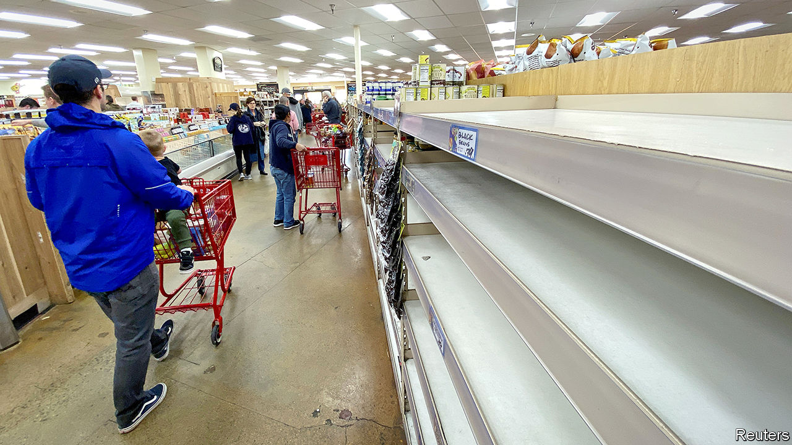
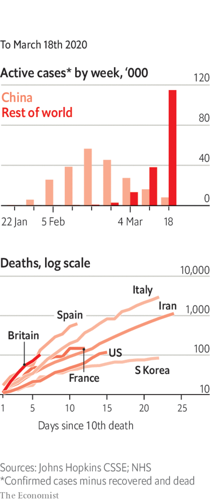

# Politics this week

> Mar 21st 2020

Governments around the world took extraordinary measures to curb the novel coronavirus and alleviate its economic consequences. In America the Trump administration proposed giving direct cash transfers to every American as part of an emergency- spending package. Some Republicans balked at the idea, but Mitch McConnell, the leader of the Senate, said that now was the time for “urgent bipartisan action”. See [article](https://www.economist.com//leaders/2020/03/19/paying-to-stop-the-pandemic).

Joe Biden swept the board in the latest Democratic primaries. In Florida, the biggest prize on offer, he won 62% of the vote to 23% for Bernie Sanders. The pair also debated in their first one-on-one clash. Ohio postponed its primary because of the pandemic, as have Georgia and Louisiana. See [article](https://www.economist.com//united-states/2020/03/19/joe-biden-builds-an-insurmountable-lead).

The Justice Department dropped charges against two Russian entities indicted by the Mueller inquiry because it believes a trial would give Russia access to sensitive documents it would have to share with the defence.

The president of France, Emmanuel Macron, declared that the country is “at war” with the coronavirus. He announced the suspension of local elections, a day after France had voted in the first round. See [article](https://www.economist.com//europe/2020/03/19/france-suspends-local-elections-because-of-covid-19).

The Constitutional Court in Russia approved amendments to the country’s constitution that will reset to zero the number of terms already served by Vladimir Putin. He would otherwise have been ineligible to run again when his current term expires in 2024. See [article](https://www.economist.com//europe/2020/03/21/some-russians-are-resisting-putins-power-grab).

The brother of the suicide-bomber who killed 22 people at an Ariana Grande concert in Manchester in 2017 was found guilty of the murder of each victim. He was convicted for obtaining the materials for the bomb and of helping in the plot. In addition to those murdered a further 800 were hurt, more than 90 with life-changing injuries.

Benny Gantz, the leader of the opposition in Israel, was given the first shot at forming a government after a tight election earlier this month. But his coalition is divided. Binyamin Netanyahu, the prime minister, has tried to push Mr Gantz into forming a unity government, under Mr Netanyahu, to deal with covid-19. See [article](https://www.economist.com//middle-east-and-africa/2020/03/19/binyamin-netanyahu-vows-to-protect-israel-from-the-virus).

The president of Iraq named Adnan al-Zurfi as prime minister-designate in a bid to end a months-long political deadlock. The previous prime minister resigned in November amid large anti-government protests. Powerful Shia parties have already lined up against Mr Zurfi’s nomination.

Sweden promised to send 150 commandos and helicopters to Mali to join a French-led mission fighting jihadists in the Sahel. Security in the country has continued to deteriorate.

Peter Mutharika, president of Malawi, sacked the head of the army, dissolved his cabinet and refused to sign new laws allowing for fresh elections in May. Malawi’s top court had annulled his re-election victory, citing vote-rigging. He plans to stick around anyway.

Brazil’s president, Jair Bolsonaro, joined supporters who were holding demonstrations in favour of him. He fist-bumped his fans and took selfies with them even though at least 17 people who accompanied him on a recent visit to Mar-a-Lago, Donald Trump’s getaway in Florida, tested positive for covid-19. Mr Bolsonaro describes the reaction to the virus as “hysteria”.

A court in Guyana temporarily blocked a recount of votes cast in the general election on March 2nd. A candidate from the president’s coalition brought the suit seeking the injunction. International observers had said there was credible evidence of fraud in an initial tally, which gave victory to the president.

China ordered American citizens working for the New York Times, the Wall Street Journal and the Washington Post to leave the country. It was the biggest mass expulsion of western correspondents from China since the Communist takeover in 1949. The government said it was a response to America’s decision to limit the number of people working for China’s main state-owned news organisations stationed in America to 100. See [article](https://www.economist.com//leaders/2020/03/21/expelling-journalists-is-no-way-to-fight-a-pandemic).

Amid cries of “shame”, opposition MPs staged a walkout from the Rajya Sabha, India’s upper house, when Ranjan Gogoi took oath as a new member. Mr Gogoi recently retired as chief justice; critics of the ruling Bharatiya Janata Party claim his seat is a pay-off for rulings that favoured the government.

East Timor entered its third week of political flux after the prime minister resigned. The president is mulling whether to call a snap election or appoint as prime minister Xanana Gusmão, a former president who says he has the support of a majority of MPs.

America urged the government of Afghanistan and the Taliban to proceed with a proposed exchange of prisoners, as promised in the agreement the Taliban signed with America in February. The Afghan government wants the exchange to proceed alongside peace talks, but the Taliban say talks cannot begin until the prisoners are released.

Countries imposed strict restrictions on border crossings, including between America and Canada. See [article](https://www.economist.com//briefing/2020/03/19/in-europe-and-around-the-world-governments-are-getting-tougher).

Stringent curbs on the movement of people were enforced in France, Spain, the San Francisco Bay Area and other places.

The number of deaths surged in Italy. For the first time China reported no new daily local infections. See [article](https://www.economist.com//europe/2020/03/19/italy-is-overtaking-china-as-the-country-worst-hit-by-covid-19).

The Philippines declared a “state of calamity”.

Researchers were concerned about a second wave of infections in Hong Kong, Singapore and Taiwan.

Supermarketstook steps to ration the sale of products and to set aside shopping hours for the vulnerable.

In what some saw as a blow, the Eurovision Song Contest was cancelled.

For our latest coverage of the virus and its consequences please visit [economist.com/coronavirus](https://www.economist.com/http://economist.com/coronavirus) or download the Economist app.

## URL

https://www.economist.com/the-world-this-week/2020/03/21/politics-this-week
