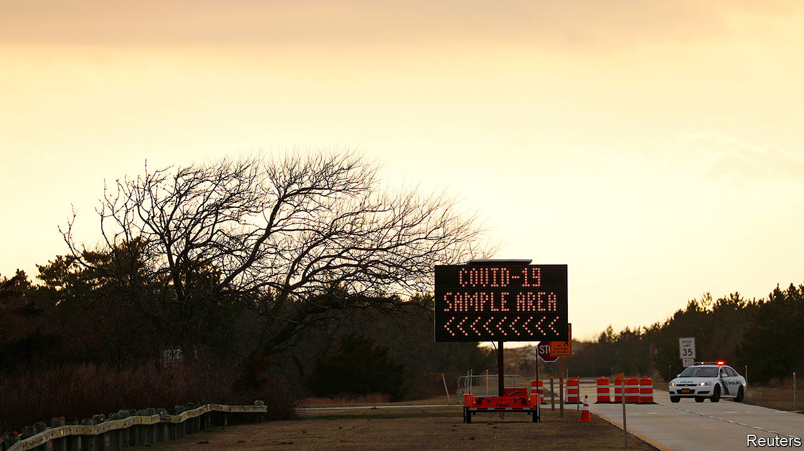

## Responding to covid-19

# American life has been transformed in a few short weeks

> The next few will be even tougher

> Mar 19th 2020WASHINGTON, DC

Editor’s note: The Economist is making some of its most important coverage of the covid-19 pandemic freely available to readers of The Economist Today, our daily newsletter. To receive it, register [here](https://www.economist.com//newslettersignup). For more coverage, see our coronavirus [hub](https://www.economist.com//coronavirus)

THE TITULAR conceit of “28 Days Later”, as with many contagion-style horror films, is of a man waking up after a month-long coma only to find society upended by a rampaging virus. Many Americans are experiencing something similar. On March 3rd there were just 122 confirmed cases of covid-19—the disease currently sweeping the world—and only seven deaths. By March 17th there were 7,786 confirmed cases (even these were a sure underestimate given the dearth of testing) and 118 deaths. Twenty-eight days later, on March 31st, what might America look like?

“We don’t know whether we’re going to look like Italy or the provinces outside Hubei” in China where the spread of covid-19 was fairly effectively contained, says David Blumenthal, president of the Commonwealth Fund, a health-policy think-tank. “But the likelihood is—given the slowness with which we responded to the epidemic—that we look more like Italy,” he adds. Jerome Adams, the surgeon-general, has warned of the same.

Can America’s health system cope? The structural problems that make pandemic response more difficult—lack of paid sick pay, a large uninsured population and a significant number of insured people nonetheless worried about out-of-pocket medical bills—cannot be mended overnight. Instead, public-health experts and doctors are increasingly worried about sheer capacity constraints. In China, 5% of those diagnosed needed intensive care. There are roughly 97,000 beds in intensive care units (ICUs), of which one-third are empty. Though America has relatively few total hospital beds per person compared with other countries, it ranks among the highest for ICU beds per person, with nearly three times as many as Italy.

“The real limiting factors are likely to be the ventilators or the staff,” says Greg Martin, a professor of medicine at Emory University and president-elect of the Society of Critical Care Medicine. There are roughly 50,000 physicians trained in critical care and 34,000 similarly specialised nurses and assistants. This could be insufficient in the face of hundreds of thousands of cases at peak rates of infection.

Then there is the problem of kit. In China, half of those in critical care required the use of ventilators, machines that help people breathe. There are thought to be 62,000 full-featured mechanical ventilators in the country, many of which are already in use (see [article](https://www.economist.com//business/2020/03/19/companies-are-scrambling-to-build-more-ventilators)). Older stocks of perhaps 100,000 devices—including CPAP machines used for those with sleep apnea—could be called upon if needed, but would provide only basic functions. Ramp-ups in ventilator production are being pondered, including through emergency powers given to the president under the Defence Production Act of 1950, but there has been little actual action yet. On a phone call with state governors, President Donald Trump urged “respirators, ventilators, all of the equipment—try getting it yourselves”, which could spark an unhelpful competition between states for scarce resources.

“Under almost any basic scenario, things look tough. Hospital beds will be completely full many times over if we don’t substantially spread the load,” warns Ashish Jha, director of the Global Health Institute at Harvard. To head that off, Mr Jha has called for an Italy-style national quarantine, lasting for at least two weeks, in which all non-essential businesses are closed and gatherings of more than five people are barred to give time for testing to become widespread. After a dismally slow start to testing, the numbers are finally heading up—although the best estimates come not from public-health agencies, but volunteer trackers using a Google sheet—to an estimated 12,535 tests conducted on March 17th. Given the expected scope of the disease, and the reported obstacles to people with symptoms actually getting tested, much more will be needed.

Most hospitals are making contingency plans. There are plans to add physical beds by cancelling elective surgeries that can be postponed, converting recovery rooms into added beds and building tents to house some patients. The Cleveland Clinic, a prominent hospital, says it has plans in place to add 1,000 beds of capacity within 72 hours if needed. Teams of doctors and nurses with other specialities could be conscripted into critical-care work, supervised by critical-care doctors who handle the trickiest cases—like respiratory distress coupled with organ failure in the kidneys or heart. If this is insufficient, recently retired doctors could be drafted into service. Some teaching hospitals are using simulation centres to prepare medical staff for the inevitable surge in cases.

Whether it will come to all this is still unclear. Testing capacity remains constrained, limiting the information epidemiologists have to feed both their models and their willingness to speculate. Their policy recommendations—social distancing, closure of schools and large gatherings—are nevertheless clear. One team of researchers has concluded that an epidemic resembling that of Wuhan, where the novel coronavirus first broke out, would overwhelm hospitals many times over, while one resembling Guangzhou, a city that locked down in the early days of the virus, could be dealt with.

On March 16th, however, a team of scientists based at Imperial College London, who have been advising the British government, also published forecasts of the epidemic’s trajectory in America. As with Britain, the figures look grim. Without any mitigation, America would experience 2.2m deaths, they predict (see [Briefing](https://www.economist.com//briefing/2020/03/19/in-europe-and-around-the-world-governments-are-getting-tougher)). Even in the case of some mitigation—isolation of the sick, social distancing for the elderly, but an otherwise normal society—American hospital and ICU capacity would be exceeded eight times over, and the country would be on track for at least 1.1m deaths. Averting this through “suppression”—isolation of sick, closing of schools and universities, social distancing for everyone—would require months until therapeutics or vaccines can be developed.

America is therefore turning towards suppression of the virus. Millions of pupils and university students have been sent home and left to take classes online. Mr Trump has advised that people not congregate in gatherings of more than ten people. San Francisco and surrounding counties have issued a “shelter-in-place” order that requires 7m to remain in their homes unless necessary. New York City is expected to do the same for its 8m residents. In 22 states, bars and restaurants have been ordered to close their seating and only serve takeaway. The state of New York is setting up drive-through testing centres, starting in New Rochelle, a commuter town in Westchester County that was one of the early sites of a covid-19 cluster, and is urging federal troops to build emergency, temporary hospital facilities. New Rochelle’s mayor says he is surviving the lockdown there on “adrenalin, coffee and M&Ms”.

The goal is to increase general hospital capacity by a factor of two and ICU capacity by a factor of ten within two months. Elections have been postponed in a few states for the Democratic primary, which now seems a dull, distant affair. America’s devolved system means that the shuttering will happen at different rates in different places, but the trajectory is clear. “You want a single national response. But when the federal government completely fails, as it has so far, then you can get states and cities to step up,” says Mr Jha.

The question is how long this can go on for. Unmitigated, the epidemic would not peak for at least another three months. Suppression can reduce the spread of the disease, as China’s experiment with locking down most of its population showed, but relaxing these measures will inevitably bring another surge in cases. Mr Trump, who a few weeks ago was suggesting the virus was the latest hoax invented to damage him, is now warning that this could be the start of a months-long reorientation in American life. And while these extraordinary actions should smother the disease, they will also smother the economy.

The dismal economic forecasts will require further action from Congress. It spent the last week haggling over a bill that would make testing for the disease free, increase the flow of safety-net benefits and grant paid sick leave to more workers (though this provision appears to be hollowing out with every iteration). Even before that bill was finalised, Washington’s attention had already turned to the even bigger economic stimulus package that must come next. Senators, both Democrats and Republicans, are tripping over themselves issuing plans to send cash directly to American families.

The total package, which could be worth $1trn or more, dwarfs the $100bn-or-so bill recently signed into law and every other stimulus package in history. The Trump administration has proposed sending $500bn in direct cash to taxpayers, $300bn to keep firms afloat, and $200bn to bail out critical industries like airlines. The typical partisan bickering from Congress and even from Mr Trump has been muted. Every politician seems to now realise that the country faces an unprecedented crisis, first of public health and then of the economy, that will last for months. Whether this action will look sufficient 28 days later is, as with seemingly every aspect of the covid-19 pandemic, deeply uncertain.■

Dig deeper:For our latest coverage of the covid-19 pandemic, register for The Economist Today, our daily [newsletter](https://www.economist.com//newslettersignup), or visit our [coronavirus hub](https://www.economist.com//coronavirus)