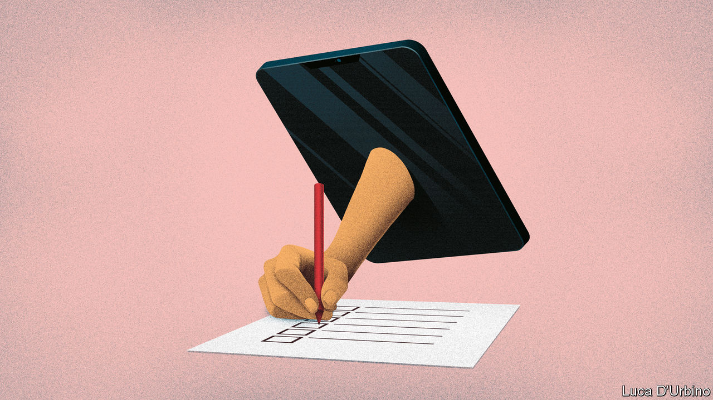

## Census and sensibility

# Coronavirus disruption risks damaging the 2020 United States census

> The data gathered will be used for a decade to distribute trillions

> Mar 21st 2020

Editor’s note: The Economist is making some of its most important coverage of the covid-19 pandemic freely available to readers of The Economist Today, our daily newsletter. To receive it, register [here](https://www.economist.com/https://my.economist.com/user#newsletter). 

WHEN THE 2020 United States census, scheduled for April 1st, was planned, the areas of most concern were mapped. They include places like Deep East Texas, an area of 10,000 square miles north-east of Houston with a population of roughly 385,000 people. “We are a totally rural region,” says Lonnie Hunt, the director of the Deep East Texas Council of Governments (DETCOG), an intergovernmental agency. “We have economically distressed people, rural people, senior citizens, minorities—we check box after box after box.” In large parts of the region most people do not have internet access. Many live in places only accessible with four-wheel drives.

Counting everybody in Deep East Texas was never going to be easy. Now it looks like it may be near impossible. “The coronavirus has certainly complicated matters,” says Mr Hunt. To help ensure an accurate count, DETCOG had hired a dozen census co-ordinators to go out to community events—sports matches, church services, school sports days—with information to persuade people to send their returns in, and internet hotspots and iPads with which to do it on the spot. Most of those events are now being cancelled. With people staying indoors, they probably will not encounter any of the workers meant to explain to them the importance of the census and get them to fill it in.

The virus may represent the biggest threat to the United States census in its 230-year history. Mandated by the constitution, it is the world’s most expensive and among the world’s oldest consistent data-gathering operations. The results determine how many congressional seats and electoral-college votes are allocated to each state, and where those districts are. Roughly $1.5trn of federal money each year is spent according to data derived at least in part from census returns. It is not just the government that uses it. Firms use it to decide where to build supermarkets, target advertising or open factories. “Every nook and cranny of the private economy relies on census data,” says Andrew Reamer of George Washington University.

It is also a huge operation involving hundreds of thousands of workers travelling across the country knocking on doors. In 2010 a quarter of Americans were counted by workers in person. It is not only the door-knocking, which begins on May 13th, that may be threatened by the need for people to self-isolate. The televised sports events that advertising would have targeted, such as the March Madness college basketball games, are all being cancelled.

Even before the outbreak of the virus this year’s census was raising concerns. The census is meant to record every single person in America on the day it is held. But this year President Donald Trump’s government wanted to add a question to the census about citizenship. The question was struck down by the Supreme Court. But Nestor Lopez, an official from Hidalgo County along the Texas-Mexico border, says he worries many people, especially undocumented immigrants, still fear information gathered could be used against them. People “do not want to be answering anything from the federal government,” he says. In fact, personally identifiable data from the census cannot be revealed for 72 years, even to other government agencies. But most people do not know that. And now they may never hear otherwise.

So far the Census Bureau has only made modest changes. On March 18th the agency announced that all field operations are to be suspended until April 1st. On other surveys officials will make phone calls instead of visits. It has asked administrators of “group quarters”—institutions like nursing homes, prisons and college dormitories—to “choose a way to count their residents that requires less in-person contact”. But more radical adjustments may be needed. Terri Ann Lowenthal, a former director of the House committee that oversees the census, notes that the count takes ten years to plan, and “yet now the Census Bureau is being forced to make shifts basically on the fly”. On March 17th Brazil announced it would delay its census by a year. American officials might have to consider that, too.■

Dig deeper:For our latest coverage of the covid-19 pandemic, register for The Economist Today, our daily [newsletter](https://www.economist.com/https://my.economist.com/user#newsletter), or visit [our coronavirus hub](https://www.economist.com//coronavirus)