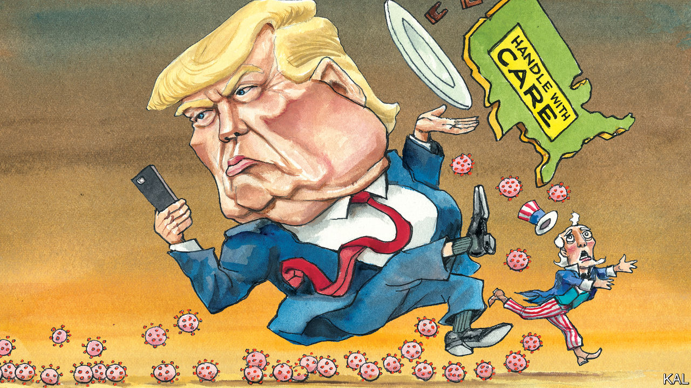

## Lexington

# Covid-19 is exposing America’s resilience—and vulnerability

> Governors, mayors and sheriffs will not let a hopeless president stop them from doing what they need to do

> Mar 21st 2020

Editor’s note: The Economist is making some of its most important coverage of the covid-19 pandemic freely available to readers of The Economist Today, our daily newsletter. To receive it, register [here](https://www.economist.com//newslettersignup). For more coverage, see our coronavirus [hub](https://www.economist.com//coronavirus)

IT IS HARD to pick the best illustration of the administration’s failings on covid-19. There have been so many.

Having been in the crowd to hear Donald Trump dismiss the virus as the Democrats’ “new hoax” three weeks ago, Lexington is still grappling with the president’s denialism. The predictable result, surveys this week suggest, is that Republican voters are much less likely than Democrats to consider the virus dangerous or to take any measure to avoid contracting it. Given that they also tend to be older, this threatens to bring a dramatic new meaning to the hoary trope about Republicans voting against their own interests.

Yet the problems extend beyond the president’s rhetoric. John Bolton’s decision to scrap the NSC’s dedicated pandemic unit is another contender. So is the Centres for Disease Control sticking with a faulty viral test when the WHO could have provided a working alternative; also the turf wars among the White House’s cast of suck-ups and cronies; and Mr Trump’s latest xenophobic attack on China. It is a stunning catalogue of failure.

And its effects could be profound. The Iraq war and financial crisis fuelled a wave of mistrust in government that helped elect Mr Trump. The viral plague may end up deadlier than the war and costlier than them both. Even cool heads are sounding the alarm. In the Atlantic Anne Applebaum foresees a devastating national epiphany—a moment when the country “long accustomed to thinking of itself as the best, most efficient, and most technically advanced society in the world, is about to be proved an unclothed emperor.” In the Financial Times another veteran of this newspaper, Gideon Rachman, suggests America’s failure on covid-19 and China’s perceived success could do dreadful damage to democracy.

These are plausible scenarios. The virus is descending on a country already gripped by pessimism. In “A Time To Build”, the conservative thinker Yuval Levin discerns a “twilight age” of national frustration and joylessness, which he ascribes to a part-justified, morally sapping loss of trust in institutions. In another new book, “Why We’re Polarised”, Ezra Klein describes the corrosive role that racially infused partisanship plays in that. He also holds out little hope of it or the political dysfunction it causes receding, because of the electoral advantages the Republicans’ lily-white minority will continue to enjoy, even as it shrinks. By 2045 whites are expected to be a minority but, thanks to West Virginia, Wyoming and the other small, mostly white states, the withered hand of Mitch McConnell could in theory still control the Senate.

Such imposing problems will probably ensure that America’s adjustment to greater diversity at home and multipolarity abroad will continue to be rocky. But they need not lead to the head-on collision pessimists fear. America’s fortunes have hardly ever been smooth (notwithstanding, as Mr Levin has previously described, rival forms of liberal and conservative nostalgia for an imagined mid-20th-century golden age). And the country’s traditional sources of resilience are still apparent—even in the current crisis.

One strength is the flipside of the bureaucratic havoc and buck-passing that the pandemic has triggered. It is a decentralised and fragmented democratic system that responds much better to local than national trials. The federal government defers to the states as a matter of course on public health, policing and emergency response. In the event of a major crisis, this is a recipe for chaos, which is why the quality of the president matters so much, as George W. Bush showed in the bungled aftermath of Hurricane Katrina and Mr Trump is showing more grievously. Only he has the bully pulpit and powers required to cut through the institutional rivalries, bottlenecks and excessive legalisms that Americans have intentionally put in the way of central authority.

Yet each cascading layer of American governance offers a partial fix, from governors—many of whom are now battling to fill the void, led by Mike DeWine of Ohio and Andrew Cuomo of New York—to hospital boards and sheriffs. And though the main strengths of this diffuse system—local sensitivity and experimentation—may now be of secondary importance, their time will soon come.

Meanwhile, the crisis is underlining how asymmetric Americans’ pessimism and mistrust of the mainstream is. While Jerry Falwell junior was informing Fox News viewers last week that covid-19 was designed by North Korea to hurt Mr Trump, mainstream media organs, universities, other centre-left entities and both the main Democratic presidential contenders were preaching social distancing. In 2009 Mr Obama’s $830bn stimulus limped out of the House of Representatives without one Republican backer; the House Democratic majority is about to grant Mr Trump’s wish for even bigger measures. Democrats, unlike many Republicans, still believe in expertise, objective truth and good government. And the fact that many blame this disaster on Mr Trump, who represents none of those things, suggests it will not shake their trust in them. Indeed they are about to nominate for president one of America’s most upbeat, undogmatic politicians. Even before considering the merits of Joe Biden’s policies, this is a basis for optimism.

Ever since Mr Trump’s election, many have asked whether he could rally the country against a major threat. The worst of their fears seem to be justified. Yet, for another tentative solace, there is still some rallying afoot. Fox has abruptly switched from offering conspiracy theories to public-health advice. It knows things have got serious. The pragmatism of many Republican lawmakers—including Mitt Romney, an early advocate of individual cash transfers—is also encouraging. Congress is about to raise its game dramatically.

The functional moment will pass, whenever the crisis recedes, leaving who knows what devastation in its wake. But amid that uncertainty, here is another silver lining. It seems increasingly possible that, in eight months’ time, voters will appraise Mr Trump on a substantial new issue: his competence to be president.■ 

Dig deeper: