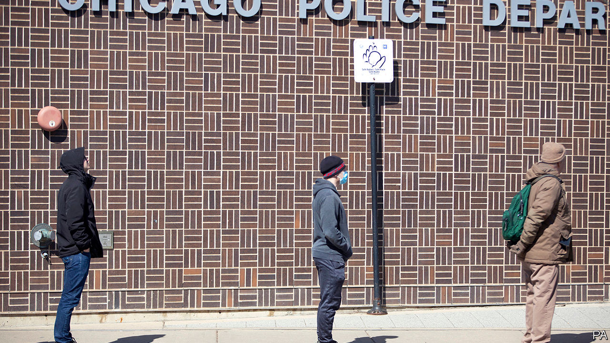

## Electoral distancing

# Joe Biden builds an insurmountable lead

> The former vice-president is way out in front in what looks like being a very odd campaign

> Mar 19th 2020NEW YORK

MAGNANIMITY IS A winner’s privilege, and the speech that Joe Biden delivered on March 17th was amply magnanimous. He told supporters of Bernie Sanders, whom he defeated in all three states voting that night, that he and his rival “may disagree on tactics, but we share a common vision”. Standing alone in his Delaware home behind a podium (a necessary piece of furniture for a candidate working from home), he praised first responders and poll-workers, consoled the bereaved and sounded more like a wartime president than a candidate. His victory in the primary is now all but assured. But what campaigning and voting will look like during the pandemic is anything but.

The most striking aspect of Mr Biden’s victory was its breadth. Arizona, Florida and Illinois collectively have 184 counties. Bernie Sanders won three of them, none by more than five points. He hoped that Latinos would buoy him in Florida, but lost the state by nearly 40 points. This may partly have been because of the weight of Cuban-Americans: Mr Sanders—in an act either of admirable principle or political lunacy—has repeatedly praised the accomplishments of the Castro regime. The picture was different in Arizona, which Mr Sanders lost by just 12 points. A greater proportion of Latinos there are Mexican, and many are recent arrivals; these groups tend to be more left-wing than Hispanics in Florida. And Arizona has a bigger Hispanic population than Florida: 30% of its residents are Latinos versus 23% in Florida.

Mr Sanders’s supporters, who have visions of turning Texas and Arizona Democratic, point to his strength with Latinos as a reason he should lead the party. The results on March 17th show that such thinking is flawed. There are more competitive electoral-college votes at stake in Florida, where Mr Sanders is much less popular. Such assertions also ignore general-election polls, which show Mr Biden beating Mr Trump in Arizona, but Mr Sanders losing. Besides, Mr Biden’s delegate lead now appears insurmountable. To win the nomination, Mr Sanders would need to win 64% of the remaining delegates. He is polling nationally at just 36%.

The Illinois primary, which Mr Biden won by 23 points, was marked by low turnout. Chicago election officials said at least 10% of 8,500 election judges—volunteers who oversee polling booths—had dropped out, fearful of viral contagion. Polling stations in Chicago had more bottles of hand sanitiser than walk-in voters. An official at one north-side site likened the dour public mood to the “start of world war two”.

Ohio, which Mr Sanders probably would have lost badly, was due to vote on March 17th, but the night before postponed its primary until June. Mike DeWine, the state’s Republican governor, said that people “mustn’t be forced to choose between their health and exercising their constitutional rights.” The state’s Supreme Court backed him in a pre-dawn ruling on polling day, leaving some voters rattling locked doors at polling stations as the sun rose.

Georgia and Louisiana, also Biden-friendly states due to vote in the coming weeks, pushed back their primaries too. Puerto Rico, due to vote on March 29th, looks likely to do the same (Maryland and Kentucky also delayed theirs). That would leave Alaska, Hawaii and Wyoming—all of which Mr Sanders could plausibly win—as the next states to vote, allowing the senator to spin a tale of comeback against the odds. Given how strong Mr Biden’s position is, though, few would believe it.

For some, the decisions to postpone voting, whatever their public-health merits, raised the spectre of Donald Trump doing something similar in November. He cannot cancel an election—that takes an act of Congress—or change the inauguration date, which is in the constitution. But a president could, conceivably, order polling places closed for public-health reasons, or take similar measures to depress turnout or discourage voting.

Tom Perez, who heads the Democratic National Committee, has urged states against peremptorily rescheduling primaries, and has instead asked them to adopt measures such as expanded absentee and postal voting, as well as longer voting hours, which would lessen the need to gather in crowds. Congress has also begun mulling how to conduct elections during a pandemic: Ron Wyden and Amy Klobuchar, two Democratic senators, introduced legislation on March 16th to make early in-person voting and voting by mail available everywhere (currently just 34 states let all voters have absentee or mail-in ballots).

However people ultimately vote, the campaign will be a much quieter affair for the next few months: no big rallies, debates before live audiences or working rope lines. That will no doubt annoy Mr Sanders, who is at his best exhorting large crowds. So is Mr Trump. If America remains locked down into autumn, he faces the prospect of either running for president without his trademark rallies, or asking his supporters to ignore the risks and gather anyway. ■

Dig deeper:

## URL

https://www.economist.com/united-states/2020/03/19/joe-biden-builds-an-insurmountable-lead
