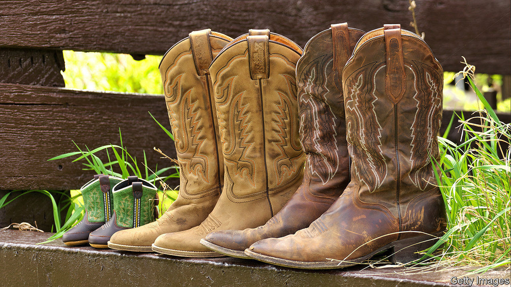

## Little gay house on the prairie

# Rural, gay Americans have more children

> Why same-sex couples are more likely to be parents in Middle America than in big cities

> Mar 19th 2020CHEYENNE

FOR MORE than a decade, America’s most prominent gay family have lived on ABC. Gay and lesbian television characters were once such a rare sight that GLAAD, an advocacy group, began an annual count, as if it were tracking an endangered species. Now millions tune in to “Modern Family” to see how Cam and Mitch are getting on raising their adopted daughter. Their portrayal of gay domesticity has been credited with helping to change attitudes and with boosting support for same-sex marriage. One poll found it was the third most popular show among Republican voters.

Yet such families are not only the preserve of Los Angeles, where the show is set. Indeed, though data are imperfect, academic studies suggest that a greater proportion of same-sex couples have children in southern states and in the Mountain West than on the coasts. Overall, more such families live in cities like Los Angeles and New York, since these have far higher gay populations. But same-sex couples who live inland seem most likely to plump for family life. Academics expect the results from the latest census, forms for which are due to land in mailboxes by March 20th, to fit the same pattern.

Take Wyoming. It has the fourth-lowest share of homosexual couples of all American states. Yet a quarter of them are raising children, compared with 9% in Washington, DC and 16% in California, according to an analysis of Census Bureau and polling data by the Williams Institute at the University of California at Los Angeles. In Laramie County, the most populous corner of the state, that rate rises to 43%.

In Cheyenne, the county seat and state capital, Dan Zwonitzer, a Republican legislator, is raising two adopted children with his husband, Justin. Another gay father boasts that he can name every character in “Paw Patrol”, an animated children’s show. One gay couple, enthusiastic supporters of Donald Trump, pose on social media in matching stars-and-stripes Speedos.

Mr Zwonitzer, whose family has lived in Cheyenne for five generations, did not come out of the closet until his mid-20s. When he did so, he gave up on his long-cherished ambition to raise a family. “I didn’t think it was going to happen in Wyoming,” he says. Yet, in common with other local couples, he claims to have encountered no hostility when he became a parent. A lesbian couple was inundated with home-cooked food when their daughter was born; a gay couple turned down several offers to babysit on Valentine’s Day, a few weeks after their daughter’s birth.

Two factors help explain the trend. The first is a legacy of conservative attitudes to gay and lesbian people that only began to shift relatively recently. An analysis of population survey data by Gary Gates, a demographer, suggests that most children living in same-sex households were born in heterosexual relationships, before one partner moved out to live with someone of the same sex. At least in the past, gays and lesbians were likely to feel less comfortable coming out early in life in socially conservative states, like Wyoming. Some began heterosexual relationships instead, producing children. “It is largely giving you information about social acceptance,” says Mr Gates.

Brian Hardy is a good example. The doctor, who was raised in Cheyenne, had four children during his 14-year marriage to a woman. “I grew up in a very religious home,” he says. “I was definitely trying to fit into a mould of what I’d always been taught was the right thing to do.” His children now spend every other week with him and his fiancé, Jason Caswell, whom he met at work two years ago.

The second factor is cultural. In general, fertility rates are higher in the interior than on the coasts. Factors that explain this gulf, such as differential rates of social conservatism and the varying cost of raising a family, might apply equally to same-sex couples. “If you’re gay in the big city, you’re always bar-hopping,” says Mr Zwonitzer. “In rural areas, you get married and settle down and have kids early.” He and his husband became foster carers for two teenagers, whom they have since adopted.

In family-oriented communities like Cheyenne, folks sometimes expect the maternity ward to follow quickly after the church aisle. “It’s like you get to a certain age round here and you should be having children,” says Kevin Ogle. Locals never asked him and his boyfriend, Shawndae, whether they wanted to have children until they got married, in 2011. “Then they were like ‘well, are you guys going to start a family?’ That’s the next step.” They met their surrogate, in Georgia, through a Facebook page. Their daughter, Charlotte, is now five.

Mr Caswell reckons he and Mr Hardy have more in common with straight parents than with other gay people who are not raising children. “We’ve never been to Mykonos,” he says, referring to a Greek island popular with gay tourists. “We teach our children that taxation is theft and that a big government is a bad government.”■

## URL

https://www.economist.com/united-states/2020/03/19/rural-gay-americans-have-more-children
