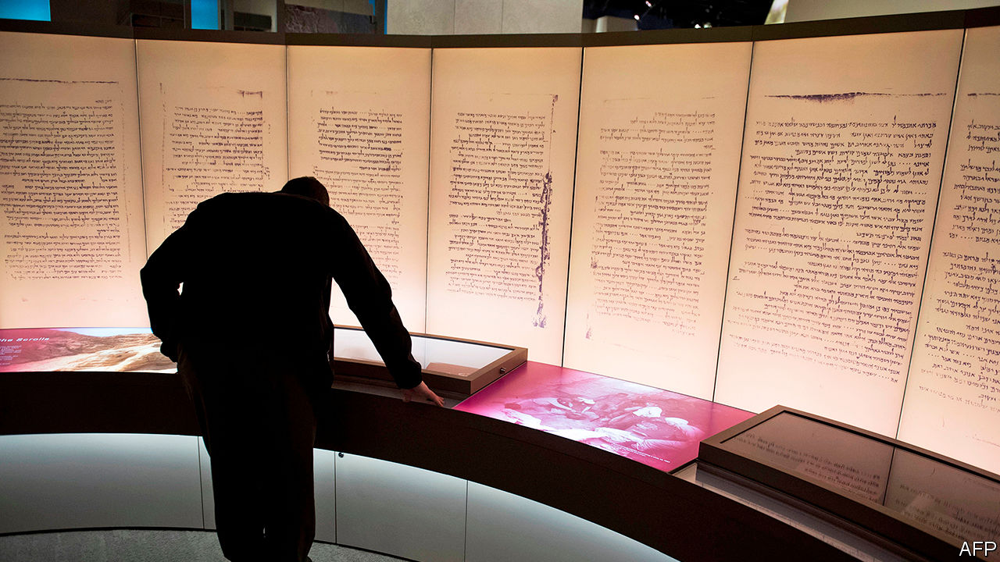

## A load of old cobblers

# The Bible museum’s fake scrolls

> The museum bought an expensive fake, but has been transparent about it

> Mar 19th 2020WASHINGTON, DC

WHEN THE Museum of the Bible opened in Washington, DC in 2017, it boasted an exhibit to make archaeologists salivate: fragments of the Dead Sea scrolls. These 2,000-year-old scraps of parchment include the oldest known transcripts of the Old Testament—and the museum had 16 of them. Except that it didn’t. In 2018 five of its fragments were revealed to be fakes. Last week, the museum announced that all 16 were forgeries, probably created in the 20th century out of ancient leather, perhaps from old shoes.

The revelation is an embarrassment for the museum, which has sought to present itself as an academically rigorous institution worthy of its location just off the National Mall, where the Smithsonian’s fine museums are located. The museum was founded by Steve Green, a prominent evangelical Christian and president of Hobby Lobby, a chain of craft shops which in 2014 persuaded the Supreme Court that it deserved a religious exemption from a federal requirement under which employers provide their workers with certain contraceptives. It has rebuffed criticisms that it is an expensive advertisement for fundamentalist Christianity. The museum has several respected biblical-scholar consultants and a breathtaking collection of biblical texts and artefacts. They include a Gilgamesh tablet from the second millennium BC and sections of the Gutenberg bible.

The museum’s Dead Sea fragments are a less impressive acquisition, apparently bought without looking too closely into their origins. The real things, most of which are in the Israel Museum in Jerusalem, were discovered in caves in what is now the West Bank in the 1940s. The “scrolls” Mr Green snapped up, part of a group of 70 or so, came to market after 2000. The researchers who studied them say the clues to their forgery include indications that they were written on a bumpy surface: parchment resembles leather after 2,000 years but it would originally have been smooth. They are also coated in animal glue to mimic the waxy sheen that develops when collagen in parchment breaks down over time to form gelatine.

This is not the first time the Bible museum has been embarrassed over its acquisitions. Last year it emerged that Hobby Lobby had bought 13 fragments of ancient papyrus texts, which had been sold by an Oxford professor who has been accused of stealing them from the collection he oversaw. The museum said the acquisitions were made “in good faith” and promptly handed them back.

It appears to have been similarly upright and transparent about its Dead Sea mis-purchases. Last February, it commissioned an independent team of researchers, who spent six months studying the fragments. Their 200-page report is displayed prominently on the museum’s website. Jeff Kloha, the museum’s chief curatorial officer, says he hopes the techniques used by the researchers will be helpful to other buyers of other such scrolls. Though Mr Green has not disclosed how much he paid for his, the group from which they came are estimated to have sold for upwards of $35m.

Yet purchasing and then displaying such artefacts without first establishing their provenance is no way to run an institution that presents itself as an authority on the Bible. The error is indicative of a wider lack of academic rigour at the museum. Though its display of biblical artefacts is impressive, with fact-based descriptions of how the Old and New Testaments were gathered and translated, elsewhere, including in a walk through the stories of the Old Testament, the museum tends to elide biblical stories with historical fact in a way that makes many biblical scholars uncomfortable. Given that America’s division of church and state means few people have the opportunity to learn about the history of the Bible, this seems unfortunate.

Yet the museum may be evangelising to fewer people than it had hoped, even before the novel coronavirus led to its temporary closure this week. In its first year, when entry was free, it received a million visitors. Since late 2018, it has charged an entrance fee. Though it will not say how many visitors it has welcomed since, it seems likely that fewer tourists, visiting the free museums on the Mall, have been swinging by to see its treasures. ■

## URL

https://www.economist.com/united-states/2020/03/19/the-bible-museums-fake-scrolls
