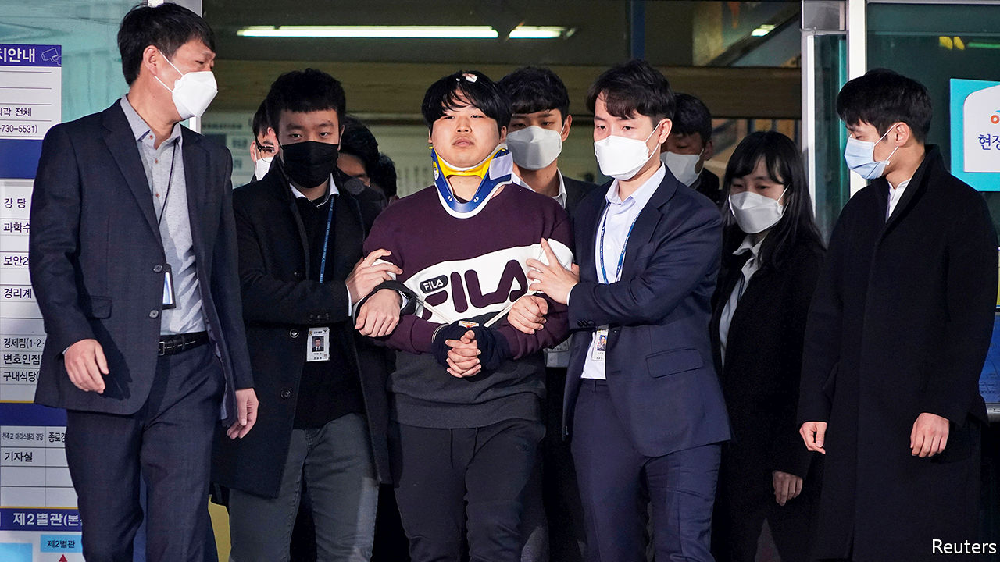

## Naming and shaming

# A sex-abuse scandal incenses millions of South Koreans

> Thousands subscribed to pornographic social-media channels featuring under-age girls

> Mar 26th 2020SEOUL

“FIRST HE JUST asked for a picture of my body, but then he asked if I could send one that showed my face...and then he asked me to play with myself...to use school supplies,” the girl told a local radio show on the morning of March 24th. She went on to describe a weeks-long ordeal during which she sent more than 40 graphic videos to a man she feared would publicly humiliate her if she stopped complying. “He had all my personal information...I was afraid he would threaten me with that if I quit.”

The girl was a middle-school student at the time of the alleged incident two years ago. She is only one of dozens of apparent victims in the latest sexual-abuse scandal to rock South Korea.

On the same day that she described her plight, police revealed the identity of the man who stands accused of running a range of porn channels, known as “nth rooms” on the Telegram chat app, charging up to 30,000 subscribers between $200 and $1,200 (most of that, it seems, collected in bitcoin to avoid detection) for access to graphic sexual content extorted from young women and under-age girls. Cho Ju-bin (pictured), a 24-year-old graduate and former college-newspaper editor who called himself baksa, or “doctor”, was named after 2.5m South Koreans signed a petition clamouring for his identity to be made public. Almost 2m people signed a separate petition demanding that the police also identify all the subscribers to the channels. Authorities say they have counted more than a quarter of a million subscribers across chat rooms featuring extorted videos, footage from spy-cams and deepfake pornography.

The case has caused particular outrage owing to the youth of many of the victims. Subscribers knew this only too well: descriptions of some channels featured personal details of the girls, including where they went to school. Public anger has eclipsed even the reaction to the “Burning Sun” scandal, which rocked the glamorous K-pop scene last year when it emerged that several stars had been complicit in producing abusive content and sharing it in online chatrooms.

The authorities are keen to be seen to be cracking down hard. So far they have detained 19 men, including Mr Cho. Dozens more are under investigation. Even South Korea’s president, despite being busy with covid-19, has become involved to reassure people that justice will prevail. Moon Jae-in vowed to take a stern approach to digital sexual-abuse crimes, calling the offenders “cruel” and public fury “justified”.

But it remains to be seen whether all the public hand-wringing will result in justice for the victims, many of them vulnerable girls with troubled family histories or financial difficulties. Activists have long complained of South Korea’s sketchy record on prosecuting sexual abuse and the misogyny entrenched in the law, which still regards being drunk as a valid defence for those accused of rape. Anger ran high last week when prosecutors recommended a sentence of only three and a half years for a chat-room host in a similar case. And even with the best of intentions, attempting to stamp out the distribution of abusive material online can be a wild-goose chase, as perpetrators shift from one anonymous platform to the next. ■

## URL

https://www.economist.com/asia/2020/03/26/a-sex-abuse-scandal-incenses-millions-of-south-koreans
