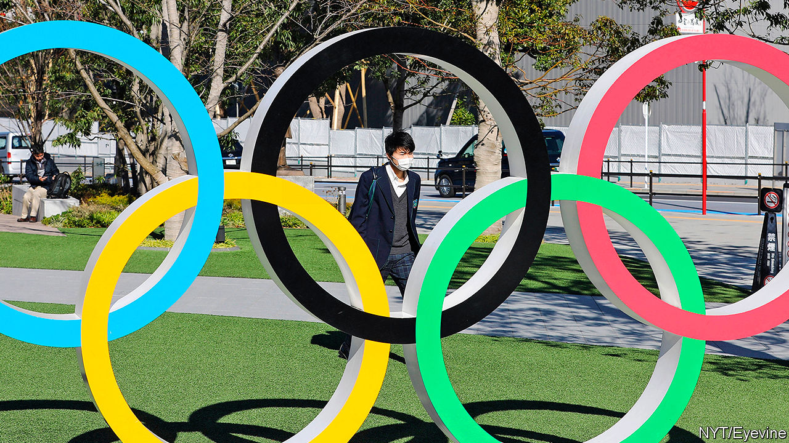
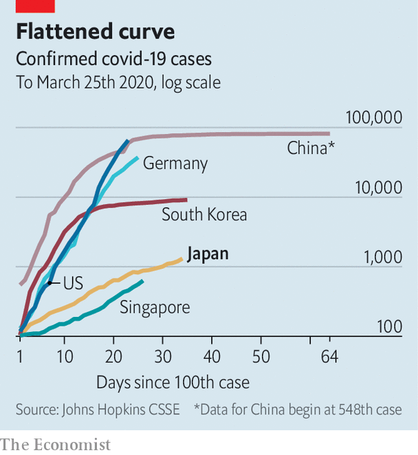

## Blowing out the flame

# Covid-19 forces Japan to delay the Olympics

> Experts fear Japan is too nonchalant about the virus

> Mar 26th 2020TOKYO

Editor’s note: The Economist is making some of its most important coverage of the covid-19 pandemic freely available to readers of The Economist Today, our daily newsletter. To receive it, register [here](https://www.economist.com//newslettersignup). For more coverage, see our coronavirus [hub](https://www.economist.com//coronavirus)

WHEN THE annals of the new coronavirus are written, a chapter will surely be devoted to the dogged insistence by Japan’s prime minister, Abe Shinzo, that despite a galloping global pandemic the Tokyo Olympic Games would go ahead as planned in July. Mr Abe—the most assertive prime minister since his beloved grandfather, Kishi Nobusuke, who secured the 1964 Olympics for Tokyo—is not used to being gainsaid. But on March 24th he at last conceded, declaring that the games would be postponed by a year. The announcement left the Olympic flame stranded in, of all places, Fukushima, the site of a nuclear meltdown in 2011.

Only 12 days earlier Mr Abe had convened a press conference on a Saturday to insist that postponement or cancellation was unthinkable. Japan itself had the coronavirus under control, he said. The games would provide a welcome tonic as the world emerged from the pandemic’s shadow. Yet the shadow was only lengthening as he spoke, shutting down travel and upending training schedules across Asia, Europe and America. At the start of this week Australia and Canada said they would not send their athletes if the games went ahead. An opinion poll found nearly two-thirds of Japanese wanted a delay.

Japan had much riding on the games, as did Mr Abe himself. Officially, they were to be the “recovery Olympics”, marking the country’s bounce-back from the Fukushima disaster. But the government also wanted to show off Japan’s corporate genius, organisational verve and innovative design, just as the Olympics did in 1964. Toto wanted to show off all-singing, all-dancing toilets and Toyota had plans for a flying car. Since the bursting of the stockmarket and property bubbles in the late 1980s, Japan Inc has suffered a collective loss of confidence. “Japan”, Mr Abe had declared when he came to power in 2012, “is back.” Here was the chance to prove it.

Pressed into national service by Dentsu, Japan’s advertising giant, big firms including Bridgestone, Canon, Nomura, Toto and Toyota provided a record $3.1bn to sponsor the games. Even before the postponement, executives wondered what the outlay of as much as $100m a firm would get them. The answer will have to wait a year. Meanwhile, the spanking new stadium, the hotels built to put up hordes of spectators, Toyota’s new fleet of London-style cabs, the Olympic banners lining the empty roads and even the commemorative manhole covers all give parts of Tokyo the air of an abandoned stage set.

The absence of visitors spending gaily this summer will be keenly felt. Even before the advent of covid-19, the economy was slowing. It is almost certainly in recession now. The Bank of Japan has been busy buying shares to prop up the stockmarket. Starting next week the Diet will rush through an emergency stimulus package worth perhaps ¥30trn ($271bn)—on a par with its response to the global financial crisis. But one senior politician worries that cautious beneficiaries will promptly stash the proceeds under the futon.

Much depends on the course of the coronavirus in Japan. Mr Abe was criticised for the early handling of the crisis—the government welcomed Chinese visitors for the lunar new year even after the Wuhan eruption was known, and fumbled the handling of a cruise ship with infected passengers. The prime minister’s poll numbers took a dive, improving only after he closed schools and even banned audiences at the spring sumo tournament.

Japan has to date been a virus outlier: the epidemic has proceeded more slowly than in other big economies. It had its first infection in mid-January, two weeks before Italy. Since then Italy has recorded more than 74,000 cases and 7,500 deaths. In Japan just over 1,300 have been reported as infected and only 45 have died.

Like other East Asian countries, Japan has learned from previous epidemics, such as SARS and bird flu, about the importance of containment: pains are taken to identify infection clusters and then to track down transmission routes, says Shindo Nahoko of the WHO. A compliant population heeds government health advice about frequent hand-washing and accepts unpopular measures such as the closure of schools.

Yet the government has to date communicated little sense of crisis—in part, the suspicion goes, to make everything appear normal so that the games could go ahead. Instead of adopting the stringent suppression measures being pursued across Asia, Europe and America, Japan is relaxing its restrictions. Hokkaido, with a big cluster of infections, has lifted the state of emergency declared in late February. Mr Abe says that schools can reopen next month.

Meanwhile fewer than a sixth of workers are working from home. Over the weekend, Tokyoites ignored official guidance and turned out in throngs to admire the cherry blossoms. A kick-boxing event in Saitama prefecture attracted 6,500 fans. Late-night revellers slurp shoulder-to-shoulder at ramen joints before heading home on crowded trains. In the land of bows, senior officials greet foreign visitors with hearty handshakes, to show that everything is fine.

Given that infections continue to rise, some are finding the general nonchalance unnerving. Reports are growing of corohara (short for “coronavirus harassment”): the bullying of people who have recently returned from abroad, or who cough in public places. Experts in public health are alarmed. Some say the government’s testing only of those who have clear symptoms or who have been in contact with a carrier risks missing the spread of infection through the wider population. Mr Abe has set up a task force and an expert panel but, says Iwata Kentaro of Kobe University, no one appears to be in charge. Kami Masahiro, who heads the non-profit Medical Governance Research Institute, fears that in a climate of complacency and restricted testing, coronavirus cases could “explode”.

For now, raising such fears is taboo among national politicians and at the public broadcaster, NHK—just as suggesting that the games should be postponed was, only a week ago. But that may soon change. Faced with a new clutch of infections in her city, the governor of Tokyo, Koike Yuriko, this week warned that the city of 13m might face a lockdown if cases could not be contained. Transmission routes were becoming increasingly hard to identify, she said; the coming three weeks would be critical. She urged Tokyoites to stay at home this weekend, although she stopped short of ordering it.

Her comments ought to shake the city’s residents out of their complacency. Nor can the prime minister afford to be complacent. If the pandemic is mishandled, even next year may prove too early to hold the games. Party rules dictate that Mr Abe retire by the autumn of 2021—which means he could miss the games he did so much to bring about, just like his grandfather did. ■

Dig deeper:For our latest coverage of the covid-19 pandemic, register for The Economist Today, our daily [newsletter](https://www.economist.com//newslettersignup), or visit our [coronavirus hub](https://www.economist.com//coronavirus)