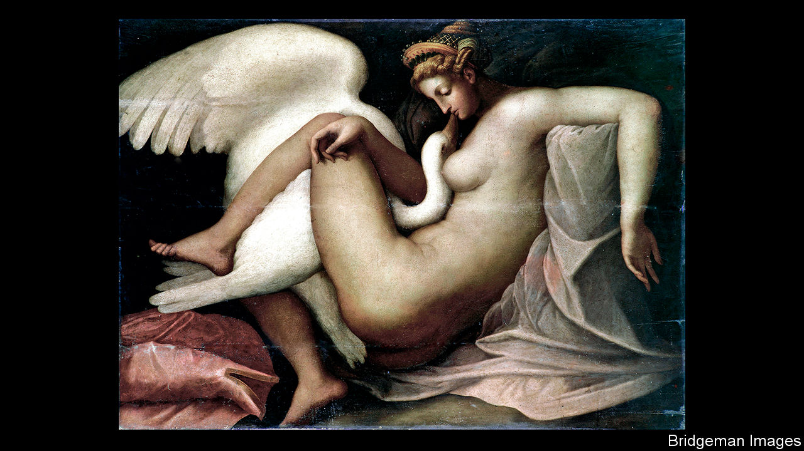

## Civilisation and barbarism

# Art and carnage in the Italian Renaissance

> “The Beauty and the Terror” shows the dark side of a fabled era

> Mar 26th 2020

The Beauty and the Terror. By Catherine Fletcher.Oxford University Press; 384 pages; $29.95. Bodley Head; £20.

FOR MOST people, the phrase “High Renaissance” conjures up thoughts of Raphael putting the final touches to the blush of a pensive Madonna; of Michelangelo chipping gingerly at the flawed marble from which he would create his peerless David; of Leonardo da Vinci sketching his latest visionary design for a flying machine. Few reflect, or perhaps even know, that this golden age of creativity was also one of near-continuous warfare in Italy.

The period between 1494, when Charles VIII of France marched across the Alps to press his claim to the Kingdom of Naples, and the Peace of Cateau-Cambrésis in 1559 saw hundreds of thousands of people die in Italy: massacred in battle, starved to death and killed by diseases during sieges, or butchered—often after rape or torture—when the besieged surrendered. Among cities sacked in the so-called Italian Wars were Naples, Brescia, Prato, Pavia and, in perhaps the most frenzied orgy of carnage and looting, Rome in 1527.

Nor was warfare the only source of turbulence. It was in this period that Europeans, including many Italians, began to explore the Americas, and in which they came into mounting conflict with the growing power of the Ottomans in and around the Mediterranean. It was also during these years that the papacy in Rome saw Western Christianity rent in two by the Protestant Reformation.

In her new book, Catherine Fletcher’s aim is to give readers a more nuanced and wide-ranging picture of a singularly tumultuous period in Italian history. The breadth of her reading is remarkable and she uses it to bring alive a huge range of subjects—from ordnance to pornography, and from the remuneration of cardinals to attitudes in Italy towards Jews and Muslims. She is perhaps at her best when teasing out the contributions by women, whether to painting, poetry or politics—or, indeed, warfare. During the siege of Siena, from 1553 to 1555, repairs and improvements to the walls were entrusted to the city’s women, divided into three groups, each led by a woman.

Had this book been written 50 years ago, it would probably have been drily entitled “Italy 1492-1571”; 20 years ago, it might have been called something grandiose like “The World of the High Renaissance”. To tempt contemporary readers, often exposed to history via sensationalising television documentaries, the actual title is “The Beauty and the Terror”. That risks disappointing many who buy Ms Fletcher’s admirable work, for there is not that much of either in it. She devotes just one chapter to those artistic geniuses and does not dwell on the gore. For example, she barely mentions the atrocities committed during the Sack of Rome; in line with modern academic opinion, she resists the temptation to demonise the notorious Borgia dynasty in general, and Lucrezia (probably its most infamous scion) in particular.

More frustratingly, she fails to explore the juxtaposition of the concepts in her title. She recounts the well-known stories of the involvement of da Vinci and Michelangelo in military technology and architecture, yet stops short of looking at what influence that had on their art. Michelangelo must have seen appalling suffering near the end of the siege of Florence. Did it affect him? And how can da Vinci’s apparent pacifism be squared with his enthusiasm for designing war machines and fortifications? The reader comes to the end of Ms Fletcher’s book more fully aware that the beauty and terror co-existed, but still none the wiser as to how they interacted. ■