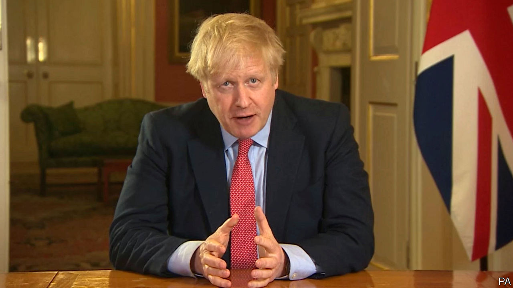

## Politics

# Boris Johnson’s belated lockdown

> Slow off the mark, Britain may have a worse plague than it needed to

> Mar 26th 2020

Editor’s note: The Economist is making some of its most important coverage of the covid-19 pandemic freely available to readers of The Economist Today, our daily newsletter. To receive it, register [here](https://www.economist.com//newslettersignup). For more coverage, see our coronavirus [hub](https://www.economist.com//coronavirus)

WHEN BORIS JOHNSON announced a partial lockdown in a sombre prime-time broadcast on March 23rd, polls put popular support for his decision at 93%. Criticism was less of the severity of the measure (though the Daily Telegraph headlined the news “End of Freedom”) than that it came so late, long after most of the rest of Europe.

Mr Johnson held his first meeting on covid-19 only in early March. Initially, the advice to the public was little more than to wash their hands regularly. There was even talk of not slowing the virus down too vigorously, so as to achieve “herd immunity”. What threw this idea overboard was a study by Imperial College London, suggesting that letting the virus spread uncontrolled might mean as many as 250,000 deaths, primarily among older people.

Even when the decision was made to do more to stop the disease, disagreement persisted over tactics. Mr Johnson’s instinctive liberalism sat ill with a compulsory lockdown enforced by the police. Accordingly, he chose to rely on moral suasion, not compulsion, to get people to work from home and avoid socialising. The government ordered the closure of pubs and restaurants only on March 20th, weeks after the rest of Europe.

But the government’s polite requests were widely ignored. The pub closures were treated by many as an excuse for gigantic final street parties. London saw much smaller falls in road and rail usage than most other European cities.

What forced Mr Johnson’s lockdown decision was that the weekend of March 21st-22nd was the first properly warm one of the year. Thousands of people visited the seaside, Snowdonia and other recreational places, clogging the roads. Big crowds thronged into many of London’s parks. Efforts to remain two metres apart, as the prime minister urged, were notable mainly for their absence.

That has changed since the lockdown. According to data from Citymapper, a navigation app, in the week before the lockdown, Londoners were moving around about half as much as they usually do; the day after, the figure was 15%. That evening, Kings Cross was spookily still. The few trains moving in and out had hardly any passengers, and most of the handful of people on its vast forecourt were beggars.

There are still holes. People who cannot do their jobs from home are supposed to go to work, so long as employers can keep them far enough apart, which is often tricky. The Tube remains a source of contagion: service reductions mean that rush-hour trains seem fuller than ever. Enforcement of the new rules is spotty: the police talk of small fines, but also suggest that their effort would be largely persuasive, not coercive.

Mr Johnson is also under fire for not investing enough in testing equipment, not least from Jeremy Hunt, a former health secretary and his erstwhile leadership rival, who believes extensive testing and tracing were key to South Korea’s containment of covid-19. But the NHS is mobilising resources swiftly, from within the service, from the private sector and from the army, which may give it the breathing space it needs to cope with covid-19.

The prime minister must certainly hope so. His premiership was meant to be defined by Brexit, the issue that brought it about. But it now seems more likely to rest on the fight against covid-19 and its aftermath. And even if he wins this war, his future is not guaranteed: after his hero, Winston Churchill, beat the Nazis, he lost the 1945 election to a revitalised Labour Party by a record margin. ■

Dig deeper:For our latest coverage of the covid-19 pandemic, register for The Economist Today, our daily [newsletter](https://www.economist.com//newslettersignup), or visit our [coronavirus hub](https://www.economist.com//coronavirus)

## URL

https://www.economist.com/britain/2020/03/26/boris-johnsons-belated-lockdown
