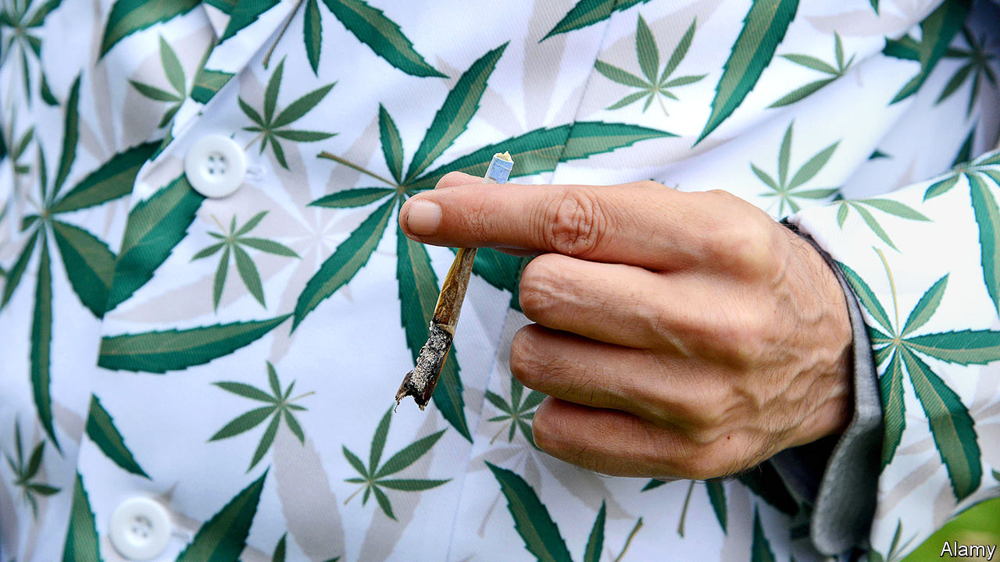

## Drugs

# Coke is out, weed is in

> The pandemic is shifting demand in the drugs market

> Mar 26th 2020

Editor’s note: The Economist is making some of its most important coverage of the covid-19 pandemic freely available to readers of The Economist Today, our daily newsletter. To receive it, register [here](https://www.economist.com//newslettersignup). For more coverage, see our coronavirus [hub](https://www.economist.com//coronavirus)

“NOBODY IS BUYING the party drugs,” laments an east London drug dealer, as he drops two quarter-ounce bags of cannabis onto a customer’s coffee table. Pulling off his protective gloves, he lights up a spliff and settles down for a short break. Outside, ambulances sweep past, their sirens spoiling the hazed ambience. His customer is more than satisfied. “It locks me down—physically and mentally,” he says. “It helps me filter out all this drama.”

The covid-19 pandemic is making Britain’s dealers jittery. As nightclubs and pubs began emptying out, cocaine pushers sent out a flurry of increasingly concerned text messages. “To avoid being affected by delays or disappointment, pre-order NOW!!” went one. Others imposed minimum orders of two or three grams, desperate to shift their stock in a shrinking market. A regular user was unpersuaded. “Imagine being on a comedown during the apocalypse.”

Demand for at least one drug is booming. Large quantities of cannabis are being sold to those preparing for a chilled-out lockdown. “I’ve had so many calls from people asking for ounces who usually buy smaller bits,” one dealer boasts. “Everyone is stockpiling weed,” says the east London dealer. “They just want to blaze their way through the lockdown.” In some parts of the country, the price of weed jumped by half.

The lockdown is also affecting supply. A south London dealer messaged his customers after it was announced, urging them to order quickly “as there will now be limits to time and delivery”. As if he were the boss of a supermarket reassuring customers about the supply chain, another told worried users that he had been on a recruiting spree to provide a more efficient service day and night.

These shifts may also play out on the streets. If revenue dwindles, gangs are likely to battle it out for the remaining custom, according to a report published on March 22nd by Policy Exchange, a think-tank. Turf has already been more closely contested in recent years, thanks to a saturated market and the growth of online suppliers.

Richard Walton, a former senior cop who co-wrote the report, predicts that some gangs will be emboldened if police are distracted by helping to deal with the pandemic. “Some street-level criminals may try to exploit an absence of police presence,” he says.

Still, some dealers have temporarily retired from the trade altogether. “I’m not going outside for a while,” says one. “I don’t want to be taking any cash that has had all those dirty hands on it.”

Dig deeper:For our latest coverage of the covid-19 pandemic, register for The Economist Today, our daily [newsletter](https://www.economist.com//newslettersignup), or visit our [coronavirus hub](https://www.economist.com//coronavirus)