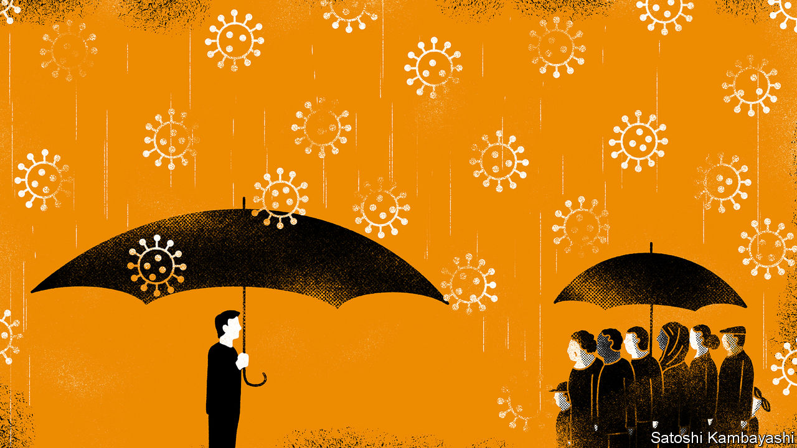
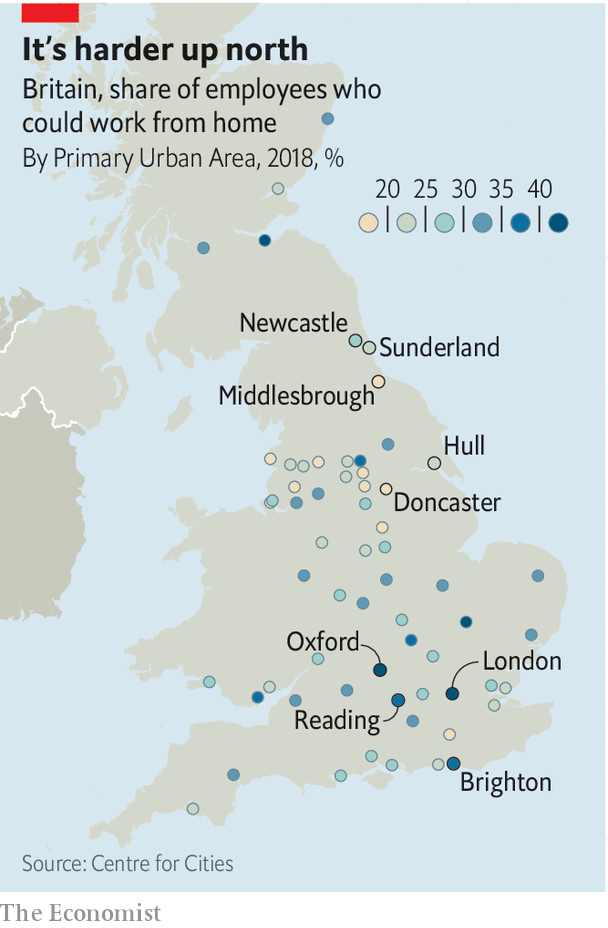
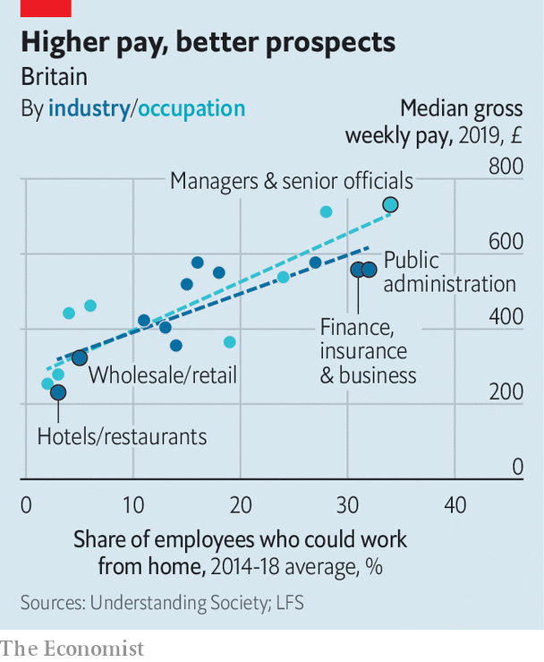

## Dealing with the virus

# How covid-19 exacerbates inequality

> Boris Johnson wants to “level up” Britain; covid-19 is doing the opposite

> Mar 26th 2020

Editor’s note: The Economist is making some of its most important coverage of the covid-19 pandemic freely available to readers of The Economist Today, our daily newsletter. To receive it, register [here](https://www.economist.com//newslettersignup). For more coverage, see our coronavirus [hub](https://www.economist.com//coronavirus)

IN SOME WAYS, Britain is more united than it has been for a long time. Bickering over Brexit has been shelved. Party politics is all but suspended, after Parliament voted to shut itself down on March 25th to minimise the risk of transmission of covid-19. Ministers are marshalling an army of volunteers to help the health service. And the virus itself is no respecter of rank: Prince Charles is among those it has infected.

Yet the fallout from the pandemic threatens to expose—and widen—inequality in brutal fashion. As Torsten Bell of the Resolution Foundation, a think-tank, puts it, “the virus doesn’t discriminate between people but the accompanying economic shock certainly does.” Before covid-19 hit, Boris Johnson’s plan was to “level up” poorer communities. The opposite is happening. Young and old, north and south, and rich and poor all have markedly different capacities to bear the burden of lockdown, social isolation and a sharp drop in economic activity.

The first divide is geographic. Differences in the structure of local labour markets may lead to vastly different outcomes across the country (see map). Some parts of the country are stuffed with professionals who can weather travel restrictions by working from home; others are full of factory workers who can hardly set up assembly lines in their living rooms. Prosperous places like Reading and Brighton have plenty of potential home-workers, according to analysis by the Centre for Cities, another think-tank. Less well-to-do cities like Middlesbrough and Hull do not.

The south-east of England, the region with the highest share of white-collar jobs, is best placed for business as usual. More than a third of journalists, for example, work in London. The Economist has been entirely written and edited from journalists’ homes, most of them in the south-east. Even within regions, differences are stark. Newcastle will cope better than neighbouring Sunderland. The map echoes geographic divides in support for Brexit. The thriving areas that voted Remain are more likely to be packed with video-conferencers today than are the so-called left-behind places that voted to leave the EU.

The second disparity is economic. The most flexible workers tend to be higher earners. The Resolution Foundation reckons about half of Britain’s highest-paid employees can work from home, but less than 10% of those in the four lowest-paid deciles can. Hospitality and retail workers, who will bear the brunt of closures, are already among the lowest-paid in Britain (see chart). Nor can they fall back on reserves: more than half of poorer households have no savings.

The government will do its best to even things out. It will bear 80% of the wage bills of employees furloughed due to the crisis and is offering firms tax breaks and soft loans. But though it promises some relief for the self-employed, these measures had not been announced as The Economist went to press. And the lower-paid may struggle disproportionately to cope without a fifth of their wages, and with the cramped conditions in which many poorer Britons live.

That is not a problem for Nicholas Coleridge, chairman of the Victoria and Albert museum. He has turned his country pile into something he says resembles an outpost of WeWork, the co-working firm. Four of his children are working from home; the family’s garden folly could come in handy for self-isolation. More space and a higher level of education will make it easier for the better-off to teach their children, who will therefore return to school even further ahead of their peers. According to Teacher Tapp, an app which surveys teachers, 27% of private secondary-school teachers communicated with pupils via video on the first day schools were shut, compared with 2% of those in state schools.

Others are less able to adapt. Families in which both parents work may not be able to supervise their children’s education. James Donovan, a self-employed carpenter in Bath, was working on a barn conversion before the government advised people to stay at home. “When Boris said ‘lockdown’, I was told not to come to work,” he says. So far, he has struggled to apply for benefits. “You’ll be waiting years to get through to anyone on the phone.” The government is redeploying thousands of staff to process applications, 477,000 of which were made in the nine days to March 24th.

Even if they can stay at home, poor families are more likely to be packed together in a small space, helping spread the disease. According to an analysis of government data by the Joseph Rowntree Foundation, a charity, 7% of English people in the poorest fifth of households live in houses without enough bedrooms, compared with less than 0.5% of the richest fifth. Ethnic minorities are also more likely to live in crowded houses. Nearly a third of Bangladeshi households have fewer bedrooms than they need. The comparable rate for white British households is 2%.

The final disparity is age. As well as being more vulnerable to covid-19, the elderly are more likely to live alone. About half of the 8m Britons who live alone are aged 65 or older. For some, the lockdown will compound feelings of loneliness. Many struggle to use the internet. Only 44% of retired Britons say they have good internet skills, compared with 95% of students.

One elderly Londoner is grappling with online shopping for the first time after her goddaughter helped her create an account. “The website kept crashing,” she says. “I’ve discovered if you do it at three or four o’clock in the morning it’s easier to get on.” They are, however, a hardy bunch. Several have told anxious grandchildren to stop worrying, since they experienced far worse during the second world war.

That experience brought the country together, and perhaps this one will too. But some fissures may deepen.■

Dig deeper:For our latest coverage of the covid-19 pandemic, register for The Economist Today, our daily [newsletter](https://www.economist.com//newslettersignup), or visit our [coronavirus hub](https://www.economist.com//coronavirus)