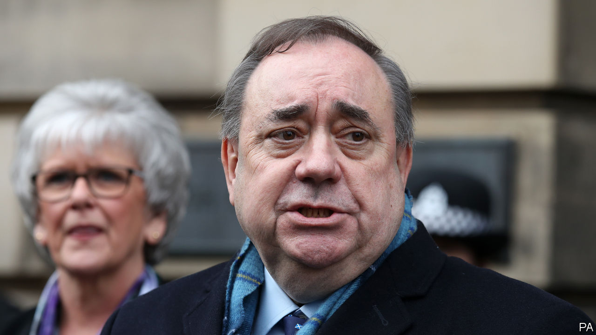

## Scottish politics

# Not-guilty verdicts for Alex Salmond

> The end of the former SNP leader’s trial is not the end of the story

> Mar 26th 2020

IN OTHER CIRCUMSTANCES, the verdict would have been the Scottish political event of the year. On March 23rd Alex Salmond, Scotland’s former first minister, was found not guilty of 12 charges of sexual assault. The jury found a thirteenth charge to be not proven.

Mr Salmond is a free man. But it is clear that he does not intend to go quietly. He greeted his acquittal with the claim that during the trial his legal team had been unable to produce “certain evidence” but it would now “see the light of day”. During the trial he claimed that the allegations against him—which ranged from indecent assault to attempted rape—had been “deliberate fabrications for political purposes”.

The verdict is an embarrassment for the Crown Office, Scotland’s criminal-prosecution service, and for the Scottish police. Nine women gave evidence and were extensively cross-examined. But the real pressure is on Nicola Sturgeon, Mr Salmond’s successor—both as first minister of Scotland and as leader of the Scottish National Party (SNP). Mr Salmond and his allies in the nationalist ranks are coming after her and her husband, SNP chief executive Peter Murrell.

Mr Salmond and Ms Sturgeon had been growing apart long before he faced criminal charges. Whereas she has approached the independence question cautiously, since 2016 he has called for the country to hold a new referendum quickly. His arrest and trial put a gulf between them. Several of his accusers were close to her and he seems to blame her for his ordeal.

Kenny MacAskill, an SNP Westminster MP and formerly Scotland’s justice minister, said that he was “delighted” for Mr Salmond and that now “some resignations” were “required”. Joanna Cherry, another SNP MP and a staunch Salmond ally who hopes to stand for election to the Scottish Parliament next year, said that she was sure the SNP’s chief executive would welcome an independent review into the Scottish government’s handling of the case. Ms Sturgeon and Mr Murrell may have detected a hint of menace in her remarks.

Compared with the spread of covid-19, Mr Salmond’s claims of a conspiracy against him may seem trivial. But when the virus recedes, the former first minister and his supporters will be waiting for the current first minister and her husband. And they will have revenge in their hearts.■