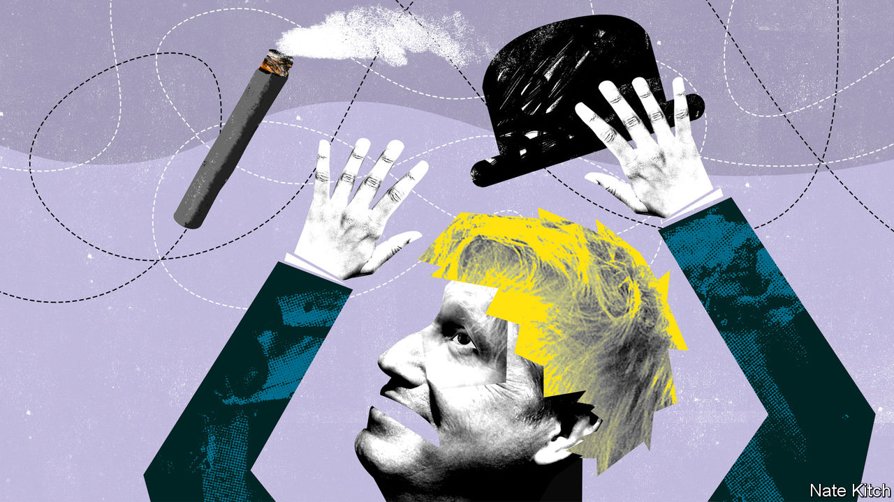

## Bagehot

# Politics in the time of covid-19

> Forget the flummery: politics is now a life or death business

> Mar 26th 2020

Editor’s note: The Economist is making some of its most important coverage of the covid-19 pandemic freely available to readers of The Economist Today, our daily newsletter. To receive it, register [here](https://www.economist.com//newslettersignup). For more coverage, see our coronavirus [hub](https://www.economist.com//coronavirus)

IN THE PAST few weeks politics has retreated to its core function: protecting the tribe from death and destruction. The government has adopted the slogan “Save lives” along with “Protect the NHS” and “Stay home”. The army is on standby. In the coming weeks thousands of people will die before their time; those who survive may confront a 1930s-style depression.

The atmosphere in the Westminster village reflects these grim facts. Boris Johnson gets through 20-hour days by munching vegan food, perhaps in the belief that plants are good for the immune system. Aides are sleeping on sofas and old camp beds. Having restricted the number of MPs allowed into the chamber so that they could sit two metres apart, the House of Commons has risen early and will remain closed for at least a month. The mother of parliaments is now a sepulchre.

Covid-19 is changing the way Britain governs itself in broader ways, too. Two kinds of politics that have dominated the country for the past decade have vanished. The first is the politics of revolution. Britain has been turned upside down by the successful campaign, driven by activists such as Dominic Cummings, the prime minister’s chief aide, to wrench Britain away from Europe. Since his election victory in December, Mr Johnson has set about implementing his grand ambitions to rewire the country for a post-Brexit future, shifting power from London to the provinces, pouring money into infrastructure and completing Brexit negotiations in double-quick time.

The second is politics as performance or spectacle. Politics has always been performance art to some degree: look at the weekly bear-pit that is prime minister’s questions or the humiliating rituals of general elections. But performance has triumphed over substance in recent years. Leading politicians have become celebrities. Mr Johnson built his political career by appearing on television and turning his first name and blond hair into a global brand. Politics has also been supercharged by the culture wars. Can people with penises reasonably be described as women? Should student groups be allowed to prevent luminaries from voicing controversial opinions at universities? These were the great issues that got people’s blood boiling only a few weeks ago.

The abrupt change of political direction has produced a bad case of whiplash, with Britain adjusting to these new circumstances more slowly than most continental countries, and old habits surviving, discordantly, into the new era. Politics suddenly requires a different sort of person—hence the disappearance of Mr Cummings and the appearance by Mr Johnson’s side of medical and scientific experts. And it requires a different style of presentation from the one that Mr Johnson was comfortable with, focusing on statesmanship rather than celebrity and reassurance rather than disruption.

Downing Street’s communications operation has been particularly slow to adjust: messages have sometimes been confused (Mr Johnson told people to stand two metres apart while obviously standing closer than that to his neighbour) and have been couched in high-falutin’ language about “herd immunity” and “social distancing”. Mr Johnson has also indulged in his natural exuberance by, for example, suggesting that the search for more ventilators should be christened “Operation Last Gasp”. But things are improving. Isaac Levido, the campaigner who won the election for Mr Johnson, has been brought in to impose more discipline in Downing Street “messaging”. The prime minister rose to the seriousness of the occasion in announcing a lockdown to the nation on March 23rd. His address was watched by 27m people.

If Mr Johnson is to come out of this well, he will need to make further changes. There is growing support for creating a national government—a veritable “covid-coalition”—modelled on Winston Churchill’s national government during the second world war, making Sir Keir Starmer deputy prime minister if he wins the Labour leadership as expected and drawing on talented MPs from across the political spectrum. The risk is that the prime minister would sacrifice the tools of party discipline and might find himself presiding over a cabinet of big egos and discordant voices. A national government may be a step too far, but there is a strong case for replacing Mr Johnson’s Brexit government with a One Nation Tory government.

The current cabinet is one of the weakest in post-war history precisely because its members were chosen for their enthusiasm for pushing through the Brexit project. Some of them—such as Dominic Raab, the foreign secretary, and Priti Patel, the home secretary—are far too divisive to command national respect. The fact that Mr Raab, an abrasive Brexit ultra, is currently Mr Johnson’s “designated survivor” should he fall victim to covid-19 is particularly worrying. Others—such as Gavin Williamson, the education secretary, and Liz Truss, the trade secretary—are over-promoted. Mr Johnson needs to draw on all the talents within his party: it is foolish that Jeremy Hunt, Britain’s longest-serving health secretary, doesn’t have a cabinet position. The prime minister also needs to choose a more acceptable figure to replace him if he becomes ill—perhaps the chancellor, Rishi Sunak, whose performance has been exemplary, but who may already have enough on his plate, or perhaps a newly promoted Mr Hunt, who, after all, came second in the Conservative Party leadership race.

Mr Johnson’s career has always been defined by his powerful sense of history (hence his obsession with Churchill) and his ruthlessness in achieving his goals (hence his willingness to break with friends and even family in order to achieve Brexit). He needs to realise that covid-19, not Brexit, will determine how he goes down in history. And he needs to apply the same ruthlessness to clearing out the Brexit cabinet that he applied to clearing out the government that he inherited from Theresa May. He should not try to fight today’s battles with yesterday’s weapons. ■

Dig deeper:For our latest coverage of the covid-19 pandemic, register for The Economist Today, our daily [newsletter](https://www.economist.com//newslettersignup), or visit our [coronavirus hub](https://www.economist.com//coronavirus)