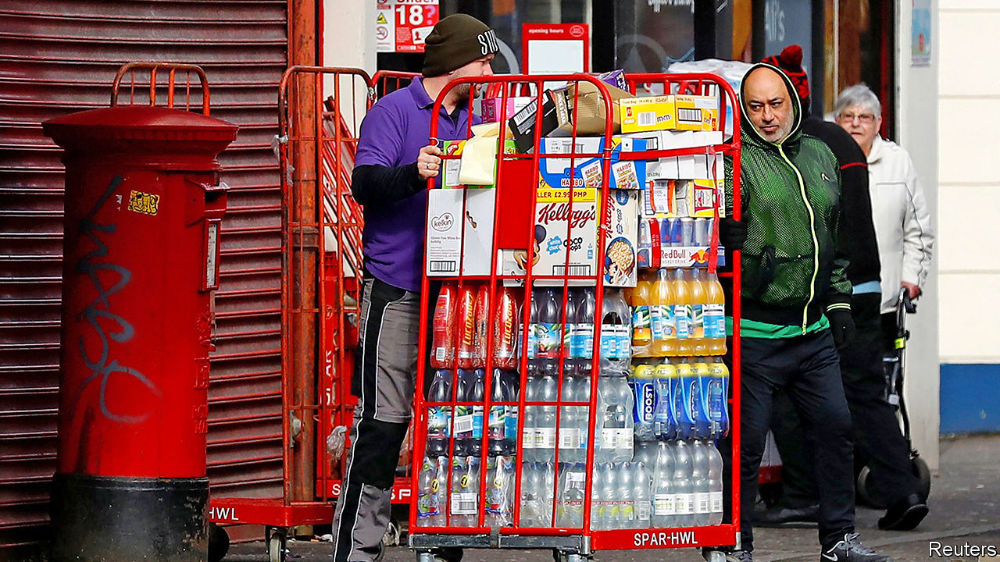

## Labour market

# The jobs retention scheme’s unintended consequences

> Intervention in the jobs market helps workers but makes it harder for businesses to hire

> Mar 26th 2020

Editor’s note: The Economist is making some of its most important coverage of the covid-19 pandemic freely available to readers of The Economist Today, our daily newsletter. To receive it, register [here](https://www.economist.com//newslettersignup). For more coverage, see our coronavirus [hub](https://www.economist.com//coronavirus)

THERE ARE now stark contrasts on Britain’s high streets. Non-essential stores are closed by government fiat, but supermarkets and food stores continue to experience high demand. Slots for online grocery deliveries now attract the kind of digital queues associated with Glastonbury Festival tickets. The big supermarket chains are on a recruitment drive. Tesco, Britain’s largest, wants to hire 20,000 temporary workers while Morrison’s is looking for 3,500 more workers for its delivery business. Unlike toilet rolls, though, the jobs are not being snapped up quickly.

On March 20th Rishi Sunak, the chancellor, announced an unprecedented intervention in the labour market. Under the Coronavirus Jobs Retention Scheme, firms hit by a sharp fall in demand have the option to furlough their workers instead of sacking them. Those furloughed will receive 80% of their salary, up to a maximum of £2,500 ($2,900) with the bill being picked up by the Treasury. Employees on the scheme will not be allowed to work.

The scheme has been widely welcomed. Capital Economics, a consultancy, reckon that, thanks to the scheme and other measures, unemployment may stay at or under 6% (up from around 4% currently) rather than heading back to the 8% seen during the financial crisis of 2007-2009. But the furloughing scheme, drawn up in a hurry, still has kinks to work out. Under the present rules it is somewhat binary: a firm can either furlough a worker or not furlough them. An employee who, for example, sees their hours cut by half will not be eligible for support. Rather than an all-or-nothing deal, many firms would appreciate being able to cut staff hours, knowing that the government would cushion the blow to employee incomes.

The scheme is also causing issues in the jobs market. Some sectors are still trying to hire, according to Indeed, a recruitment website. Customer-service adverts are up by 3%; security and warehouse jobs are up by 2%. The obvious solution would be for non-essential stores to loan staff to areas in high demand. But that appears unlikely to happen. For many furloughed workers, staying at home on 80% of their previous salary with lower travel and child-care costs, not to mention less risk of infection, is a more attractive option than stacking shelves or loading deliveries.

Xiaowei Xu, an economist at the Institute for Fiscal Studies, a think-tank, argues that “alongside the imperative to protect jobs that will still be viable and productive once the crisis has passed, there is also an urgent need to reallocate some workers in sectors that have temporarily shut down to those facing labour shortages”. That may mean tweaking the retention scheme so that “it is available to furloughed workers who take up temporary work in priority sectors”. So far in this crisis, government policy has done a good job at supporting employment but unless resources are able to shift to where demand is still strong, bottlenecks and disruption will follow.■

Dig deeper:For our latest coverage of the covid-19 pandemic, register for The Economist Today, our daily [newsletter](https://www.economist.com//newslettersignup), or visit our [coronavirus hub](https://www.economist.com//coronavirus)