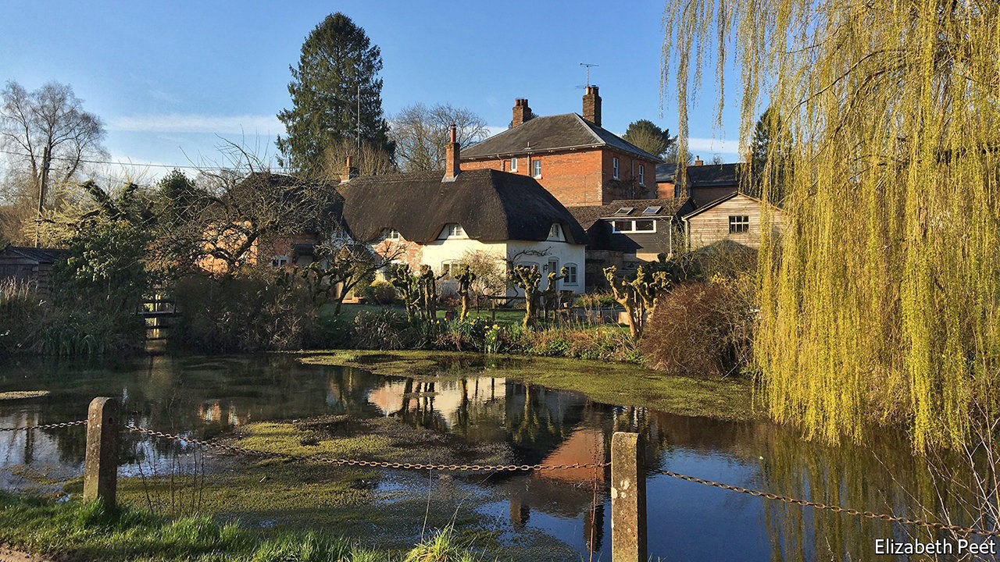

## Rural England

# Village life under lockdown

> Covid-19 has brought a retail revolution to a small corner of Wiltshire

> Mar 26th 2020WILTON

Editor’s note: The Economist is making some of its most important coverage of the covid-19 pandemic freely available to readers of The Economist Today, our daily newsletter. To receive it, register [here](https://www.economist.com//newslettersignup). For more coverage, see our coronavirus [hub](https://www.economist.com//coronavirus)

THE PRACTICALITIES of living under lockdown can be especially hard in a small village. Broadband reception in Wilton, in the south-west of England, is patchy so working from home can be tricky. Other than a pond furnished with the requisite number of ducks, the village has few amenities even in healthy times. And now The Swan, the local pub and only village institution (there is no church), has been forced to close.

Yet these Wiltshire villagers are not complaining. Covid-19 is more prevalent in London than in rural England. Locals want to keep it that way, so they are quite happy with the reduction in train services. A new local WhatsApp group is flooded with messages offering to pick up food or prescriptions for the elderly or to walk other people’s dogs and news bulletins: loo paper available in Tesco in Marlborough, potatoes now for sale on the market stall, newspaper deliveries still happening intermittently.

What’s more, covid-19 has brought about a retail revolution. Bill Clemence, The Swan’s landlord, has turned the saloon bar into a pop-up shop selling vegetables, fruit, milk, bread and even (wonders!) local eggs. Wine is priced at a flat £10 a bottle. For the first few days he worried he might be breaking the rules, but he has since been reassured. He allows only two people inside at once and insists that all payments must be contactless, but his service has fast become indispensable. The pub is also selling plenty of take-out family meals to help those who find themselves stuck at home with schoolchildren.

Glorious spring sunshine is helping keep spirits up. The daffodils are out and the first mowing of the year is under way. The biggest local farmer is upbeat, as the uncertainty that covid-19 has brought has pushed up demand for wheat, allowing him to forward sell a much bigger chunk of his spring crop than he would have expected at this stage.

Much as in the rest of the country, covid-19 is bringing the village closer despite (or perhaps because of) lost social amenities. More walkers and cyclists appear to be on the roads, just as fewer cars are driving into nearby towns. And although social distancing is being carefully maintained, the greetings that are exchanged seem cheerier than usual.

Dig deeper:For our latest coverage of the covid-19 pandemic, register for The Economist Today, our daily [newsletter](https://www.economist.com//newslettersignup), or visit our [coronavirus hub](https://www.economist.com//coronavirus)