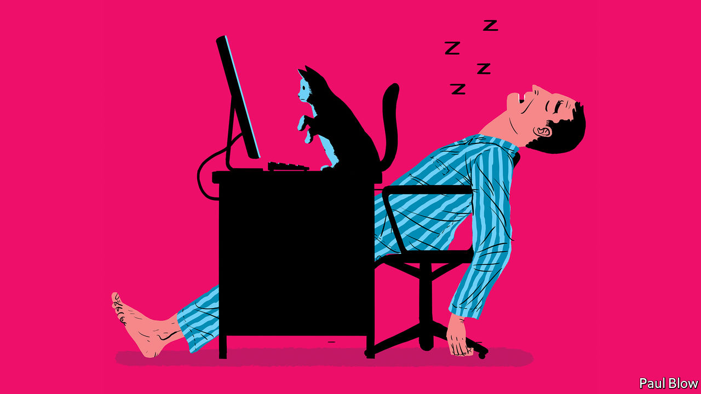

## Bartleby

# Diary of a home worker

> The challenges of concentrating during a lockdown

> Mar 26th 2020

Editor’s note: The Economist is making some of its most important coverage of the covid-19 pandemic freely available to readers of The Economist Today, our daily newsletter. To receive it, register [here](https://www.economist.com//newslettersignup). For more coverage, see our coronavirus [hub](https://www.economist.com//coronavirus)

MORNING: WAKE up at 7am. Listen to radio news full of government restrictions, disease numbers and tales of economic decline. Stop on the way to shower to wake up teenage daughter so she can get ready for school. Daughter tersely points out that her school has been closed for days.

7.20: Breakfast is tricky decision. Is the family closer to running out of milk and cereal, or bread? Realise that cat has only two food sachets left.

7.30: Email inbox consists almost entirely of companies explaining how they are coping with the pandemic. This includes every hotel and restaurant that ever took an online booking.

8.00: Head for supermarket to pick up extra cat food. Shelves resemble scene from zombie apocalypse. Purchase tub of ice cream on grounds that virus poses bigger threat to health than obesity does.

8.30: Attempt to read company’s disaster recovery policy. Hitherto had been more likely to pick up a newly discovered novel by Ayn Rand. Can’t make head nor tail of it. Beg daughter for help as she has actually heard of these apps. Think wistfully of the days when journalism involved a typewriter, carbon paper and the telephone directory.

8.50: Look at academic paper in the hope it will provide column idea. Give up when the abstract turns out to be too, er, abstract. Wish that vital books were not left in the office, seven miles away.

9.00: Check Twitter and news websites for virus developments on grounds this is “research”. Disappear down rabbit hole for 45 minutes.

9.45: Cough briefly. As paranoia sets in, check temperature. All fine but then second thought: what if thermometer is broken? To be safe, wash hands while singing all of “Bohemian Rhapsody”.

10.30: Time to dial into editorial meeting. Realise cannot find phone number or meeting code. Send email to colleague who returns a WhatsApp message with the answer. But that arrives on the phone needed to dial in. Hunt for pen and paper to write down the numbers.

10.35: Finally get through to meeting. Wonder about etiquette for conference calls taken at home. Is it OK to put the kettle on? Eat a biscuit?

10.45: Try to contribute. Realise phone is on mute. After two minutes, work out how to unmute phone. Discussion has moved on. Mute again to avoid embarrassment. Reflect that listening to meeting in which one does not contribute is akin to watching a play performed in a foreign language. Start to miss regular meetings, a concept previously beyond imagination.

11.15: Go for stroll. Have conversation with neighbour who stands a careful two yards away. Wonder whether, like medieval lepers, we will all eventually have to walk down street, ringing bell and shouting, “unclean!”

11.30: Return to house to find cat has sat on laptop, and accidentally opened a whole bunch of tabs and typed random letters. If cat does this long enough, could she write entire column?

11.45: Check Google calendar and find, after cancellations, there are no meetings left for the whole of 2020. Perhaps this is how it is going to be.

11.59: Think of virus-related joke.

Noon: Tweet the joke.

12.01: Realise quip was in terrible taste and hurriedly delete it.

12:15: Lunch dilemma. Eat perishable food before it goes off or non-perishable food which could be out of stock in the supermarket? Settle for ice cream on the grounds that should never have bought it in the first place. Start to watch TV detective series for a few minutes as deserved mental break.

1.30: Suddenly realise the time as detective show ends. Turn off TV.

1.45: Inbox now consists of pitches from two types of PR people. One group wants to highlight products that will make home-working easier and would make great column. The other lot wants to know whether The Economist would like to publish an article from their chief executive praising their own company. Hit delete button multiple times.

2.30: Think about working in Starbucks as a break from the kitchen table. Remember that Starbucks and every other coffee chain has now closed for business indefinitely.

4.00: Consider writing column that is not virus-related but worry it might seem otherworldly. Conduct search of internet for topic that is virus-related but at the same time vaguely cheerful.

5.00: Wonder whether the business editor would accept a column based on a homeworker’s diary. Estimate the odds to be rather long.

Dig deeper:For our latest coverage of the covid-19 pandemic, register for The Economist Today, our daily [newsletter](https://www.economist.com//newslettersignup), or visit our [coronavirus hub](https://www.economist.com//coronavirus)