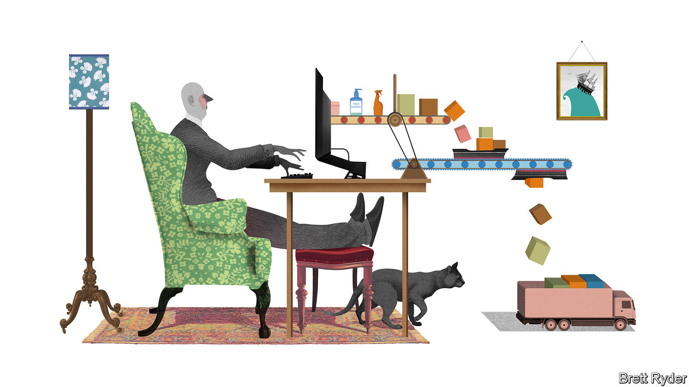

## Schumpeter

# How Alan Jope runs Unilever from his study

> A dispatch from the home front

> Mar 26th 2020

Editor’s note: The Economist is making some of its most important coverage of the covid-19 pandemic freely available to readers of The Economist Today, our daily newsletter. To receive it, register [here](https://www.economist.com//newslettersignup). For more coverage, see our coronavirus [hub](https://www.economist.com//coronavirus)

ON MARCH 13TH Alan Jope, boss of Unilever, a consumer-goods conglomerate that makes everything from Dove soap to Knorr soup, ordered the firm’s 60,000 office workers in all countries bar China to work from home. The 56-year-old Scot took a train to Edinburgh where he joined his family. Sitting in his study, he recently spoke to Schumpeter via an online video-chat that he uses to run a business empire. In a world gone awry, it all felt rather normal. Mr Jope, in his habitual casual garb, looked relaxed. Despite the gravity of the covid-19 pandemic, remote working is “dead easy”, he says; without commuting, he has more time to liaise with underlings around the world.

That is good news, and not just for Unilever. Since January the company has been on the front line of the covid-19 outbreak. As one of the world’s biggest consumer-goods firms, it sells food, hygiene products and other more or less essential staples to 2.5bn customers in 190 countries. Without continued availability of its wares the pandemic’s toll would almost certainly be even greater.

Listening to Mr Jope it becomes clear how many rules of business the pandemic has shattered. The impact on production, consumption and generation of profit is even greater than on office work. The nature of the top job, which he has held since January 2019, has changed, too. In the past the hallmark of a good boss was a strategic mind. The covid era is all about the here and now.

Like many a boss, Mr Jope thinks in categories. For his firm, the pandemic has come in three waves. It began with the lockdown in China. The stoppages then spread to northern Italy, the rest of Europe and America. Now they have reached poor places such as the Philippines, India and Africa. He has four guiding principles: look after people; look after supply; look after demand; look after cash.

First, people. Unilever is trying to safeguard the physical and financial well-being of its 155,000-strong workforce. Besides sending office staff home, factories are operating in “Fort Knox mode” to prevent the spread of infection, he says. Sales teams are ordered to contact customers virtually. Unilever will maintain pay levels for up to three months for all who work for it either directly or, like cleaning and catering staff, through contractors.

Second, production. For Unilever, China and Italy have been laboratories. They offered valuable insights into dealing with lockdowns and “deep cleaning” of factories. When the authorities locked down Lombardy, they at first banned lorry transit. After companies warned of the risk this posed for the supply of food and basic necessities, the order was relaxed. Countries are realising how important it is to keep products moving across borders and within them, Mr Jope says. The firm is not too exposed to cross-border snags. Almost all its products are made from ingredients sourced in the country of production. It scarcely uses air freight, and seaports mostly remain open. Mr Jope says he has so far seen limited disruption at the base of the supply chain, among farmers or packaging firms (but concedes this may change if lockdowns last for months). The biggest bottleneck in many places, he says, is a shortage of lorry drivers, who are “critical”.

As for consumers, his third priority, they have been forced to shop less in all. Moreover, the sheer scale of panic buying in some places in recent weeks has led Unilever to turn monthly sales forecasts into weekly ones. Consumption patterns are not uniform. America and Europe have witnessed shelves stripped, mostly in big supermarkets. In developing countries people flock to neighbourhood shops. Demand is shifting online just about everywhere, but internet shopping is “totally overwhelmed”.

Cash is the fourth concern. Unilever is in decent shape. Its debt is moderate, at less than two times EBITDA. It notched up €52bn ($58bn) in sales last year. Most important at a time of a corporate cash crunch, it had €6.1bn in free cashflow. Like other consumer-goods giants Unilever bolstered it over the past decade by being robust with suppliers. It is not alone. The payables (roughly, what is owed to suppliers) of eight big consumer-goods multinationals, including Unilever, has risen from a median of 9% of sales in the 2000s to 16% last year, in part thanks to longer payment periods.

Now Mr Jope is giving some of it back. On March 24th the firm said it would extend €500m of cashflow relief to suppliers and customers, by speeding up payment to small and medium-sized vendors, and offering credit to small retailers that rely on Unilever. The chief executive says that if many other big companies pay their suppliers more quickly, it would considerably ease the financial strains felt by the small fry. Unilever’s relief up and down its supply chain presents a big shift in a business model of wringing efficiencies through ultra-lean production and distribution. But it has little choice. Although sales of some products may get a boost from panic buying, overall Unilever will not benefit as self-isolating consumers shop less, he thinks.

Apart from changing Unilever’s business, covid-19 is also reshaping its boss’s role. For decades, CEOs have fancied themselves as grand strategists, like generals who believe strategy is to war what plot is to the play. Reputations were burnished with bold, cunning moves, such as mergers and acquisitions or spin-offs. The running of day-to-day operations, including supply chains and staff, were about as glamorous as stage management.

No longer. Mr Jope says that right now strategy is not the main priority. His “operational brains”—the HR, supply-chain and operations chiefs—are more important than ever. His country heads are crucial to running businesses on the ground, including negotiations with panicky governments. Internal communication is critical. One day strategic opportunities will resurface. But right now is not the time for distractions. At least most of them: before saying goodbye he lets slip, slightly bashfully, that his next appointment is a virtual party organised by some of his younger employees. ■

Dig deeper:For our latest coverage of the covid-19 pandemic, register for The Economist Today, our daily [newsletter](https://www.economist.com//newslettersignup), or visit our [coronavirus hub](https://www.economist.com//coronavirus)

## URL

https://www.economist.com/business/2020/03/26/how-alan-jope-runs-unilever-from-his-study
