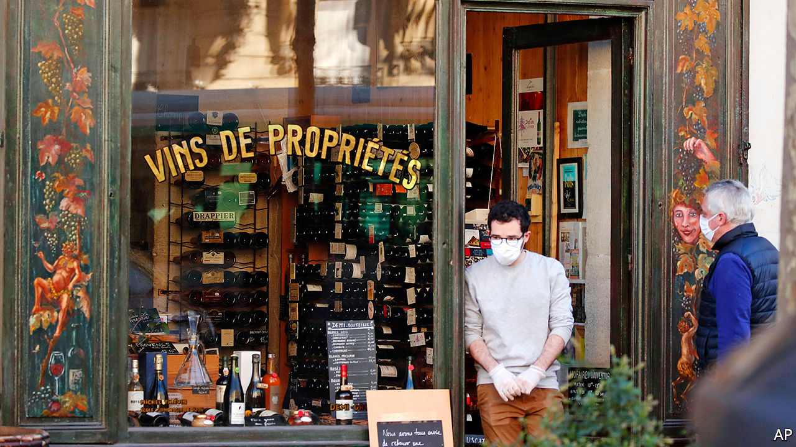

## Still open

# How retailers vie to be considered “essential” in a lockdown

> Or not

> Mar 26th 2020PARIS

Editor’s note: The Economist is making some of its most important coverage of the covid-19 pandemic freely available to readers of The Economist Today, our daily newsletter. To receive it, register [here](https://www.economist.com//newslettersignup). For more coverage, see our coronavirus [hub](https://www.economist.com//coronavirus)

MAN DOES not live by bread alone, even in confinement. Sections of the world’s high streets have been spared from national edicts to shut up shop until covid-19 passes. Supermarkets, pharmacies and banks remain open just about everywhere. Other exemptions reflect which industries politicians feel voters cannot do without.

Is booze a basic need? Not in Pennsylvania or India, where alcohol retailers have been shuttered. France, predictably, has spared its wine merchants. Cavistes had originally been ordered to close, then permitted to stay open even as the French lockdown was tightened (cheesemongers count as food shops, in case you were wondering). Dutch and Californian cannabis dispensaries were also allowed to reopen. Weed sales in California reportedly tripled as tokers pondered life cooped up with their families.

Bookshops remain open in Belgium but not Britain, despite an appeal by James Daunt, boss of Waterstones, a big chain, that they were “no different to a supermarket or pharmacy”. By contrast, when France’s finance minister, Bruno Le Maire, wanted to exempt booksellers, their association beseeched him to keep them closed—but also to stop Amazon and supermarkets from selling books.

Dry cleaners and launderettes have usually remained open, including in New York. But the need to look dapper does not extend to coiffures. Barbers and hairdressers closed in much of Europe (though Germany let them stay open at first). Their trade group, too, pleaded for them to be forced to stay shut, pointing out that hairdressers could scarcely avoid coming into close contact with customers. Also, being closed can help trim expenses by putting staff on government wage-replacement schemes, and perhaps other handouts.

South Korea at no point strictly enforced closure of commerce. But gyms and night clubs that want to stay open must keep a visitor log and enforce distancing rules or be held liable for medical bills of anyone infected on their premises. Non-food establishments from Lucknow to Los Angeles might anyway see few clients even if they kept going. People must juggle child care with remote work. They have lost their income, or are about to; confidence is plummeting. Until it rebounds, shopkeepers may prefer to seek government life-support.

Dig deeper:For our latest coverage of the covid-19 pandemic, register for The Economist Today, our daily [newsletter](https://www.economist.com//newslettersignup), or visit our [coronavirus hub](https://www.economist.com//coronavirus)

## URL

https://www.economist.com/business/2020/03/26/how-retailers-vie-to-be-considered-essential-in-a-lockdown
