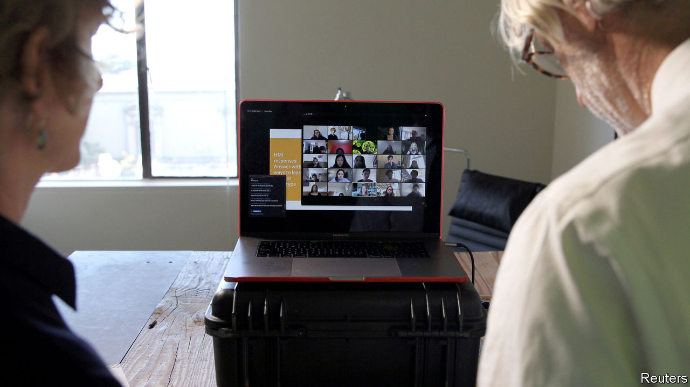

## The nowhere firm

# How to manage a business without a headquarters

> Pandemic lessons for all companies from startups born office-less

> Mar 26th 2020BERKELEY AND SLACK

Editor’s note: The Economist is making some of its most important coverage of the covid-19 pandemic freely available to readers of The Economist Today, our daily newsletter. To receive it, register [here](https://www.economist.com//newslettersignup). For more coverage, see our coronavirus [hub](https://www.economist.com//coronavirus)

“WEIRDLY, THINGS haven’t changed much,” says Kyle Mathews as he sprays disinfectant on his hands. At least at work. His startup, Gatsby, helps websites manage content in the cloud. It has no headquarters and its 50-odd employees straddle the world, from Mr Mathews’s home in Berkeley, California, to Siberia.

Such “fully distributed” firms were on the rise before covid-19. As national lockdowns spread, conventional ones are forced into similar arrangements. Those that have grown up this way offer lessons. 

Distributed organisations are as old as the internet. Its first users 50 years ago realised how much can be done by swapping emails and digital files. These exchanges led to the development of “open source” software, jointly written by groups of strangers often geographically distant.

Today most distributed startups have open-source roots. Gatsby is one. Nearly all 1,200 employees of another, Automattic, best known for WordPress, software to build websites, work from home. GitHub, which hosts millions of open-source projects (and was acquired by Microsoft in 2018), may be the world’s biggest distributed enterprise. Two-thirds of its 2,000 staff work remotely. Most firms that build blockchains, a type of distributed database, are by their nature dispersed.

Plenty of startups start out distributed to avoid high rents—and so high wages—in Silicon Valley and other tech centres. Many opt to stay that way. Joel Gascoigne, boss of Buffer, which helps customers manage social-media accounts, works remotely in Boulder, Colorado. Stripe, an online-payments firm, has a head office in San Francisco but its new engineering hub is a collection of remote workers.

Distributed startups exist thanks to a panoply of digital tools—most obviously corporate-messaging services such as Slack (chat) and Zoom (videoconferencing), as well as lesser-known firms like Miro (virtual whiteboards for brainstorming) or Donut (which pairs employees to forge personal bonds). Others, like Process Street, Confluence or Trello, help manage work flow and keep track of what goes on in virtual corridors—crucial when people do not share the same physical space. Firms offering organisational scaffolding for distributed firms include Rippling, which manages payroll and employee benefits, grants workers access to corporate services and sets up their devices. Much that is now done in spreadsheets could be turned into a virtual service, predicts Rich Wong of Accel, a venture-capital (VC) firm (and early investor in Slack).

Besides new tools, distributed firms need novel management practices. One rule is not to mix physical and virtual teams. Online participants in mixed meetings often feel excluded. GitHub’s boss, Nat Friedman, has all employees—himself included—log in to meetings virtually, even if they are in the office. Looking over someone’s shoulder to see if they are working (or worse, use software to do it) is another no-no. Remote workers do not slack off, as some managers fear. Trust your team, set clear and, where possible, measurable goals, and let people do their thing, counsels Mr Mathews. To foster camaraderie, Buffer organises an annual in-person retreat (covid-19 will push it online this year).

Trust also requires transparency and explicitness—another reason documentation is key, says Michael Pryor, co-founder of Trello (whose workforce is 80% remote). Discussions that lead to a decision must be captured in writing, he explains, so everyone understands the trade-offs being considered. As a result, distributed firms favour wordsmiths, not good speakers as traditional firms do. Good writing demands clear thinking and discipline, says Mr Friedman, who has been managing distributed teams for 20 years. VCs duly report that distributed startups tend to be better at preparing board meetings.

The pandemic may lead some companies that have outsourced lots of operations to the cloud to go a step further and get rid of at least some offices. “I just don’t think we are going to go back [to business as usual],” says Frank Slootman, boss of Snowflake, a database firm. Even digerati like Twitter plan to turn more virtual.

Still, some businesses suddenly forced into remote work will rue the experience, predicts Mr Gascoigne. Without a learning period they will get all the drawbacks and few of the benefits. Brainstorming and other creative activities are possible online but take practice—and even then feel like an imperfect ersatz of an actual room. Recruiting and breaking in new employees is hard virtually. According to one recent survey of 3,500 remote workers, one in five struggles with loneliness. That is partly why GitHub and Trello operate optional offices.

Most businesses will always have to be located somewhere and need people to work side by side. But as technology improves, swathes of the knowledge economy will gradually move more functions online, thinks Venkatesh Rao of Ribbonfarm, a consultancy. New firms will erect a new virtual floor, which others then inhabit. The coronavirus-fuelled exodus to cyberspace is unlikely to be the last.■

Dig deeper:For our latest coverage of the covid-19 pandemic, register for The Economist Today, our daily [newsletter](https://www.economist.com//newslettersignup), or visit our [coronavirus hub](https://www.economist.com//coronavirus)

## URL

https://www.economist.com/business/2020/03/26/how-to-manage-a-business-without-a-headquarters
