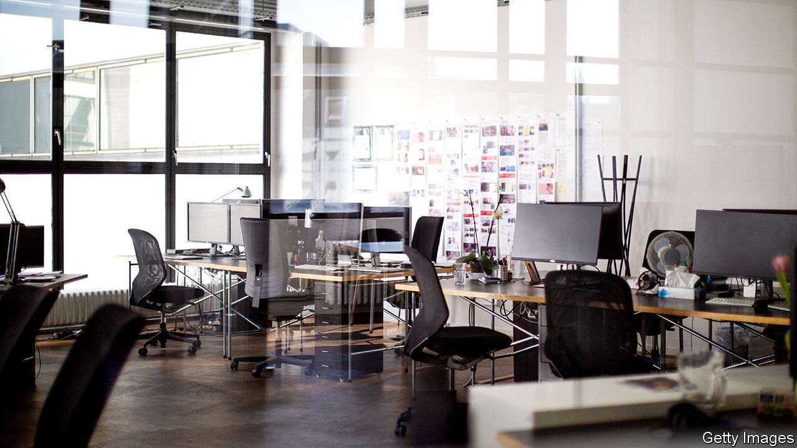
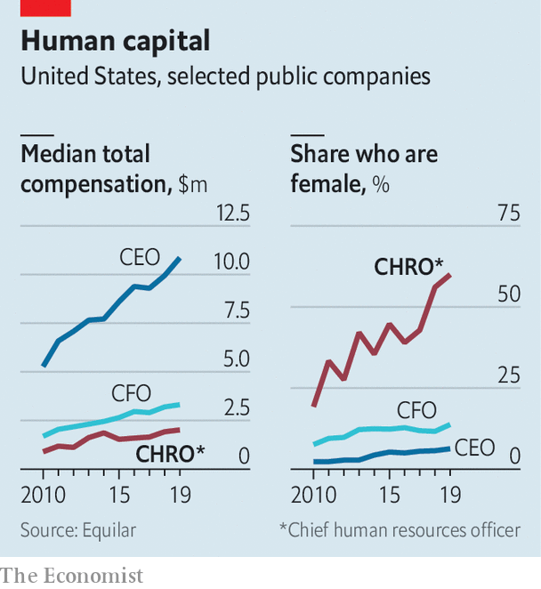

## The importance of people people

# The coronavirus crisis thrusts corporate HR chiefs into the spotlight

> In a pandemic, a chief people officer can make or break a company

> Mar 26th 2020AMSTERDAM

WHEN THE financial crisis rocked the business world in 2007-09, boardrooms turned to corporate finance chiefs. A good CFO could save a company; a bad one might bury it. The covid-19 pandemic presents a different challenge—and highlights the role of another corporate function, often unfairly dismissed as soft. Never have more firms needed a hard-headed HR boss.

The duties of chief people officers, as top human-resources executives are sometimes called, are critical. They must keep employees healthy; maintain morale; oversee a historic remote-working experiment; and consider whether, when and how to lay workers off. Their in-trays are bulging.

Once derided as “pay and parties” managers, by the early 1990s HR chiefs turned to compliance, keeping firms out of the courts (and newspapers). A subsequent string of corporate imbroglios raised their status, notes Patrick Wright of the University of South Carolina. Executive-pay scandals in the 2000s at firms such as WorldCom and Tyco got them more involved in remuneration. A decade later bungled successions at giants like HP, a printer-maker, left them with a bigger say in filling top jobs. More recently they have dealt with firms’ often very public “me too” troubles.

As recruiting and retaining skilled workers became CEOs’ big concern—four-fifths now fret about skill shortages, up from half in 2012—HR heads’ desks moved closer to the corner office. Today many reside right next to the boss. Shareholders are inviting more outside HR chiefs onto boards. In America salaries remain lower than CFOs’ pay but have risen about 20% faster since 2010 (see chart).

A higher profile entails new expectations. HR was once the domain of history graduates and masters in labour relations; nowadays plenty hold business degrees. Although most firms recruit them from HR jobs, more are choosing outsiders or unconventional candidates. Russell Reynolds Associates, an executive-search firm, found that HR heads appointed to Fortune 100 companies in 2016-19 were around 50% likelier than earlier hires to have worked abroad, in general management or finance.

Before covid-19 tight labour markets and millennial empowerment forced employers to think about getting the most out of workers, says Dane Holmes, a former human-capital head at Goldman Sachs who now runs Eskalera, an HR-analytics firm. Diane Gherson, in charge of HR at IBM, overhauled the computing giant’s performance management with big data. Algorithms challenge managers’ instincts on pay and promotion and alert her team when employees are at risk of fleeing (often before they realise it themselves).

The pandemic makes such “people analytics” more relevant. Beth Galetti, Ms Gherson’s opposite number at Amazon and an engineer with no prior HR experience, oversees 1,000 developers working exclusively on HR tech. The e-commerce titan’s earlier investment in digital induction for new hires is paying off. “We on-boarded 1,700 new corporate employees on Monday [March 16th] alone,” Ms Galetti reports.

Covid-19 may lead more HR chiefs to adopt such systems. Right now most have more pressing problems. Mala Singh, chief people officer at EA, a maker of video games, represents the C-suite in its pandemic-response group. This occupies 60-70% of her (long) day. Her team has been getting desks, computers, even noise-cancelling headphones for home-workers. A bigger concern is balancing jobs with child care. Ms Singh told the caregivers on staff to take as much time as they need to adapt without using up paid leave. She is digitally monitoring employee sentiment, particularly anxiety. In a creative business like EA’s, stress about family “does not enable productive work”, she explains.

Many companies outside the knowledge economy face tougher choices. HR leaders must strike a balance between a firm’s professed purpose, which these days often involves treating staff well, and the bottom line, observes Dan Kaplan of Korn Ferry, a consultancy. The instinct is to cut costs through mass lay-offs. Rather than slash payrolls willy-nilly, says Bill Schaninger of McKinsey, another consultancy, good HR heads can try to reconfigure company work flows: what needs to be done by whom, what can be automated and what requires people to share the same space. Some workers who at first appear redundant may be redeployed or reskilled.

The smartest HR-ers at the doughtiest firms are already gazing beyond the flattened curve. Though not quite recruiting—times are too uncertain—Ms Gherson has begun to groom rivals’ talent. Now that everyone is working from home, she says, no one is listening in on their calls. For an HR chief, “it’s the perfect opportunity.”■

## URL

https://www.economist.com/business/2020/03/26/the-coronavirus-crisis-thrusts-corporate-hr-chiefs-into-the-spotlight
