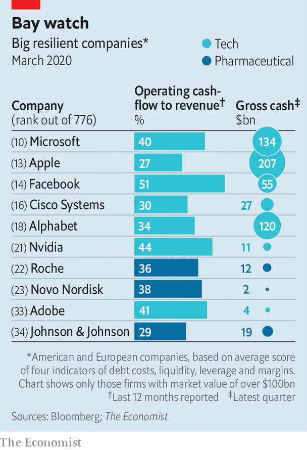

## Best in show

# The pandemic shock will make big, powerful firms even mightier

> And change the societies in which the corporate top dogs operate

> Mar 26th 2020

Editor’s note: The Economist is making some of its most important coverage of the covid-19 pandemic freely available to readers of The Economist Today, our daily newsletter. To receive it, register [here](https://www.economist.com//newslettersignup). For more coverage, see our coronavirus [hub](https://www.economist.com//coronavirus)

ACROSS THE rich world, governments and economists are scrambling to work out how costly virus-related lockdowns will be. Will the economy shrink by a tenth or a third? Is the slump going to last for three months, six or more? No one can say with any precision. A similarly unnerving and inexact exercise is happening in boardrooms as firms try to estimate by how much their cashflows will fall and whether they have the resources to survive.

Amid the chaos one thing, at least, is clear: a few powerful firms are set to gain more clout. Already some are a source of financial stability. It costs less to insure Johnson & Johnson’s debt against default than Canada’s. Apple’s gross cash pile of $207bn exceeds most countries’ fiscal stimulus. Unilever is funnelling cash to its army of suppliers (see [article](https://www.economist.com//business/2020/03/26/how-alan-jope-runs-unilever-from-his-study)). In the long run this group of firms—call them the top dogs—may win market share by investing more heavily than, or buying, enfeebled rivals. The catch is that the post-pandemic world will put these corporate champions on a leash.

Downturns are capitalism’s sorting mechanism, revealing weak business models and stretched balance-sheets. In the past three recessions the share prices of American firms in the top quartile of each of ten sectors rose by 6% on average, while those in the bottom quartile fell by 44%. The drop in sales and profits in 2020 will be much steeper, though hopefully shorter, than in a typical slowdown.

A few firms directly hit by travel and shopping bans have spelled out just how steep. On March 23rd Primark, a fashion retailer, said it was shutting all 376 of its stores in 12 countries, forgoing over $770m in sales per month. It expects to save only half its costs. For most firms the picture is murkier, and perhaps not quite as glum. Some factories are still running and white-collar firms operate remotely. So far companies have announced a flurry of cuts to dividends and share buy-backs. But few have said exactly how much cashflow they expect to burn. For most it will be a lot.

Who, then, are the top dogs? To get a sense of firms’ resilience The Economist has examined the largest 800-odd listed American and European firms. We took their average score on four measures: the cost of insuring their debt against default, operating margins, cash buffers and leverage. Some medium-sized firms score well, but the strongest tend to be bigger, measured by valuation and profits. The 100 hardiest have a median enterprise value nearly twice that of the puniest 100, and median operating profits 17% higher. Their share prices have done better—or less badly—in the past month, falling by a median of 17%, compared with 36% for the 100 frailest.

Silicon Valley and Big Pharma dominate (see chart). Technology firms make up 48 of the top 100. The likes of Microsoft (10th), Apple (13th), Facebook (14th) and Alphabet (18th) operate with big cash buffers. Demand for some of their products is surging: Microsoft’s team-working software, for example. Another 24 are health-care firms. Many have spare cash and a captive market of people in need of drugs. Plenty of the weaklings are in the ailing transport, retail and recreation industries (think Marks & Spencer or American Airlines).

Clear winners and losers are emerging within sectors, too. In tech, Amazon is adding 100,000 workers in America to meet e-commerce demand. Meanwhile SoftBank, a Japanese conglomerate which bet big on flaky startups (including smaller e-merchants), has been forced to announce $41bn in divestments to raise cash, among them, perhaps, the sale of part of its lucrative stake in Alibaba, China’s biggest listed firm. In energy, the shares of giants such as ExxonMobil, Royal Dutch Shell and BP have outperformed smaller firms by a vast margin. Occidental Petroleum, an aggressive medium-sized company that has tried to acquire its way to the big league, now has a hefty $40bn in debt. L’Oréal, a big French personal-care group, has done vastly better than Coty, an American rival. Even among beleaguered aircraft-makers a gap has opened up. On March 23rd Airbus, Europe’s champion, said it had about $32bn of liquid funds available. Debt investors view it as less risky than Boeing, which may seek a bail-out from the American government.

The top dogs’ resilience should eventually translate into an enduring advantage, allowing them to win market share over time. Their cost of capital will be lower. Suppliers will favour them over feebler customers. With higher margins and bigger cash buffers, they will be able to afford higher investment even as other firms cut back. Some will pursue takeovers, encouraged by governments which put the survival of foundering firms (and jobs) ahead of antitrust concerns. As valuations fall and capital gets pricier, the ability of loss-making startups to nibble away at big firms’ profits will recede for a while.

Not everything may go the top dogs’ way. Calls for a new social contract may get louder after the virus passes, with firms pressed to offer vital products for lower prices and to give workers more security. Capitalism may become less Darwinian, as weak firms are propped up by bail-outs and subsidised loans. The amount earmarked for cheap business loans and guarantees by governments in America, Britain, France, Germany and Italy is at least $4trn, or a fifth of their outstanding non-financial corporate debt. Some industries may temporarily be run as officially sanctioned cartels, colluding in order to stabilise prices and production. That will make it harder for strong firms to assert their advantage. Covid-19 won’t only have lasting effects on society and people’s behaviour. It will also alter the structure of global business.■

Dig deeper:For our latest coverage of the covid-19 pandemic, register for The Economist Today, our daily [newsletter](https://www.economist.com//newslettersignup), or visit our [coronavirus hub](https://www.economist.com//coronavirus)

## URL

https://www.economist.com/business/2020/03/26/the-pandemic-shock-will-make-big-powerful-firms-even-mightier
