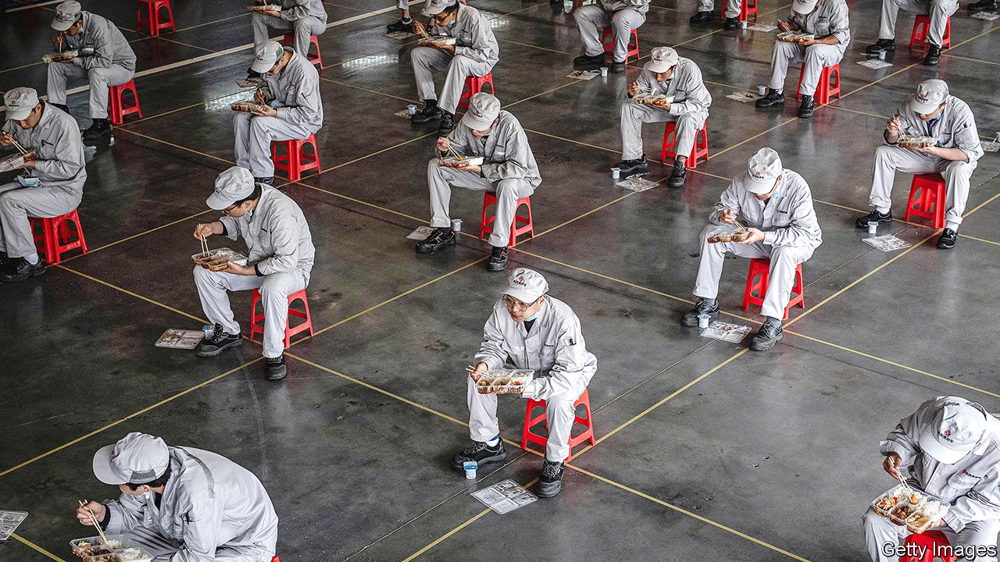
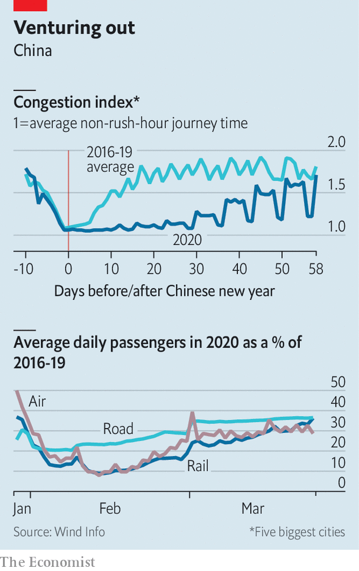
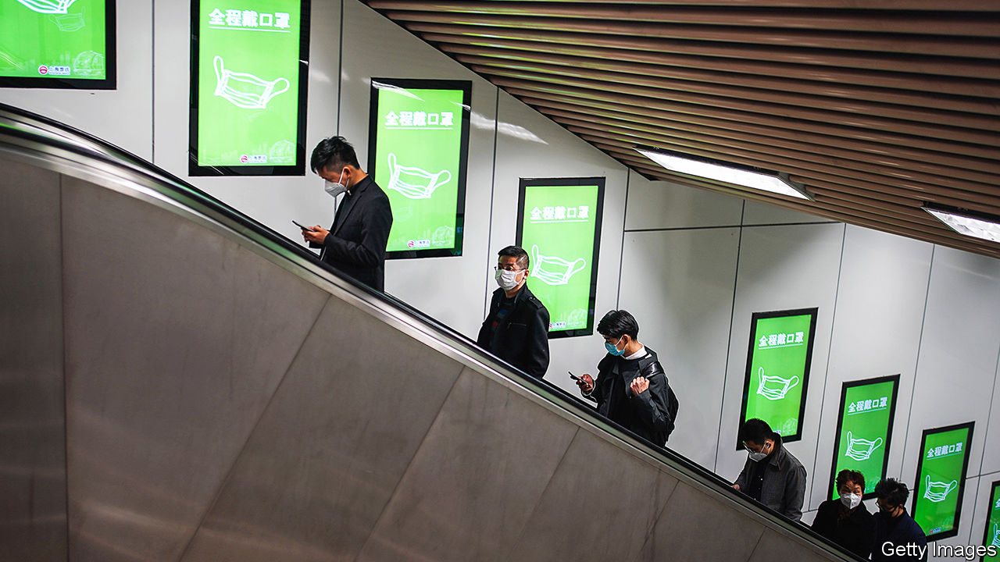

## The post-virus economy

# China goes back to work

> But not back to normal

> Mar 26th 2020SHANGHAI

Editor’s note: The Economist is making some of its most important coverage of the covid-19 pandemic freely available to readers of The Economist Today, our daily newsletter. To receive it, register [here](https://www.economist.com//newslettersignup). For more coverage, see our coronavirus [hub](https://www.economist.com//coronavirus)

IN GOOD TIMES Gu Changshi’s job is to persuade companies to invest in Lingang, a wind-swept free-trade zone on the edge of Shanghai, abutting the Pacific Ocean. But over the past two months, as China has battled covid-19, his job has been to ensure basic survival, both physical and corporate. First his agency requisitioned two hotels to quarantine anyone coming to Lingang from virus-hit regions. Then it started offering conditional cash grants to beleaguered companies located there. “There is no fixed limit to the subsidies,” he says, his hands spreading wide.

When China went into lockdown in late January, economists thought that its growth trajectory would be V-shaped. There would be a sharp slowdown, followed by a swift rebound as soon as the virus was under control, as happened with China’s outbreak of SARS in 2003. They were right about the slowdown. Hundreds of millions of people stayed inside for weeks on end. Factories, offices, restaurants and shops closed, in scenes now being replayed around the world. Most analysts think that China’s economy shrank in the first three months of 2020, perhaps by as much as 10%. The last time it contracted was more than four decades ago, at the end of the Cultural Revolution, according to official data.

The prediction of a quick, strong recovery is more debatable. With barely any new cases of covid-19 now being detected, the government is trying to restore normal life. At four separate meetings of the ruling Politburo since late February, leaders have declared that they want to restart the economy. But doing so is far from simple when the pandemic is still raging elsewhere.

Reviving growth involves boosting both supply and demand. Officials schooled in Marxist theory, which emphasises production rather than consumption, have naturally turned first to the former, ie, to ensuring that goods are made. The main problem has been a dearth of blue-collar workers, many of whom went to their hometowns for the spring festival just before the lockdown and have not yet returned. Production hubs along the coast have chartered trains and buses to bring them back.

Officials boast that things are almost normal again. Fully 98% of all listed companies have resumed work, says the securities regulator. Around the country 89% of big investment projects, from airport expansions to the laying of gas pipelines, are also under way, according to a planning commission. “Roaring Chinese factories in full swing”, Xinhua, a state news agency, proclaimed on March 21st.

The reality is less exuberant. When any measure becomes an official target, it is susceptible to distortion—a phenomenon known as Goodhart’s law. It has been amply demonstrated in China over the years. In this case an obsession with the “work resumption rate” has invited fiddling. Some low-level officials have told firms to embellish their recoveries, reports Caixin, a magazine. To prevent such trickery, the central authorities started checking electricity data. The logical next step? Some companies were told to consume more power by turning on idle equipment.

Measures aimed at preventing another surge of covid-19 have added to the complexities of manufacturing in China. The German manager of an optical-wire factory in Jiangsu province has divided his workers into ten separate units to minimise the risk of cross-infections. The units are kept apart from each other in the factory, the canteen and their dormitories. Such measures are necessary but cumbersome, he says. Firms are also wary of sending staff around the country because some places still impose 14-day quarantines on outsiders. Travel between cities, whether by plane, train or car, is at less than half its normal level (see lower chart). Video calls only help so much when a creaking furnace needs fixing.

Nevertheless, on the supply side, the overall picture is encouraging. Large companies report that they are fully operational. Foxconn, which makes most of Apple’s iPhones in China, has said that it will resume normal production by the end of March. Even many smaller companies are in good shape. Sean Xie, the general manager in China of Lenze, a German automation company, says that all 260 of its employees had returned to its factory in Shanghai as of March 20th, apart from a couple still stuck in Wuhan, the centre of the outbreak of covid-19 (Wuhan plans to lift its lockdown on April 8th).

Resuscitating demand is proving more difficult. It involves two things that are harder for the government to manage: global growth and public anxiety about the disease. Officials had hoped that factories, once up and running, would be able to tap into strong demand abroad. The relentless march of the virus around the world has put paid to that. “All the wheels started spinning very quickly here, but the orders aren’t there,” says a chemicals executive who oversees a factory in the city of Wuxi.

China can take some solace in the fact that it relies less on exports than it did during the global financial crisis of 2007-09. But domestic consumption is now far more central to the economy than exports ever were, and it is much curtailed. Retail sales plunged, unsurprisingly, when just about everyone was cooped up at home. People now can move more freely, but many still avoid large crowds. Shops and restaurants are quiet. Covid-19 has cut people’s incomes, so few seem willing to splurge yet on big-ticket items. Queues outside Apple stores—open in China but closed everywhere else—are deceptive. Apple strictly limits the number of customers to ensure a safe distance between them.

A good proxy for the state of consumption in China is urban traffic. Some thus welcome the return of traffic jams: congestion has reached about 90% of its normal level (see chart). But a closer look is less comforting. Some people who used to take subways to work are using cars instead, to limit contact with others. Passenger numbers on subways are down by roughly two-thirds in big cities. Unusually, there is no road congestion at the weekend. The occupancy rate of a posh international hotel chain is in the single digits, says the company’s boss in China. Bao Wenjun, who owns a restaurant in Shanghai selling cheap and tasty noodles, says that his revenues are down by nearly three-quarters.

For consumption to recover, people must feel confident. They do not. Most provinces have reduced their emergency-alert levels. Even Hubei, the worst-hit, has started to let people (other than residents of Wuhan, the capital) travel elsewhere. But anxiety abounds. Except in a few remote regions, schools are into their second month of closure. Only about 500 of the country’s 11,000 cinemas have re-opened. The government has tightened border controls because many travellers—541 at last count—have tested positive for the virus after arriving from abroad.

In the past China has often been quick to unleash stimulus measures to counteract economic slowdowns. Its spending splurge in response to the global financial crisis was crucial to the world’s recovery. This time China has been uncharacteristically restrained. Britain has pledged to make loans to firms worth 15% of GDP and America is working on a support package worth nearly 10% of its output. But China’s fiscal measures—mainly tax and fee cuts—so far add up to little more than 1% of its GDP. Whereas America has slashed its interest rates to zero, China has barely trimmed its own.

What explains the frugality? One reason is that China has no need to replicate some of the other countries’ actions. Take the struggling airline industry. The American programme includes $58bn in aid for it. Britain may take direct stakes in its airlines. The Chinese government already owns the country’s biggest airlines. State-owned firms account for about three-quarters of corporate debt in China. The government need not spell out that it stands behind them. Investors know that. Whereas corporate-bond prices have fallen sharply in the West—reflecting concerns about firms’ solvency—they have only inched down in China. In the Lingang free-trade zone, Mr Gu goes out of his way to note that the official subsidies are mainly aimed at private businesses, which have a harder time obtaining loans than state firms do.

For officials the most worrying trend is a sharp rise in joblessness. The unemployment rate in urban areas jumped nearly a full percentage point to 6.2% in February, the highest on record. And this rate fails to capture the tens of millions of migrants who are still in their hometowns, waiting for the economy to perk up before returning to cities for work. So the government is cautiously rolling out some stimulus. On March 20th it pledged to increase financial support for the unemployed.

More help may be on the way. The government has given provinces more leeway to raise funds for such things as infrastructure and buildings. Spending of this kind has been a cornerstone of China’s past stimulus packages. But now it is proceeding gingerly. It fears that unleashing more of it could push up debt levels, which are already dangerously high. Most crucially, for all their talk about restarting the economy, China’s leaders are wary of letting growth rip until they are certain that a boom in business will not also bring a resurgence of covid-19. “We want to reduce risk to the absolute minimum and will not count the cost of that,” says Mr Gu. The economic rebound can wait. ■

Dig deeper:For our latest coverage of the covid-19 pandemic, register for The Economist Today, our daily [newsletter](https://www.economist.com//newslettersignup), or visit our [coronavirus hub](https://www.economist.com//coronavirus)

## URL

https://www.economist.com/china/2020/03/26/china-goes-back-to-work
