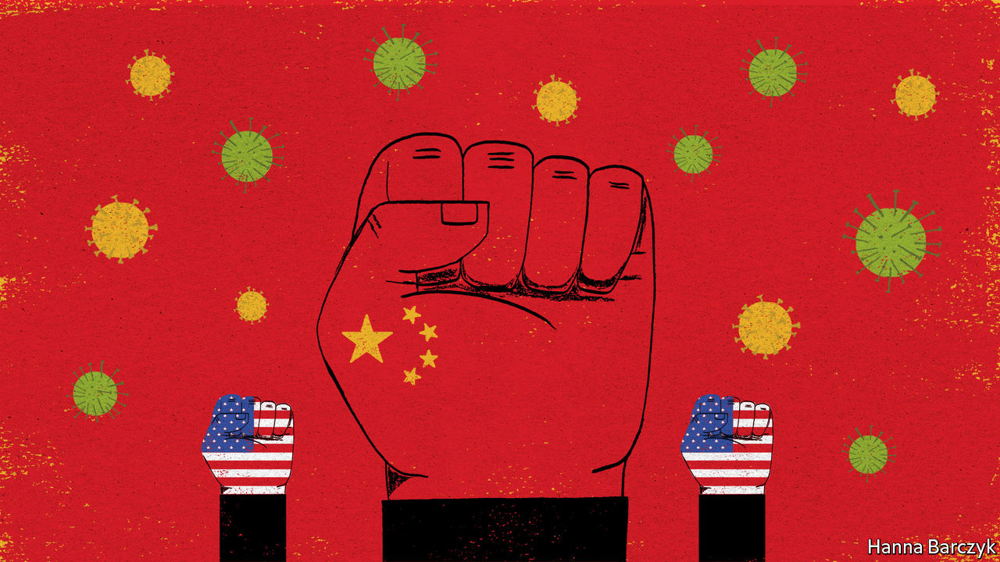

## Chaguan

# The pandemic will boost China’s standing, its propagandists claim

> But beware simple predictions

> Mar 26th 2020

Editor’s note: The Economist is making some of its most important coverage of the covid-19 pandemic freely available to readers of The Economist Today, our daily newsletter. To receive it, register [here](https://www.economist.com//newslettersignup). For more coverage, see our coronavirus [hub](https://www.economist.com//coronavirus)

VICTORY IS A perilous moment for a guerrilla army. Over years of civil war, revolutionaries become experts at raids, ambushes and subversion behind enemy lines. Then one day a foe melts away, giving up a great city or miles of precious terrain and setting insurgents a different challenge: how will you govern, now this is yours? In 1949 the peaceful fall of ancient, palace-filled Peiping, as Beijing was then officially known, daunted even Mao Zedong. Comparing his troops to scholars summoned to sit entrance tests for the imperial civil service, he mused: “Today we’re heading into the capital to take the big test... All of us have to make the grade.”

Today, a new victory is in sight. For decades when a pandemic or other worldwide scourge has struck, the response has been co-ordinated by rich Western countries led by America, occupying the high ground of global leadership in a mixture of altruism and bossy self-interest. Now, under President Donald Trump, America is abandoning that terrain. Take Chinese propaganda outlets at face value, and China is ready to advance and take the ground.

Some may object that Communist Party chiefs have a nerve to seek praise for their response to covid-19. After all, Chinese officials spent several disastrous weeks silencing doctors and concealing test results, and letting millions leave Wuhan, the city where the illness was first seen. That cover-up will forever colour judgments of what came next: a mass mobilisation of hundreds of millions of Chinese to tame a first wave of infections. Yet bungling by foreign leaders, and above all by Mr Trump, has handed the Chinese government a chance to recover. Plenty of ordinary citizens remain angry about early missteps in Wuhan. But many of the same citizens cheer reports of China’s delivery of medical supplies and advice to more than 80 countries, and gasp at news of rising death tolls in Italy, Britain and America.

Small wonder that a cottage industry has sprung up in the West, churning out essays arguing that Mr Trump is creating a vacuum that China is poised to fill, as the covid-19 pandemic reshapes the world order. There is something to this. China’s best scientists are sprinting to create a covid-19 vaccine. If they win that race (and good luck to them), brace for a torrent of global commentary comparing this to the Soviet launch of Sputnik, the first satellite. It is sobering to watch foreign leaders, from Serbia’s president to Hungary’s prime minister and Italy’s foreign minister, loudly thanking China for medical supplies and teams of doctors while chiding European neighbours for abandoning them (never mind that some of those supplies were sold by China, not donated).

For all that, it remains unclear whether China wants to occupy newly vacant positions of global leadership—if that involves accepting multilateral rules and norms that might constrain its actions in the future. China seeks thanks and respect for its virus response. It is happy to see covid-19 weaken rivals like America. But it is worth noting what it has and has not achieved during this pandemic. China has long had a genius for befriending countries and leaders who are shunned by mainstream peers. The pro-Chinese leaders of Serbia and Hungary are also autocratic admirers of Russia, whose ties with the European Union are fractious. Recruiting foreign leaders to be “friends of China” is not the same as having an appealing model—a Chinese Way—to offer the world.

During this crisis China has made several moves that pay domestic dividends but make no sense for a country that hopes to win hearts and minds abroad. In particular, official media, backed by Chinese diplomats with Twitter accounts and a taste for nationalist provocation, have promoted offensive, often contradictory conspiracy theories about the origins of the virus. State media have publicised a quote from an Italian scientist, recalling cases of a strange pneumonia circulating before covid-19 was identified in China, and insinuating that this reveals that the virus began in Italy, not China. The scientist has since clarified that he believes that the virus is “without a doubt” from China, fuming about Chinese “propaganda”. Too late. A Chinese internet hashtag about covid-19’s history in Italy has been viewed almost half a billion times. At the same time Chinese netizens have seized on a rival theory pushed by foreign-ministry provocateurs—though it is unsupported by any evidence—that covid-19 somehow escaped from an American military laboratory and was carried to China by American athletes competing in a military sports tournament in Wuhan. Depressingly, lots of Chinese netizens are unfazed by the flimsiness of these theories, some of which have been obliquely disowned by China’s ambassador to America. Convinced that America is a dirty fighter intent on keeping China down, online nationalists have a bleaker goal: get some low blows in first.

Sowing distrust and division abroad is a risky game for China. Another master of disinformation, Russia, can sell its oil and gas even amid global chaos. As a would-be tech superpower that has profited mightily from globalisation, China has much to lose from a world which cannot agree on basic facts. The nasty side of China’s virus diplomacy has political costs, too. European governments may often be appalled by Mr Trump. But in a commentary published on March 23rd the EU’s foreign-policy chief, Josep Borrell, described China’s aggressive messaging in a global battle of narratives over covid-19, and pointedly chided powers that seek geopolitical advantage by spinning the “politics of generosity”.

China may emerge from this crisis stronger in relative terms, and less willing than ever to be criticised or thwarted. But beware simple predictions about vacuums being filled. The West may lose ground that China prefers not to fill. As Mao understood, an enemy’s retreat is a test as well as an opportunity. True global leadership may require China to ditch its love of ambiguity and cynical opportunism, and spell out what it really believes and wants. If that is the test, the hard men who run China may prefer to skip it. ■

Dig deeper:For our latest coverage of the covid-19 pandemic, register for The Economist Today, our daily [newsletter](https://www.economist.com//newslettersignup), or visit our [coronavirus hub](https://www.economist.com//coronavirus)