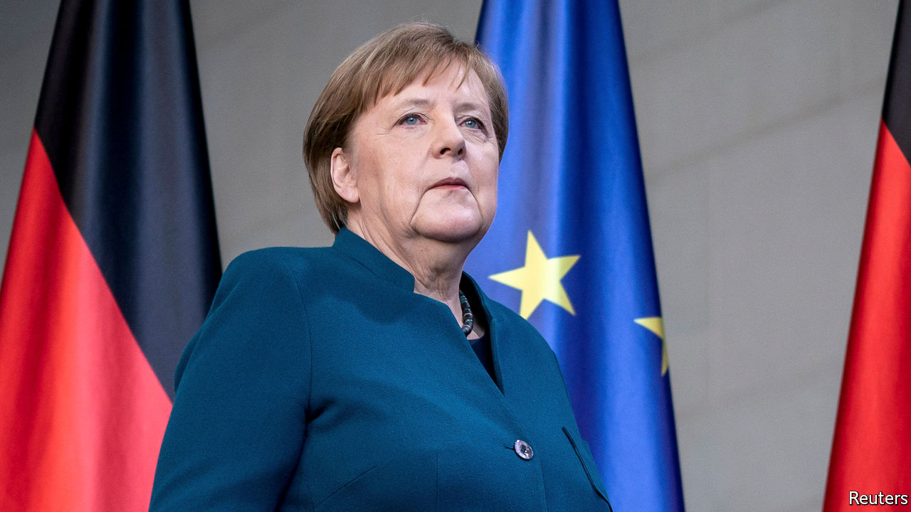

## Desperate times

# Germany offers cash for everyone

> Spending big to offset the corona crunch

> Mar 26th 2020BERLIN

IT WAS SHAPING up to be a bumper year for the Hotel Esplanade in Dortmund. On February 13th its owners threw a big party to celebrate a €2.5m ($2.7m) extension, and to mark the moment that Katja Kortmann took over as manager from her retiring father. Two weeks later the cancellations began: first a trickle, then a tidal wave of up to 300 a day. On March 27th the Esplanade will close its doors to guests and send its 40 staff home. The plan is to reopen on April 19th, but Ms Kortmann doubts that will happen. “It’s just tragic,” she says.

Desperate times, desperate measures. On March 25th Germany’s MPs—sitting the requisite two metres apart in the Bundestag—backed an extraordinary set of policies designed to shield the country’s workers and companies from the worst ravages of the virus. Even sceptical observers have been surprised by the government’s speed and boldness. Its package, the most comprehensive in Europe, includes several elements, some of them dusted off from previous crises.

Chief among them is an expansion of Kurzarbeit (short-time work), under which the state pays 60-67% of the forgone wages of workers whose hours are cut. The scheme, copied across Europe, helped Germany avoid mass lay-offs in 2008-09, but Ms Kortmann’s experience shows how things will differ this time. In the previous crisis, notes Sebastian Dullien of the IMK research institute, manufacturers that faced declining orders used Kurzarbeit to reduce the hours of shift workers. Now the scheme will have to bolster consumer-facing outfits whose customers evaporated overnight. Almost all the Esplanade’s staff, including Ms Kortmann, will be on zero hours once the hotel shuts. The government is planning for Kurzarbeit to extend to 2.15m workers—5% of those with jobs—at a cost of €10bn for a year.

Larger firms can avail themselves of €400bn in liquidity guarantees issued by a new Economic Stabilisation Fund, modelled on a bank bail-out fund from 2008. Another €100bn may be reserved for direct equity stakes in companies, including “strategic” firms at risk of takeover, and the same amount can be provided to the state development bank, which Olaf Scholz, the finance minister, has promised will lend in unlimited quantities to troubled firms. Germany’s 3m small companies and freelancers, meanwhile, can receive grants of €9,000-15,000 to cover fixed costs like rent as long as they can prove that they have been hurt by the pandemic, which should not be hard. Along with various other measures the package amounts to a cool €750bn (though the full sum is unlikely to be used). Several German states are offering further help and Mr Scholz has hinted at a separate post-crisis stimulus.

Germany has had to slaughter several sacred cows to get here. The government’s supplementary budget foresees borrowing of €156bn this year, around 4% of GDP, which means the hallowed schwarze Null (“black zero”) no-deficit policy, in force since 2014, is history. The Bundestag had to invoke an emergency clause in the constitutional debt brake, which normally limits borrowing to 0.35% of GDP. A rotating cast of international financial institutions has long urged Germany to loosen its purse-strings. It took covid-19 to do what the IMF and European Central Bank could not.

For now the measures will cushion the worst of the blow. But for smaller firms with thin cash reserves, the help will only go so far. Alexander Zimmer, who runs the Marienburg Monheim Manor, a conference centre near Dusseldorf, is one example. His workers will receive Kurzarbeitergeld, but he will top it up to a full salary to make life easier for them. He thinks he can do that for three months at most.

At the European level there has been some cross-border solidarity: several German states have accepted patients from overloaded French and Italian hospitals. But the German government is unwilling to heed requests to back jointly guaranteed euro-zone debt (see [article](https://www.economist.com//europe/2020/03/26/how-grasshoppers-triumphed-over-ants-in-europe)). “If we’re declaring war on the virus, eurobonds should be the instrument of choice, but I’m not hopeful,” says Moritz Schularick, an economics professor at the University of Bonn. The pandemic has changed a lot in Germany. But not everything. ■